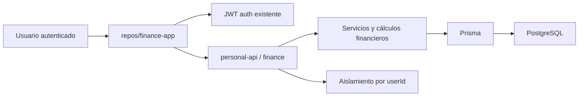
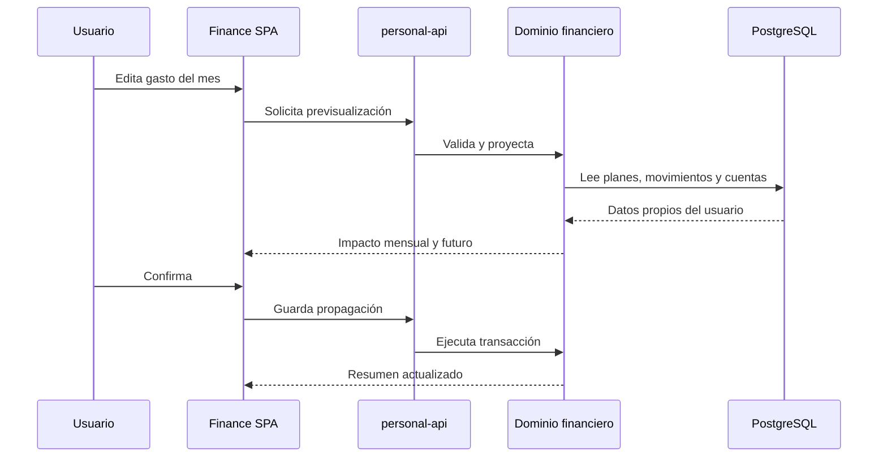

# Arquitectura — Aplicación de finanzas personales

**Versión:** 1.0  
**Estado:** Definición técnica aprobable  
**Fuente funcional:** [`docs/briefs/finance-app/prd.md`](../../briefs/finance-app/prd.md)  
**Modelo de datos:** [`docs/architecture/finance-app/sql-tables.md`](sql-tables.md)

> Este documento define límites técnicos, flujos y decisiones de implementación. No sustituye el PRD. No es una especificación exhaustiva de endpoints.

## 1. Objetivo

Definir la arquitectura de una aplicación privada de finanzas personales que reemplaza hojas de cálculo mensuales por:

- una SPA React/TypeScript independiente;
- un módulo `finance` dentro de `personal-api`;
- un modelo PostgreSQL/Prisma con importes exactos, historial editable y proyección de meses posteriores.

## 2. Alcance y fuera de alcance

### En alcance (MVP técnico)

- SPA nueva en `repos/finance-app`.
- Módulo backend `finance` en `repos/personal-api`.
- Autenticación JWT existente; usuarios provisionados por administrador.
- Aislamiento estricto por `userId`.
- Periodos mensuales editables con propagación confirmada hacia el futuro.
- Cuentas configurables, categorías, reglas recurrentes, presupuestos, ítems planeados y movimientos.
- Crédito, pagos de tarjeta, Fondo Klar y retiro de efectivo.
- Resumen mensual, simulación/previsualización y sugerencias derivadas.
- Pruebas unitarias de cálculos, integración del módulo y verificación de build/lint.

### Fuera de alcance (MVP)

- Registro público y recuperación de contraseña.
- Integración bancaria o importación automática de estados de cuenta.
- Importación desde hojas de cálculo.
- Cuentas compartidas o familiares.
- Microservicios separados para finanzas.
- Persistencia de saldos/proyecciones derivados como fuente de verdad.
- Multimoneda, inversiones, criptomonedas o préstamos distintos a tarjetas.

## 3. Decisiones irrevocables

1. **Frontend:** SPA independiente en `repos/finance-app` (React + TypeScript + Vite).
2. **Backend:** módulo vertical `finance` dentro del modular monolith `personal-api`.
3. **Persistencia:** PostgreSQL vía Prisma; migraciones append-only.
4. **Auth:** reutilizar login/refresh/logout JWT existentes; usuarios creados por administrador.
5. **Ownership:** cada lectura y escritura financiera filtra por el usuario autenticado; el rol global `ADMIN` no otorga acceso cruzado a datos financieros de otros usuarios.
6. **Autoridad de cálculo:** el backend calcula saldos, totales, proyección y sugerencias; el frontend presenta y confirma.
7. **Dinero:** `NUMERIC(14,2)` / Prisma `Decimal`. Queda prohibido copiar `Float` de otros módulos.
8. **Fechas financieras:** fecha calendario (`DATE` / string `YYYY-MM-DD`) sin conversión implícita de zona horaria. Timestamps solo para auditoría técnica.
9. **Libro vs derivados:** movimientos, planes, reglas y cuentas son fuente de verdad; saldos y proyecciones se calculan.
10. **Propagación:** un cambio confirmado desde un periodo afecta ese periodo y los futuros; los periodos anteriores conservan su contexto.
11. **Sin bancos en MVP:** captura manual únicamente.

## 4. Contexto y límites del sistema



### Límites

- La SPA **no** accede a PostgreSQL.
- `personal-api` centraliza validación, reglas de negocio y persistencia.
- Las transferencias internas (Débito ↔ Efectivo, Débito/Klar ↔ pago de tarjeta) **no** son gastos ni ingresos.
- Las compras de crédito y los pagos de tarjeta son tipos distintos de movimiento.
- El retiro de efectivo de $6,250 mueve dinero hacia Efectivo; el consumo ocurre en Mandado/Salidas.

## 5. Arquitectura frontend

### Stack de referencia

Reutilizar patrones de:

- `repos/fitness-nutrition-tracker` — dashboard, routing, TanStack Query, shell UI;
- `repos/user-management-app` — `ApiError`, sesión, refresh ante `401`, tests de HTTP.

Stack: React 19, TypeScript, Vite, React Router, TanStack Query, React Hook Form + Zod, componentes accesibles (Radix/shadcn o equivalentes del workspace).

### Estructura de carpetas

Compatible con la regla React del workspace (`components/`, `pages/`, `hooks/`, `utils/`, `types/`):

```text
repos/finance-app/src/
  main.tsx
  App.tsx
  api/
    http.ts
    auth.ts
    finance.ts
    query-keys.ts
    types.ts
  auth/
    AuthProvider.tsx
    RequireAuth.tsx
    session-storage.ts
  components/
    layout/
    finance/
    forms/
    feedback/
  pages/
    LoginPage/
    DashboardPage/
    MonthDetailPage/
    AccountsPage/
    SettingsPage/
  hooks/
  utils/
    money.ts
    dates.ts
  types/
    finance.ts
  test/
```

### Responsabilidades

| Área | Responsabilidad |
|------|-----------------|
| `App.tsx` | Solo composición: providers, router, shell |
| `api/` | Encapsula `fetch`, tokens y contratos HTTP |
| `auth/` | Sesión, bootstrap, refresh, guarda de rutas |
| `hooks/` | TanStack Query, mutaciones, invalidación |
| `utils/` | Funciones puras (`money`, fechas, formatos MXN) |
| `types/` | Contratos de dominio compartidos en UI |
| `pages/` | Rutas; orquestan hooks y componentes |
| `components/` | UI reutilizable; no conoce detalles de `fetch` |

Cada componente/página vive en su carpeta con `index.tsx` y export nombrado.

## 6. Navegación, composición y datos

### Rutas conceptuales

| Ruta | Propósito |
|------|-----------|
| Login | Inicio de sesión; sin datos financieros |
| Dashboard / resumen mensual | Focal: ahorro esperado, disponible, alertas |
| Detalle de mes | Presupuestos, planes, movimientos, crédito, Klar |
| Cuentas | CRUD de cuentas configurables |
| Configuración | Preferencias de UI y defaults visibles |

### Estrategia de datos

- **Resumen:** un read model agregado del backend para evitar cascadas de solicitudes.
- **Detalle:** cargas independientes en paralelo (movimientos, presupuestos, cuentas del periodo).
- **Mutaciones:** invalidan claves explícitas del resumen y de los periodos afectados.
- **Query keys:** centralizadas en `api/query-keys.ts` (por ejemplo `finance.summary(periodId)`, `finance.transactions(periodId, filters)`).

### Componentes principales y estados

| Componente | Focal / rol |
|------------|-------------|
| `MonthSummary` | Totales esperados vs reales y ahorro |
| `AccountBalanceList` | Saldos derivados por cuenta |
| `BudgetSection` | Límites por categoría y restante |
| `MovementTable` | Libro filtrable; mostrar/ocultar estados |
| `ProjectionImpactDialog` | Previsualización antes de confirmar propagación |
| `CreditDebtPanel` | Límite, deuda, disponible, pagos |
| `SavingsFundPanel` | Entradas/salidas Klar y saldo |
| `SuggestionList` | Sugerencias informativas; no mutan solas |

Cada componente debe soportar: default, loading, empty, error, disabled y focus. Tablas y totales usan `font-variant-numeric: tabular-nums` y formato `es-MX` (MXN).

## 7. Dominio backend

### Montaje

Registrar el router en `repos/personal-api/src/routes/v1/index.ts`, siguiendo `src/modules/_template/README.md`.

Ejemplo de montaje:

```typescript
v1Router.use('/finance', financeRouter);
```

### Estructura del módulo

```text
src/modules/finance/
  finance.routes.ts
  finance.controller.ts
  finance.schemas.ts
  finance.repository.ts
  finance.service.ts
  finance.calculations.ts
  finance.projection.ts
  finance.defaults.ts
  finance.errors.ts
```

| Archivo | Responsabilidad |
|---------|-----------------|
| `routes` | Middleware (`authenticate`, rate limits) y wiring |
| `controller` | Handlers delgados con `asyncHandler` |
| `schemas` | Zod; tipos vía `z.infer` |
| `repository` | Únicamente Prisma |
| `service` | Casos de uso y orquestación |
| `calculations` | Funciones puras de saldos y totales |
| `projection` | Simulación y propagación cronológica |
| `defaults` | Mandado 3×$2,000; Salidas 4×$500; Extras $1,400; retiro $6,250 |
| `errors` | Errores tipados del dominio |

No colocar SQL ni Prisma en controladores o en cálculos puros.

## 8. Autenticación, autorización y errores

### Auth

- Todas las rutas `finance` usan `authenticate`.
- No usar `optionalAuth` en datos financieros.
- El `userId` de autoridad sale del JWT autenticado (`req.user`), no del cuerpo ni de params del cliente.
- El repositorio aplica `userId` en **cada** lectura y escritura.
- Usuarios provisionados vía `/api/v1/users` (ADMIN); sin registro público ni recuperación de contraseña en esta fase.

### Errores

Reutilizar el contrato `{ error, message, details }` y `ApiError` en el frontend.

| Situación | Comportamiento |
|-----------|----------------|
| Validación Zod | 400 con detalles de campo |
| Recurso inexistente o de otro usuario | 404 (sin filtrar existencia ajena) |
| Conflicto de propagación / versión | 409 |
| No autenticado | 401 |
| Fallo interno | 500 sin trazas ni SQL al cliente |

## 9. Libro de movimientos y motor de proyección

### Fuente de verdad

- Configuración de cuentas.
- Reglas recurrentes y presupuestos por periodo.
- Ítems planeados (`FinancePlanItem`).
- Movimientos realizados (`FinanceTransaction`).

### Reglas centralizadas (`calculations` + `projection`)

- Saldo no crediticio = saldo inicial + entradas − salidas.
- Crédito disponible = límite − deuda.
- Compra de crédito aumenta deuda una vez.
- Pago de crédito reduce deuda y saldo de origen; no vuelve a contar el gasto.
- Transferencia interna no es ingreso ni gasto.
- Planeado → proyección; realizado → realidad; cancelado → fuera de ambos totales.
- Retiro de efectivo $6,250 → transferencia a Efectivo; no es gasto.
- Modificación confirmada desde un periodo recalcula periodos posteriores en orden cronológico.

### Simulación

1. Previsualización sin persistir.
2. Confirmación explícita del usuario (diálogos de impacto).
3. Persistencia en transacción de base de datos.
4. Protección de concurrencia con `updatedAt` / versión del periodo (conflicto 409).

Visibilidad en UI (mostrar/ocultar planeados o cancelados) **no** cambia totales.

## 10. Familias de recursos (contrato conceptual)

Sin listar cada endpoint, el módulo expone estas familias:

| Familia | Lectura | Mutación | Ownership | Caché frontend |
|---------|---------|----------|-----------|----------------|
| Resumen mensual | Agregado del periodo | Derivado; se invalida tras mutaciones | `userId` | Clave `summary` |
| Periodos | Listar / abrir | Crear / editar metadatos | `userId` | Timeline + detalle |
| Cuentas | Listar / detalle | CRUD; desactivar conserva historial | `userId` | Cuentas + resumen |
| Categorías | Listar | Crear / renombrar / desactivar | `userId` | Detalle de mes |
| Reglas recurrentes | Listar | Crear / editar con alcance futuro | `userId` | Periodos afectados |
| Presupuestos / ítems planeados | Por periodo | Editar límites, fechas, estados | `userId` | Detalle + resumen |
| Movimientos | Filtrar por periodo/cuenta/estado | Crear / editar / cancelar | `userId` | Detalle + resumen |
| Previsualización de proyección | POST de simulación | Confirmación posterior | `userId` | Temporal; no caché larga |

Validación en boundary Zod; ownership en servicio + repositorio.

### Tracer bullet



Primera rebanada de implementación: login existente → resumen del periodo actual → lectura de cuentas/movimientos → una mutación de movimiento → recalculo de resumen.

## 11. Rendimiento, accesibilidad y resiliencia frontend

- Consultas independientes en paralelo (`Promise.all` / múltiples queries).
- No duplicar arrays grandes en props serializadas innecesarias.
- Evitar imports desde barrels pesados.
- Usar `AbortSignal` para cancelar consultas al cambiar de periodo.
- Estados de carga y error por zona (resumen vs tabla vs paneles).
- Errores de red recuperables con reintento explícito.
- Error Boundary en el shell de rutas autenticadas.
- Controles semánticos (`button`, `input`, etc.) y navegables por teclado.
- Hit areas aproximadas de 44×44 px.
- Respetar `prefers-reduced-motion`.
- Listas largas de movimientos preparadas para densidad y scroll (contenido fuera de vista no debe bloquear la interacción principal).

## 12. Pruebas, despliegue y observabilidad

### Backend (`repos/personal-api`)

| Capa | Alcance |
|------|---------|
| Unit | `finance.calculations` y `finance.projection` |
| Schema | Validación Zod de entradas |
| Integration | Rutas autenticadas con PostgreSQL de prueba |
| Setup | Limpiar tablas `Finance*` en `tests/helpers/setup.ts` |

Comandos: `npm run build`, `npm run lint`, `npm test`, `npm run db:migrate`, `npm run db:migrate:deploy`.

### Frontend (`repos/finance-app`)

| Capa | Alcance |
|------|---------|
| Unit / component | HTTP, auth, formularios, estados de UI |
| Typecheck | `npm run typecheck` |

Comandos: `npm run build`, `npm run lint`, `npm run typecheck`.

### Despliegue

- Migraciones append-only; producción usa `prisma migrate deploy` (no `db:push` como sustituto).
- Coordinar despliegue de API y SPA cuando cambie el contrato.
- Logs sin montos, conceptos ni PII financiera en claro más allá de lo necesario para operación.
- Health existente de `personal-api` sigue siendo la sonda de readiness.

## 13. Riesgos, trade-offs e impacto

### Trade-offs

| Decisión | Por qué |
|----------|---------|
| Modular monolith | Reutiliza auth, Prisma, CI y despliegue; YAGNI frente a microservicio |
| No persistir saldos derivados | Una sola fuente de verdad; evita inconsistencias al editar historial |
| `Decimal` en lugar de `Float` | Evita errores de redondeo en dinero |
| Soft-deactivate vs delete | Preserva significado histórico de movimientos |
| Previsualización + confirmación | Evita propagaciones accidentales a muchos meses |

### Diferido

- Registro público y recuperación de contraseña.
- Bancos e importación automática.
- Importación desde hojas de cálculo.
- Cuentas compartidas.
- Metas avanzadas y gráficas multi-mes (después del MVP).

### Impacto (antes de implementar)

| Riesgo | Mitigación | Verificar manualmente |
|--------|------------|------------------------|
| Propagar un cambio a muchos meses futuros | Diálogo de impacto + confirmación + transacción | Editar plantilla en marzo y revisar abril+ |
| Edición concurrente del mismo periodo | `updatedAt` / versión → 409 | Dos pestañas guardando el mismo mes |
| Desactivar cuenta o regla | Soft-deactivate; historial intacto | Desactivar Netflix y abrir mes histórico |
| Eliminar usuario | Cascade existente de `User` | Confirmar que no quedan huérfanos |
| Sesión expirada | Refresh; si falla, volver a login | Caducar access token y mutar |
| Respuesta parcial / fallo de cálculo | Transacción; no commit a medias | Forzar error a mitad de propagación |
| Doble conteo crédito / efectivo | Tipos de transacción distintos | Compra TDC + pago + retiro $6,250 |

## 14. Fases de implementación sugeridas

1. Scaffold SPA + montaje vacío del módulo `finance` + migración de tablas.
2. Tracer bullet: auth → resumen → movimientos → mutación → recalculo.
3. Reglas recurrentes, defaults y presupuestos por periodo.
4. Propagación futura con previsualización.
5. Crédito, pagos y Klar.
6. Sugerencias y pulido de estados UI.
7. Cobertura de pruebas y endurecimiento de concurrencia.

La implementación debe seguir este documento y [`sql-tables.md`](sql-tables.md), no inventar una segunda arquitectura durante el desarrollo.
