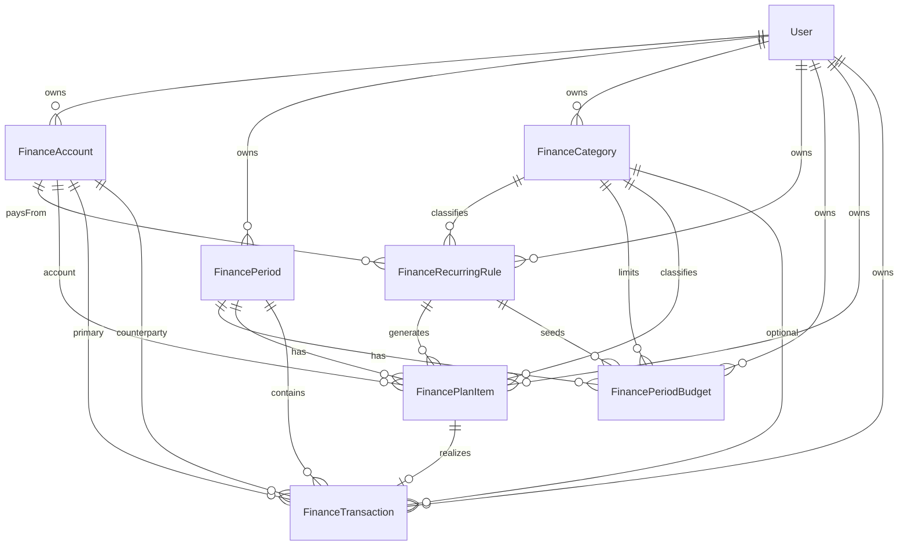

# Tablas SQL — Aplicación de finanzas personales

**Versión:** 1.0  
**Estado:** Diseño de modelo para implementación Prisma/PostgreSQL  
**Arquitectura:** [`docs/architecture/finance-app/architecture.md`](architecture.md)  
**Fuente funcional:** [`docs/briefs/finance-app/prd.md`](../../briefs/finance-app/prd.md)

> Este documento define el modelo relacional propuesto. Los saldos, totales y sugerencias **no** se persisten como fuente de verdad.

## 1. Convenciones

| Convención | Valor |
|------------|-------|
| Proveedor | PostgreSQL |
| ORM | Prisma (modelos PascalCase, columnas camelCase, sin `@@map` salvo necesidad futura) |
| Identificadores | `String @id @default(uuid())` |
| Ownership | `userId` en toda entidad de dominio financiero |
| Auditoría | `createdAt`, `updatedAt` |
| Dinero | `NUMERIC(14,2)` / Prisma `Decimal` — **nunca** `Float` |
| Fechas financieras | `DATE` (calendario); timestamps solo para auditoría |
| Soft-deactivate | Preferir `isActive = false` sobre borrado físico de cuentas/categorías/reglas |
| Cascade | `onDelete: Cascade` desde `User` hacia datos financieros del usuario (convención existente) |
| Historial | Desactivar no borra referencias; movimientos históricos conservan contexto |

Relación con el schema actual: se extiende `User` en [`repos/personal-api/prisma/schema.prisma`](../../../repos/personal-api/prisma/schema.prisma) con relaciones a las entidades `Finance*`.

## 2. Diagrama entidad-relación

## 3. Enums

### FinanceAccountType

| Valor | Uso |
|-------|-----|
| `DEBIT` | Cuenta de débito |
| `CASH` | Efectivo |
| `CREDIT` | Tarjeta de crédito |
| `SAVINGS` | Fondo de ahorro (p. ej. Klar) |
| `OTHER` | Otro |

### FinanceAccountStatus

| Valor | Uso |
|-------|-----|
| `ACTIVE` | Visible y usable en nuevos periodos |
| `INACTIVE` | Conservada para historial |

### FinanceCategoryGroup

| Valor | Uso |
|-------|-----|
| `MONTHLY_SERVICES` | Servicios mensuales |
| `GROCERIES` | Mandado |
| `OUTINGS` | Salidas |
| `EXTRAS` | Extras |
| `INCOME` | Ingresos |
| `TRANSFER` | Transferencias / retiros de efectivo |
| `CREDIT` | Compras o pagos de crédito |
| `SAVINGS` | Movimientos de fondo de ahorro |
| `OTHER` | Personalizado |

### FinancePlanItemStatus

| Valor | Uso |
|-------|-----|
| `PLANNED` | Entra en proyección / gasto esperado |
| `REALIZED` | Entra en gasto/ingreso real y saldo |
| `CANCELLED` | Conservado; no afecta totales |

### FinanceTransactionType

| Valor | Uso |
|-------|-----|
| `INCOME` | Ingreso recibido |
| `EXPENSE` | Gasto / consumo |
| `TRANSFER` | Transferencia interna (incl. retiro a efectivo) |
| `CREDIT_PURCHASE` | Compra con tarjeta |
| `CREDIT_PAYMENT` | Pago de deuda de tarjeta |
| `SAVINGS_DEPOSIT` | Depósito a fondo de ahorro |
| `SAVINGS_WITHDRAWAL` | Retiro desde fondo de ahorro |

## 4. Tablas de configuración y periodos

### FinanceAccount

Cuenta configurable del usuario (Débito, Efectivo, Crédito, Klar, otras).

| Columna | Tipo | Nulo | Notas |
|---------|------|------|-------|
| `id` | UUID | No | PK |
| `userId` | UUID | No | FK → `User.id` Cascade |
| `name` | TEXT | No | Nombre visible |
| `type` | `FinanceAccountType` | No | |
| `status` | `FinanceAccountStatus` | No | Default `ACTIVE` |
| `initialBalance` | NUMERIC(14,2) | No | Saldo de apertura; ≥ 0 para no crédito; crédito puede modelar deuda inicial aparte |
| `creditLimit` | NUMERIC(14,2) | Sí | Obligatorio cuando `type = CREDIT`; null en otros |
| `openingDebt` | NUMERIC(14,2) | Sí | Deuda inicial de tarjeta; default 0 si crédito |
| `statementDay` | INT | Sí | Día de corte opcional (1–31) |
| `paymentDay` | INT | Sí | Día de pago opcional (1–31) |
| `includeInProjections` | BOOLEAN | No | Default true |
| `startsOn` | DATE | No | Fecha desde la cual aplica |
| `createdAt` | TIMESTAMPTZ | No | |
| `updatedAt` | TIMESTAMPTZ | No | |

**Constraints / índices**

- PK `id`
- FK `userId` → `User`
- CHECK `creditLimit IS NULL OR creditLimit >= 0`
- CHECK `openingDebt IS NULL OR openingDebt >= 0`
- CHECK: si `type = CREDIT` entonces `creditLimit IS NOT NULL`
- INDEX `(userId, status)`
- INDEX `(userId, type)`
- UNIQUE parcial recomendada: un nombre activo único por usuario (`userId`, `name`) donde `status = ACTIVE`

Desactivar (`INACTIVE`) no elimina movimientos históricos.

### FinancePeriod

Periodo calendario mensual del usuario.

| Columna | Tipo | Nulo | Notas |
|---------|------|------|-------|
| `id` | UUID | No | PK |
| `userId` | UUID | No | FK → `User` Cascade |
| `year` | INT | No | p. ej. 2026 |
| `month` | INT | No | 1–12 |
| `label` | TEXT | Sí | Opcional (Enero, etc.) |
| `notes` | TEXT | Sí | |
| `version` | INT | No | Default 1; incrementa en mutaciones propagadas (concurrencia) |
| `createdAt` | TIMESTAMPTZ | No | |
| `updatedAt` | TIMESTAMPTZ | No | |

**Constraints / índices**

- UNIQUE `(userId, year, month)`
- CHECK `month BETWEEN 1 AND 12`
- CHECK `year >= 2000`
- INDEX `(userId, year, month)`

El estado “pasado / actual / futuro” es derivado de la fecha del sistema, no una columna persistida obligatoria.

### FinanceCategory

Categoría propia del usuario.

| Columna | Tipo | Nulo | Notas |
|---------|------|------|-------|
| `id` | UUID | No | PK |
| `userId` | UUID | No | FK → `User` Cascade |
| `group` | `FinanceCategoryGroup` | No | |
| `name` | TEXT | No | |
| `isSystemDefault` | BOOLEAN | No | true para bases Mandado/Salidas/Extras/Servicios |
| `isActive` | BOOLEAN | No | Default true |
| `sortOrder` | INT | No | Default 0 |
| `createdAt` | TIMESTAMPTZ | No | |
| `updatedAt` | TIMESTAMPTZ | No | |

**Constraints / índices**

- UNIQUE `(userId, group, name)`
- INDEX `(userId, isActive, sortOrder)`

### FinanceRecurringRule

Plantilla que genera expectativas mensuales (servicios, mandado, salidas, retiro, ingreso base).

| Columna | Tipo | Nulo | Notas |
|---------|------|------|-------|
| `id` | UUID | No | PK |
| `userId` | UUID | No | FK → `User` Cascade |
| `categoryId` | UUID | No | FK → `FinanceCategory` Restrict |
| `accountId` | UUID | Sí | FK → `FinanceAccount` Restrict; cuenta de pago/origen |
| `name` | TEXT | No | Spotify, Aurrerá 1, Retiro efectivo, etc. |
| `group` | `FinanceCategoryGroup` | No | Redundancia controlada para consultas |
| `amount` | NUMERIC(14,2) | No | Monto base por ocurrencia; ≥ 0 |
| `occurrencesPerMonth` | INT | No | Default 1; Mandado=3, Salidas=4, etc. |
| `expectedDayOfMonth` | INT | Sí | 1–31 opcional |
| `effectiveFromYear` | INT | No | Año desde el cual aplica |
| `effectiveFromMonth` | INT | No | Mes desde el cual aplica |
| `effectiveToYear` | INT | Sí | Null = abierta |
| `effectiveToMonth` | INT | Sí | |
| `isActive` | BOOLEAN | No | Default true |
| `createdAt` | TIMESTAMPTZ | No | |
| `updatedAt` | TIMESTAMPTZ | No | |

**Constraints / índices**

- CHECK `amount >= 0`
- CHECK `occurrencesPerMonth >= 1`
- CHECK `effectiveFromMonth BETWEEN 1 AND 12`
- CHECK `effectiveToMonth IS NULL OR effectiveToMonth BETWEEN 1 AND 12`
- INDEX `(userId, isActive)`
- INDEX `(userId, effectiveFromYear, effectiveFromMonth)`
- INDEX `(categoryId)`
- INDEX `(accountId)`

Un cambio aplicado “desde un mes” actualiza la vigencia y regenera/ajusta ítems y presupuestos de ese mes y futuros; los meses anteriores no se reescriben.

### FinancePeriodBudget

Límite por categoría dentro de un periodo (puede overridear la regla).

| Columna | Tipo | Nulo | Notas |
|---------|------|------|-------|
| `id` | UUID | No | PK |
| `userId` | UUID | No | FK → `User` Cascade |
| `periodId` | UUID | No | FK → `FinancePeriod` Cascade |
| `categoryId` | UUID | No | FK → `FinanceCategory` Restrict |
| `recurringRuleId` | UUID | Sí | FK → `FinanceRecurringRule` SetNull |
| `limitAmount` | NUMERIC(14,2) | No | ≥ 0 |
| `isOverride` | BOOLEAN | No | true si el usuario cambió solo este mes |
| `createdAt` | TIMESTAMPTZ | No | |
| `updatedAt` | TIMESTAMPTZ | No | |

**Constraints / índices**

- UNIQUE `(periodId, categoryId)`
- CHECK `limitAmount >= 0`
- INDEX `(userId, periodId)`
- INDEX `(recurringRuleId)`

**Ownership:** `userId` debe coincidir con el de `periodId` y `categoryId` (validado en servicio; opcionalmente con constraint/trigger).

## 5. Planes e ítems esperados

### FinancePlanItem

Representa servicios, compras de Mandado, Salidas, Extras, ingresos planeados y retiros/transferencias planeadas.

| Columna | Tipo | Nulo | Notas |
|---------|------|------|-------|
| `id` | UUID | No | PK |
| `userId` | UUID | No | FK → `User` Cascade |
| `periodId` | UUID | No | FK → `FinancePeriod` Cascade |
| `categoryId` | UUID | No | FK → `FinanceCategory` Restrict |
| `accountId` | UUID | No | FK → `FinanceAccount` Restrict |
| `counterpartyAccountId` | UUID | Sí | Para transferencias planeadas (efectivo, Klar, TDC) |
| `recurringRuleId` | UUID | Sí | Origen de plantilla; SetNull si se elimina regla |
| `concept` | TEXT | No | |
| `expectedDate` | DATE | No | Fecha calendario exacta |
| `plannedAmount` | NUMERIC(14,2) | No | ≥ 0 |
| `realizedAmount` | NUMERIC(14,2) | Sí | ≥ 0 cuando status = REALIZED |
| `status` | `FinancePlanItemStatus` | No | Default `PLANNED` |
| `notes` | TEXT | Sí | Observaciones |
| `isHidden` | BOOLEAN | No | Preferencia de vista; **no** afecta cálculos |
| `transactionId` | UUID | Sí | FK → `FinanceTransaction` Unique; un ítem realizado → una transacción |
| `createdAt` | TIMESTAMPTZ | No | |
| `updatedAt` | TIMESTAMPTZ | No | |

**Constraints / índices**

- CHECK `plannedAmount >= 0`
- CHECK `realizedAmount IS NULL OR realizedAmount >= 0`
- CHECK: si `status = REALIZED` entonces `realizedAmount IS NOT NULL`
- CHECK: si `status = PLANNED` entonces `transactionId IS NULL`
- UNIQUE `(transactionId)` donde no null
- INDEX `(userId, periodId, status)`
- INDEX `(userId, expectedDate)`
- INDEX `(recurringRuleId)`
- INDEX `(categoryId)`
- INDEX `(accountId)`

Un ítem pertenece a un solo usuario/periodo. Transición a `REALIZED` crea como máximo una `FinanceTransaction` vinculada.

## 6. Movimientos y transferencias

### FinanceTransaction

Libro de movimientos reales (y, cuando aplique, el lado realizado de un plan).

| Columna | Tipo | Nulo | Notas |
|---------|------|------|-------|
| `id` | UUID | No | PK |
| `userId` | UUID | No | FK → `User` Cascade |
| `periodId` | UUID | No | FK → `FinancePeriod` Cascade; periodo de la fecha de ocurrencia |
| `type` | `FinanceTransactionType` | No | |
| `accountId` | UUID | No | Cuenta principal |
| `counterpartyAccountId` | UUID | Sí | Contraparte en transferencias / pagos |
| `categoryId` | UUID | Sí | Null en transferencias puras si no aplica |
| `planItemId` | UUID | Sí | FK → `FinancePlanItem` SetNull; inverso de `transactionId` |
| `transferGroupId` | UUID | Sí | Agrupa los dos lados lógicos de una transferencia |
| `occurredOn` | DATE | No | Fecha calendario exacta |
| `amount` | NUMERIC(14,2) | No | Siempre ≥ 0; el tipo define dirección |
| `concept` | TEXT | No | |
| `notes` | TEXT | Sí | |
| `isHidden` | BOOLEAN | No | Solo vista; no cambia totales |
| `createdAt` | TIMESTAMPTZ | No | |
| `updatedAt` | TIMESTAMPTZ | No | |

**Semántica por tipo**

| Tipo | Cuenta principal | Contraparte | ¿Cuenta como gasto? |
|------|------------------|-------------|---------------------|
| `INCOME` | Destino (Débito) | — | No |
| `EXPENSE` | Origen (Débito/Efectivo) | — | Sí |
| `TRANSFER` | Origen | Destino (Efectivo/Klar/…) | No |
| `CREDIT_PURCHASE` | Tarjeta crédito | — | Sí (consumo); aumenta deuda |
| `CREDIT_PAYMENT` | Origen (Débito/Klar) | Tarjeta crédito | No (no re-cuenta compra) |
| `SAVINGS_DEPOSIT` | Origen | Fondo ahorro | No |
| `SAVINGS_WITHDRAWAL` | Fondo ahorro | Destino | No |

Retiro base de Salidas y mandado ($6,250): `TRANSFER` desde Débito hacia Efectivo.

Compra a crédito: `CREDIT_PURCHASE` en la tarjeta.  
Pago de tarjeta: `CREDIT_PAYMENT` con origen y tarjeta como contraparte.

**Constraints / índices**

- CHECK `amount >= 0`
- CHECK: tipos `TRANSFER`, `CREDIT_PAYMENT`, `SAVINGS_DEPOSIT`, `SAVINGS_WITHDRAWAL` requieren `counterpartyAccountId`
- CHECK: `accountId <> counterpartyAccountId` cuando contraparte no null
- INDEX `(userId, occurredOn)`
- INDEX `(userId, periodId)`
- INDEX `(userId, accountId, occurredOn)`
- INDEX `(transferGroupId)`
- INDEX `(planItemId)`
- INDEX `(type)`

Ownership: `userId` de cuentas, periodo, categoría e ítem debe coincidir (validación de servicio; impedir enlaces cruzados entre usuarios).

## 7. Relación inversa PlanItem ↔ Transaction

Para evitar ciclos de FK rígidos en migración:

1. Crear ambas tablas.
2. Preferir **una** dirección autoritativa:
   - Opción A (recomendada): `FinancePlanItem.transactionId` UNIQUE opcional; `FinanceTransaction.planItemId` opcional sin UNIQUE cruzada obligatoria.
   - El servicio mantiene ambos campos en la misma transacción DB.

No permitir dos transacciones realizadas para el mismo ítem.

## 8. Fuente de verdad vs derivados

### Persistido (fuente de verdad)

- Cuentas, periodos, categorías, reglas, presupuestos, ítems planeados, transacciones.

### No persistido en MVP (derivado en `finance.calculations` / `finance.projection`)

| Derivado | Origen |
|----------|--------|
| Saldo actual por cuenta | `initialBalance` + movimientos realizados |
| Crédito disponible | `creditLimit − deuda` |
| Deuda actual | `openingDebt` + compras crédito − pagos |
| Gasto esperado | Ítems/presupuestos planeados + compras crédito planeadas |
| Gasto real | Movimientos `EXPENSE` / `CREDIT_PURCHASE` realizados |
| Ahorro esperado (efectivo al cierre) | Ingresos y salidas de efectivo proyectadas |
| Ahorro real | Misma lógica con realizados |
| Alertas y sugerencias | Reglas sobre derivados |
| Simulación no confirmada | Solo en memoria / respuesta de previsualización |

## 9. Defaults al crear usuario o primer periodo

Sembrados por `finance.defaults.ts` (por usuario), no como catálogo global compartido:

| Default | Detalle |
|---------|---------|
| Categorías base | Servicios, Mandado, Salidas, Extras, Transferencias, Crédito, Ahorro |
| Mandado | 3 ítems planeados × $2,000 → límite $6,000 |
| Salidas | 4 ítems × $500 → límite $2,000 |
| Extras | límite $1,400 |
| Retiro efectivo | regla/transferencia planeada $6,250 Débito → Efectivo |
| Cuentas sugeridas | Débito, Efectivo, Crédito, Fondo Klar (creables; no forzadas sin acción del usuario) |

## 10. Orden de migración

1. Enums Prisma.
2. Tablas dependientes de `User`: `FinanceAccount`, `FinancePeriod`, `FinanceCategory`.
3. `FinanceRecurringRule`, `FinancePeriodBudget`.
4. `FinancePlanItem`, `FinanceTransaction` (+ FKs cruzadas opcionales).
5. Índices y CHECKs.
6. Actualizar relación `User` en `schema.prisma`.
7. Actualizar `tests/helpers/setup.ts` para limpiar tablas `Finance*` en orden seguro (hijos primero).
8. Seeds de defaults por usuario en servicio (no migración global de montos personales).

### Compatibilidad operativa

- Migración **append-only** bajo `prisma/migrations/` con nombre cronológico, por ejemplo `20260813120000_add_finance_tables/`.
- Validar con `npm run db:migrate` (dev) y `npm run db:migrate:deploy` (CI/prod).
- **No** usar `npm run db:push` como sustituto en producción.
- No introducir `Float` para dinero en ningún modelo nuevo.

## 11. Limpieza de pruebas

Orden sugerido en `beforeEach` (después de tokens/fitness/groceries según dependencias):

1. `FinanceTransaction`
2. `FinancePlanItem`
3. `FinancePeriodBudget`
4. `FinanceRecurringRule`
5. `FinanceCategory`
6. `FinancePeriod`
7. `FinanceAccount`
8. `User` (ya existente)

## 12. Mapeo rápido PRD → tablas

| Requisito PRD | Tabla / mecanismo |
|---------------|-------------------|
| Login y datos propios | `User` + `userId` en todas las filas |
| Meses editables | `FinancePeriod` |
| Propagación futura | reglas + regeneración de ítems/presupuestos + `version` |
| Cuentas configurables | `FinanceAccount` |
| Ingreso mensual / extra | `FinanceRecurringRule` + `FinancePlanItem` / `FinanceTransaction` tipo `INCOME` |
| Servicios, Mandado, Salidas, Extras | categorías + reglas + ítems + presupuestos |
| Retiro $6,250 | `TRANSFER` / ítem planeado de transferencia |
| Fecha exacta y estados | `expectedDate` / `occurredOn` + `FinancePlanItemStatus` |
| Mostrar/ocultar | `isHidden` |
| Crédito y pagos | `CREDIT_PURCHASE` / `CREDIT_PAYMENT` |
| Klar | cuenta `SAVINGS` + depósitos/retiros |
| Simulación | proyección en servicio; sin tabla de borrador en MVP |
| Resumen y sugerencias | derivados; sin tablas |
