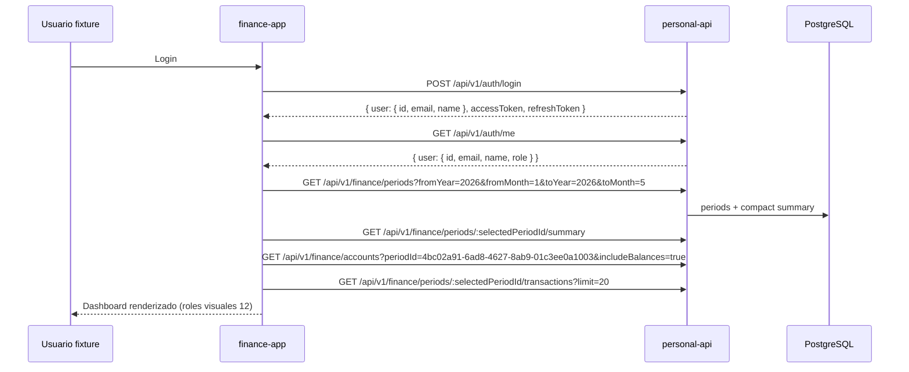

# Integración — Tracer bullet dashboard

**Tipo:** Integration
**Depende de:** [`12-ux-ui-dashboard-and-timeline.md`](12-ux-ui-dashboard-and-timeline.md), [`17-integration-finance-api-client-and-cache.md`](17-integration-finance-api-client-and-cache.md), [`16-integration-auth-and-http-client.md`](16-integration-auth-and-http-client.md), [`06-backend-database-and-migrations.md`](06-backend-database-and-migrations.md)
**Implementa:** Primera rebanada vertical login → resumen del periodo seleccionado → cuentas/movimientos → dashboard renderizado; seed/fixture de usuario y datos mínimos; estados loading/empty/error y verificación ownership en `repos/finance-app` + seed backend.
**No incluye:** Mutaciones con propagación (`19`), flujos crédito completos (`20`), runbook E2E completo (`21`), commits.

## Resultado

Tras login con usuario provisionado, el usuario llega al resumen del periodo
**seleccionado explícitamente** por la fixture: Marzo de 2026. El dashboard
muestra hero de ahorro esperado, efectivo disponible, timeline compacta,
paneles crédito/efectivo/Klar y sugerencias — con estados loading, empty y
error por zona. Un segundo usuario no ve datos del primero (404/empty
ownership). No se usa la fecha del sistema para elegir el periodo foco; la
clasificación `PAST | CURRENT | FUTURE` sigue siendo informativa.

## Contratos de entrada y salida

### Flujo tracer bullet



### Artefactos de seed que se crearán antes del runbook

| Artefacto | Ruta |
|-----------|------|
| Seed idempotente (resolución de identidades + ledger) | `repos/personal-api/scripts/seed-finance-tracer.ts` |
| Script npm a registrar | `db:seed-finance-tracer` → registra `repos/personal-api/scripts/seed-finance-tracer.ts` |
| Limpieza idempotente | `repos/personal-api/scripts/clean-finance-tracer.ts` |
| Script npm a registrar | `db:clean-finance-tracer` → registra `repos/personal-api/scripts/clean-finance-tracer.ts` |
| Test integración | `repos/personal-api/tests/integration/finance-tracer-seed.test.ts` |

Estos scripts son **artefactos planificados**, no comandos que ya existan. El
runbook `21` solo puede ejecutar sus nombres después de crear los dos archivos,
registrarlos en `repos/personal-api/package.json` y verificar el test de seed.

### Identidades A/B — provisión e IDs de runtime

Los usuarios A/B se provisionan por admin con emails/passwords fijos y sin
campo `id`. El UUID de cada uno es el que asigne `POST /api/v1/users`; no se
fija mediante Prisma, helper de test ni registry. Antes de escribir una fila
`Finance*`, el seed inicia sesión con cada credencial y resuelve el owner real
por `GET /api/v1/auth/me`.

| Fixture | Email | Password | `name` | `role` top-level | ID a usar |
|---------|-------|----------|--------|------------------|------------|
| A | `finance.integration@example.com` | `FinanceTest1!` | `Finance Integration User` | `READ_ONLY` | `$env:FINANCE_USER_ID`, `$me.user.id` tras login → `/auth/me` |
| B | `finance.other@example.com` | `FinanceOtherTest1!` | `Finance Other Integration User` | `READ_ONLY` | `$env:FINANCE_OTHER_USER_ID`, `$me.user.id` tras login → `/auth/me` |

El siguiente bloque es la precondición reproducible del seed; obtiene
`$adminLogin` después de sembrar el admin con `ADMIN_EMAIL`,
`ADMIN_PASSWORD` y `ADMIN_NAME`. Un `409` no basta para reutilizar un email:
obliga a comprobar la contraseña fixture y la identidad completa; si falla, el
bloque aborta en lugar de borrar automáticamente un usuario no verificado.

```powershell
# Solo si este tracer se prepara sin haber ejecutado antes el bootstrap de 16.
Set-Location repos/personal-api
$env:ADMIN_EMAIL = 'admin@example.com'
$env:ADMIN_PASSWORD = 'secret123'
$env:ADMIN_NAME = 'Initial Admin'
npm run db:seed-admin
```

```powershell
# API activa; role permanece top-level y el payload jamás incluye id.
$adminLoginBody = @{
  email = $env:ADMIN_EMAIL
  password = $env:ADMIN_PASSWORD
} | ConvertTo-Json -Compress

$adminLogin = curl.exe -s -X POST http://localhost:3000/api/v1/auth/login `
  -H 'Content-Type: application/json' `
  -d $adminLoginBody | ConvertFrom-Json
if ([string]::IsNullOrWhiteSpace($adminLogin.accessToken)) {
  throw 'No fue posible autenticar al admin para provisionar las fixtures.'
}

$fixtureUsers = @(
  @{
    email = 'finance.integration@example.com'
    password = 'FinanceTest1!'
    name = 'Finance Integration User'
    role = 'READ_ONLY'
  },
  @{
    email = 'finance.other@example.com'
    password = 'FinanceOtherTest1!'
    name = 'Finance Other Integration User'
    role = 'READ_ONLY'
  }
)

$fixtureSessions = @{}

function Try-ResolveFixtureSession {
  param([Parameter(Mandatory)] [hashtable] $FixtureUser)

  $loginBody = @{
    email = $FixtureUser.email
    password = $FixtureUser.password
  } | ConvertTo-Json -Compress

  try {
    $login = curl.exe -s -X POST http://localhost:3000/api/v1/auth/login `
      -H 'Content-Type: application/json' `
      -d $loginBody | ConvertFrom-Json
    if (
      [string]::IsNullOrWhiteSpace($login.accessToken) -or
      [string]::IsNullOrWhiteSpace($login.refreshToken) -or
      $null -eq $login.user -or
      [string]::IsNullOrWhiteSpace($login.user.id) -or
      $login.user.email -cne $FixtureUser.email -or
      $login.user.name -cne $FixtureUser.name
    ) {
      return $null
    }

    $me = curl.exe -s http://localhost:3000/api/v1/auth/me `
      -H "Authorization: Bearer $($login.accessToken)" | ConvertFrom-Json
  } catch {
    return $null
  }

  if (
    $null -eq $me.user -or
    [string]::IsNullOrWhiteSpace($me.user.id) -or
    $login.user.id -cne $me.user.id -or
    $me.user.email -cne $FixtureUser.email -or
    $me.user.name -cne $FixtureUser.name -or
    $me.user.role -cne $FixtureUser.role
  ) {
    return $null
  }

  return [pscustomobject]@{
    accessToken = $login.accessToken
    id = $me.user.id
  }
}

foreach ($fixtureUser in $fixtureUsers) {
  $provisionBody = $fixtureUser | ConvertTo-Json -Compress
  $status = (curl.exe -s -o NUL -w '%{http_code}' -X POST http://localhost:3000/api/v1/users `
    -H "Authorization: Bearer $($adminLogin.accessToken)" `
    -H 'Content-Type: application/json' `
    -d $provisionBody).Trim()
  if ($status -notin @('200', '201', '409')) {
    throw "No se pudo provisionar $($fixtureUser.email): HTTP $status"
  }

  # Tras 409, este login con password fixture es obligatorio.
  $session = Try-ResolveFixtureSession $fixtureUser
  if ($null -eq $session) {
    throw (
      "El email $($fixtureUser.email) ya existe o no es la fixture esperada. " +
      "Abortado: con el admin obtenido mediante ADMIN_EMAIL, ADMIN_PASSWORD y ADMIN_NAME, " +
      "identifica y elimina/recrea solo el usuario cuyo email, name y role coincidan exactamente " +
      "con esta fixture; nunca borres otro usuario. Después repite la provisión."
    )
  }
  $fixtureSessions[$fixtureUser.email] = $session
}

$env:FINANCE_USER_EMAIL = $fixtureUsers[0].email
$env:FINANCE_USER_PASSWORD = $fixtureUsers[0].password
$env:FINANCE_USER_ID = $fixtureSessions[$env:FINANCE_USER_EMAIL].id
$env:FINANCE_OTHER_USER_EMAIL = $fixtureUsers[1].email
$env:FINANCE_OTHER_USER_PASSWORD = $fixtureUsers[1].password
$env:FINANCE_OTHER_USER_ID = $fixtureSessions[$env:FINANCE_OTHER_USER_EMAIL].id
```

`repos/personal-api/scripts/seed-finance-tracer.ts` repite esa resolución (no
confía solo en valores exportados), desenvuelve y valida
`$me.user.id/email/name/role`, verifica que `$login.user.id` coincida con
`$me.user.id` además de email ↔ `id`, y usa esos IDs runtime como `userId` al
crear las filas Finance. El ledger se crea solo
para A; B queda provisionado, autenticable y sin filas Finance para probar
ownership.

### Fixture ID registry — solo entidades Finance

Esta es la tabla canónica de UUID v4 fijos para entidades Finance. Todo JSON,
URL concreta, seed y aserción de los specs `17`–`21` que refiera un periodo,
cuenta, categoría, regla, ítem, presupuesto o transacción del tracer debe usar
literalmente uno de estos UUIDs. Excluye deliberadamente `User.id`: A/B se
identifican por email y sus IDs runtime se resuelven como `$me.user.id` tras
login → `/auth/me`.
Los aliases de esta columna solo son etiquetas documentales, nunca payloads.

| Etiqueta | UUID v4 fijo | Uso |
|----------|--------------|-----|
| Enero 2026 | `4bc02a91-6ad8-4627-8ab9-01c3ee0a1001` | Periodo A |
| Febrero 2026 | `4bc02a91-6ad8-4627-8ab9-01c3ee0a1002` | Periodo A |
| Marzo 2026 | `4bc02a91-6ad8-4627-8ab9-01c3ee0a1003` | Periodo foco A |
| Abril 2026 | `4bc02a91-6ad8-4627-8ab9-01c3ee0a1004` | Periodo A |
| Mayo 2026 | `4bc02a91-6ad8-4627-8ab9-01c3ee0a1005` | Periodo A |
| Cuenta Débito | `7f5c8b0d-771c-4d4c-8cbd-7e7f318f1001` | Cuenta A |
| Cuenta Efectivo | `7f5c8b0d-771c-4d4c-8cbd-7e7f318f1002` | Cuenta A |
| Cuenta Crédito | `7f5c8b0d-771c-4d4c-8cbd-7e7f318f1003` | Cuenta A |
| Cuenta Klar | `7f5c8b0d-771c-4d4c-8cbd-7e7f318f1004` | Cuenta A |
| Categoría Ingreso | `9bde3079-486b-44f1-97d5-49a0d3e91001` | `INCOME` |
| Categoría Servicios | `9bde3079-486b-44f1-97d5-49a0d3e91002` | `MONTHLY_SERVICES` |
| Categoría Mandado | `9bde3079-486b-44f1-97d5-49a0d3e91003` | `GROCERIES` |
| Categoría Salidas | `9bde3079-486b-44f1-97d5-49a0d3e91004` | `OUTINGS` |
| Categoría Extras | `9bde3079-486b-44f1-97d5-49a0d3e91005` | `EXTRAS` |
| Categoría Transferencias | `9bde3079-486b-44f1-97d5-49a0d3e91006` | `TRANSFER` |
| Categoría Crédito | `9bde3079-486b-44f1-97d5-49a0d3e91007` | `CREDIT` |
| Categoría Ahorro | `9bde3079-486b-44f1-97d5-49a0d3e91008` | `SAVINGS` |
| Presupuesto Servicios Marzo | `7ac0a3f5-3c1e-4d93-8d1f-7c5d18a65001` | Límite $10,350.00 |
| Presupuesto Mandado Marzo | `7ac0a3f5-3c1e-4d93-8d1f-7c5d18a65002` | Límite $6,000.00 |
| Presupuesto Salidas Marzo | `7ac0a3f5-3c1e-4d93-8d1f-7c5d18a65003` | Límite $2,000.00 |
| Presupuesto Extras Marzo | `7ac0a3f5-3c1e-4d93-8d1f-7c5d18a65004` | Límite $1,400.00 |
| Regla ingreso | `1c429e75-5c2d-407f-8993-b673f6d21001` | $10,000 mensual |
| Regla Spotify | `1c429e75-5c2d-407f-8993-b673f6d21002` | Servicio $350 |
| Regla Mandado | `1c429e75-5c2d-407f-8993-b673f6d21003` | 3 × $2,000 |
| Regla Salidas | `1c429e75-5c2d-407f-8993-b673f6d21004` | 4 × $500 |
| Regla retiro | `1c429e75-5c2d-407f-8993-b673f6d21005` | Transferencia $6,250 |
| Regla renta | `1c429e75-5c2d-407f-8993-b673f6d21006` | Compromiso futuro |
| Ítem ingreso Enero | `d0bf673e-d70c-4a8d-9ed2-7418f2073001` | Vinculado al ingreso realizado |
| Ítem ingreso Febrero | `d0bf673e-d70c-4a8d-9ed2-7418f2073002` | Vinculado al ingreso realizado |
| Ítem ingreso Marzo | `d0bf673e-d70c-4a8d-9ed2-7418f2073003` | Vinculado al ingreso realizado |
| Ítem renta Marzo | `d0bf673e-d70c-4a8d-9ed2-7418f2073004` | Planeado $10,000 |
| Ítem esencial Abril | `d0bf673e-d70c-4a8d-9ed2-7418f2073005` | Planeado $23,000 |
| Ítem ingreso Mayo | `d0bf673e-d70c-4a8d-9ed2-7418f2073006` | Planeado $10,000 |
| Ítem esencial Mayo | `d0bf673e-d70c-4a8d-9ed2-7418f2073007` | Planeado $10,000 |
| Tx ingreso Enero | `e8c54f93-3b6d-4c28-8e8b-4fcd709e4001` | `INCOME` |
| Tx gasto Enero | `e8c54f93-3b6d-4c28-8e8b-4fcd709e4002` | `EXPENSE` |
| Tx ingreso Febrero | `e8c54f93-3b6d-4c28-8e8b-4fcd709e4003` | `INCOME` |
| Tx gasto Febrero | `e8c54f93-3b6d-4c28-8e8b-4fcd709e4004` | `EXPENSE` |
| Tx ingreso Marzo | `e8c54f93-3b6d-4c28-8e8b-4fcd709e4005` | `INCOME` |
| Tx Spotify Marzo | `e8c54f93-3b6d-4c28-8e8b-4fcd709e4006` | `EXPENSE` |
| Tx Mandado 1 Marzo | `e8c54f93-3b6d-4c28-8e8b-4fcd709e4007` | `EXPENSE` |
| Tx Mandado 2 Marzo | `e8c54f93-3b6d-4c28-8e8b-4fcd709e4008` | `EXPENSE` |
| Tx Mandado 3 Marzo | `e8c54f93-3b6d-4c28-8e8b-4fcd709e4009` | `EXPENSE` |
| Tx salida Marzo | `e8c54f93-3b6d-4c28-8e8b-4fcd709e4010` | `EXPENSE` |
| Tx extra Marzo | `e8c54f93-3b6d-4c28-8e8b-4fcd709e4011` | `EXPENSE`, editable |
| Tx compra crédito Marzo | `e8c54f93-3b6d-4c28-8e8b-4fcd709e4012` | `CREDIT_PURCHASE` |
| Tx retiro efectivo Marzo | `e8c54f93-3b6d-4c28-8e8b-4fcd709e4013` | `TRANSFER` |
| Tx pago crédito Abril | `e8c54f93-3b6d-4c28-8e8b-4fcd709e4014` | `CREDIT_PAYMENT` |
| Tx depósito Klar Abril | `e8c54f93-3b6d-4c28-8e8b-4fcd709e4015` | `SAVINGS_DEPOSIT` |
| Tx retiro Klar Abril | `e8c54f93-3b6d-4c28-8e8b-4fcd709e4016` | `SAVINGS_WITHDRAWAL` |

### Ledger canónico de la fixture

El seed es idempotente por los UUID fijos Finance del registro y por el
`userId` de A resuelto en runtime. `selectedPeriodId` se fija a
`4bc02a91-6ad8-4627-8ab9-01c3ee0a1003`; por tanto, **Marzo 2026 es el foco
determinista**, incluso si el reloj clasifica ese mes como pasado. Nunca usa un
UUID fijo para crear, buscar o limpiar a User A/B.

| Cuenta | UUID | Apertura 2026-01-01 | Regla |
|--------|------|---------------------|-------|
| Débito | `7f5c8b0d-771c-4d4c-8cbd-7e7f318f1001` | $20,000.00 | Participa en ahorro |
| Efectivo | `7f5c8b0d-771c-4d4c-8cbd-7e7f318f1002` | $1,000.00 | Participa en ahorro |
| Crédito | `7f5c8b0d-771c-4d4c-8cbd-7e7f318f1003` | Deuda $0.00; límite $50,000.00 | No es efectivo |
| Klar | `7f5c8b0d-771c-4d4c-8cbd-7e7f318f1004` | $12,000.00 | Saldo separado de ahorro |

| Regla | Categoría / cuenta | Monto y vigencia |
|-------|--------------------|------------------|
| `1c429e75-5c2d-407f-8993-b673f6d21001` | Ingreso / Débito | $10,000.00 mensual Ene–May |
| `1c429e75-5c2d-407f-8993-b673f6d21002` | Servicios / Débito | Spotify $350.00 |
| `1c429e75-5c2d-407f-8993-b673f6d21003` | Mandado / Efectivo | 3 × $2,000.00 |
| `1c429e75-5c2d-407f-8993-b673f6d21004` | Salidas / Efectivo | 4 × $500.00 |
| `1c429e75-5c2d-407f-8993-b673f6d21005` | Transferencias / Débito → Efectivo | $6,250.00 |
| `1c429e75-5c2d-407f-8993-b673f6d21006` | Servicios / Débito | Renta y compromisos futuros |

| Ítem planeado | Periodo | Categoría | Cuenta | Estado / monto |
|---------------|---------|-----------|--------|----------------|
| `d0bf673e-d70c-4a8d-9ed2-7418f2073001` | Enero | Ingreso | Débito | REALIZED, $10,000.00; vinculado a `e8c54f93-3b6d-4c28-8e8b-4fcd709e4001` |
| `d0bf673e-d70c-4a8d-9ed2-7418f2073002` | Febrero | Ingreso | Débito | REALIZED, $10,000.00; vinculado a `e8c54f93-3b6d-4c28-8e8b-4fcd709e4003` |
| `d0bf673e-d70c-4a8d-9ed2-7418f2073003` | Marzo | Ingreso | Débito | REALIZED, $10,000.00; vinculado a `e8c54f93-3b6d-4c28-8e8b-4fcd709e4005` |
| `d0bf673e-d70c-4a8d-9ed2-7418f2073004` | Marzo | Servicios | Débito | PLANNED, $10,000.00 |
| `d0bf673e-d70c-4a8d-9ed2-7418f2073005` | Abril | Servicios | Débito | PLANNED, $23,000.00 |
| `d0bf673e-d70c-4a8d-9ed2-7418f2073006` | Mayo | Ingreso | Débito | PLANNED, $10,000.00 |
| `d0bf673e-d70c-4a8d-9ed2-7418f2073007` | Mayo | Servicios | Débito | PLANNED, $10,000.00 |

| Transacción | Periodo | Tipo | Origen → destino | Categoría | Monto |
|-------------|---------|------|------------------|-----------|-------|
| `e8c54f93-3b6d-4c28-8e8b-4fcd709e4001` | Enero | `INCOME` | Débito | Ingreso | $10,000.00 |
| `e8c54f93-3b6d-4c28-8e8b-4fcd709e4002` | Enero | `EXPENSE` | Débito | Extras | $2,000.00 |
| `e8c54f93-3b6d-4c28-8e8b-4fcd709e4003` | Febrero | `INCOME` | Débito | Ingreso | $10,000.00 |
| `e8c54f93-3b6d-4c28-8e8b-4fcd709e4004` | Febrero | `EXPENSE` | Débito | Servicios | $2,000.00 |
| `e8c54f93-3b6d-4c28-8e8b-4fcd709e4005` | Marzo | `INCOME` | Débito | Ingreso | $10,000.00 |
| `e8c54f93-3b6d-4c28-8e8b-4fcd709e4006` | Marzo | `EXPENSE` | Débito | Servicios | $350.00 |
| `e8c54f93-3b6d-4c28-8e8b-4fcd709e4007` | Marzo | `EXPENSE` | Efectivo | Mandado | $2,000.00 |
| `e8c54f93-3b6d-4c28-8e8b-4fcd709e4008` | Marzo | `EXPENSE` | Efectivo | Mandado | $2,000.00 |
| `e8c54f93-3b6d-4c28-8e8b-4fcd709e4009` | Marzo | `EXPENSE` | Efectivo | Mandado | $2,000.00 |
| `e8c54f93-3b6d-4c28-8e8b-4fcd709e4010` | Marzo | `EXPENSE` | Efectivo | Salidas | $500.00 |
| `e8c54f93-3b6d-4c28-8e8b-4fcd709e4011` | Marzo | `EXPENSE` | Débito | Extras | $500.00 |
| `e8c54f93-3b6d-4c28-8e8b-4fcd709e4012` | Marzo | `CREDIT_PURCHASE` | Crédito | Crédito | $3,500.00 |
| `e8c54f93-3b6d-4c28-8e8b-4fcd709e4013` | Marzo | `TRANSFER` | Débito → Efectivo | Transferencias | $6,250.00 |
| `e8c54f93-3b6d-4c28-8e8b-4fcd709e4014` | Abril | `CREDIT_PAYMENT` | Débito → Crédito | Crédito | $3,500.00 |
| `e8c54f93-3b6d-4c28-8e8b-4fcd709e4015` | Abril | `SAVINGS_DEPOSIT` | Débito → Klar | Ahorro | $2,000.00 |
| `e8c54f93-3b6d-4c28-8e8b-4fcd709e4016` | Abril | `SAVINGS_WITHDRAWAL` | Klar → Débito | Ahorro | $500.00 |

Los presupuestos de Marzo son Servicios
`7ac0a3f5-3c1e-4d93-8d1f-7c5d18a65001` ($10,350.00), Mandado
`7ac0a3f5-3c1e-4d93-8d1f-7c5d18a65002` ($6,000.00), Salidas
`7ac0a3f5-3c1e-4d93-8d1f-7c5d18a65003` ($2,000.00) y Extras
`7ac0a3f5-3c1e-4d93-8d1f-7c5d18a65004` ($1,400.00). Conforme a `08`, el gasto
esperado de Marzo es `$19,400.00`: renta planeada `$10,000.00` cubre el
presupuesto de Servicios y se cuenta una vez; Mandado `$6,000.00`, Salidas
`$2,000.00` y Extras `$1,400.00` no tienen plan item aplicable y aportan su
fallback activo una vez cada uno. Los `$10,850.00` de consumos ya realizados
aparecen solo en gasto real. El retiro, el pago de tarjeta y los movimientos
Klar no se suman como gasto.

En el desglose de categorías que consume `17`, Servicios tiene
`expected: "10000.00"` por el plan item; Mandado, Salidas y Extras tienen
`expected` igual al fallback activo. `remainingActual` siempre es
`limit − actual` y `remainingProjected` descuenta únicamente el consumo
pendiente, sin volver a contar lo realizado; por eso los cuatro valores
proyectados son `"0.00"` en Marzo.

| Periodo | Ingreso esp./rec. | Gasto esp./real | Ahorro esp./real | Efectivo | Crédito disp. | Klar |
|---------|-------------------|-----------------|------------------|-----------|---------------|------|
| Enero | $10,000.00 / $10,000.00 | $2,000.00 / $2,000.00 | $29,000.00 / $29,000.00 | $1,000.00 | $50,000.00 | $12,000.00 |
| Febrero | $10,000.00 / $10,000.00 | $2,000.00 / $2,000.00 | $37,000.00 / $37,000.00 | $1,000.00 | $50,000.00 | $12,000.00 |
| Marzo | $10,000.00 / $10,000.00 | $19,400.00 / $10,850.00 | $29,650.00 / $39,650.00 | $750.00 | $46,500.00 | $12,000.00 |
| Abril | $0.00 / $0.00 | $23,000.00 / $0.00 | $1,650.00 / $34,650.00 | $750.00 | $50,000.00 | $13,500.00 |
| Mayo | $10,000.00 / $0.00 | $10,000.00 / $0.00 | $1,650.00 / $34,650.00 | $750.00 | $50,000.00 | $13,500.00 |

El ahorro esperado de Marzo sale de Débito proyectado
`$36,000 + $10,000 − $350 − $500 − $6,250 − $10,000 = $28,900`
más Efectivo `$1,000 + $6,250 − $6,500 = $750`. El ahorro real omite
la renta aún planeada: `$38,900 + $750 = $39,650`. Así, el retiro es
insuficiente por `$250` frente a los `$6,500` reales de Mandado + Salidas.
Los fallbacks de presupuesto solo completan `expectedExpense`; no inventan
transacciones ni flujos de cuenta, por lo que no alteran esta ecuación canónica
de `expectedSavings`.

### Contexto determinista de sugerencias

El seed calcula y entrega a `buildSuggestions` el `SuggestionContext` completo
documentado en la fixture de `17`: compara Marzo contra el ahorro esperado de
Febrero `$37,000.00`, usa los thresholds explícitos de `08` y agrega el pago de
crédito de Abril `e8c54f93-3b6d-4c28-8e8b-4fcd709e4014` ($3,500.00). Tras ese
pago y los compromisos de efectivo de Abril, el líquido proyectado es `$1,650.00`,
por debajo del piso `$2,000.00`.

Esa fila futura es el único fundamento de `CREDIT_PAYMENT_CASH_PRESSURE` para el
summary de Marzo. Si el seed no puede construir ese efecto futuro, debe entregar
`futureCreditPaymentCashEffects: []` y no emitir esa sugerencia; no se deduce del
saldo actual ni de la fecha del sistema.

### Fixture — login → dashboard (expectativas UI)

**Valores esperados con `selectedPeriodId` Marzo** (roles visuales `12`):

| Rol visual | Valor esperado |
|------------|----------------|
| Ahorro esperado (hero) | `$29,650.00` |
| Ahorro real | `$39,650.00` |
| Efectivo disponible (Débito + Efectivo real) | `$39,650.00` |
| Gasto esperado | `$19,400.00` |
| Gasto real | `$10,850.00` |
| Crédito disponible | `$46,500.00` |
| Saldo Klar | `$12,000.00` |
| Retiro efectivo | `$6,250.00` (transferencia, no gasto) |
| Efectivo restante | `$750.00` |
| Cobertura retiro | `INSUFFICIENT`: faltan `$250.00` |

### Artefactos SPA tracer

| Artefacto | Ruta |
|-----------|------|
| Dashboard page | `repos/finance-app/src/pages/DashboardPage/DashboardPage.tsx` |
| Componentes | `repos/finance-app/src/components/finance/MonthSummaryHero.tsx`, `repos/finance-app/src/components/finance/PeriodTimeline.tsx`, `repos/finance-app/src/components/finance/AccountBalanceList.tsx`, `repos/finance-app/src/components/finance/SuggestionList.tsx`, `repos/finance-app/src/components/finance/CreditDebtPanel.tsx`, `repos/finance-app/src/components/finance/SavingsFundPanel.tsx`, `repos/finance-app/src/components/finance/CashPanel.tsx` |
| Hook orquestador | `repos/finance-app/src/hooks/useDashboardData.ts` |
| Router default | `/` → Dashboard; en el tracer recibe `selectedPeriodId = 4bc02a91-6ad8-4627-8ab9-01c3ee0a1003` |
| Test componente | `repos/finance-app/src/test/pages/DashboardPage.test.tsx` |

### `useDashboardData` — contrato

```typescript
export function useDashboardData(selectedPeriodId: string | undefined) {
  // Paralelo: periods timeline + summary + accounts + transactions preview
  // Retorna zonas independientes loading/error para 12
}
```

### Estados UI (mapeo `12`)

| Zona | Loading | Empty | Error |
|------|---------|-------|-------|
| Hero ahorro | Skeleton display | «Sin periodo» + CTA crear | Banner retry |
| Timeline | Skeleton filas | «Aún no hay meses» + CTA | Inline error |
| Resumen por cuenta | Skeleton cards | Sin cuentas activas | Parcial: resto visible |
| Sugerencias | Omitir bloque | Ocultar sección | No bloquear dashboard |
| Panel crédito | Skeleton | Sin cuenta crédito | Inline |

### Ownership — fixture segundo usuario

| Usuario | Credencial / identidad runtime | Expectativa |
|---------|--------------------------------|-------------|
| A | `finance.integration@example.com`; `$env:FINANCE_USER_ID` tras login → `/auth/me` | Ve Marzo con totales arriba |
| B | `finance.other@example.com` + `FINANCE_OTHER_USER_PASSWORD`; `$env:FINANCE_OTHER_USER_ID` tras login → `/auth/me` | `GET /api/v1/finance/periods` → `[]` o solo sus periodos; `GET /api/v1/finance/periods/4bc02a91-6ad8-4627-8ab9-01c3ee0a1003/summary` → 404 |

SPA usuario B: dashboard empty state; nunca muestra `$29,650.00` de usuario A.

## Tareas

1. Implementar `repos/personal-api/scripts/seed-finance-tracer.ts` idempotente:
   provisionar/reutilizar A/B solo por `POST /api/v1/users` con
   `{ email, password, name, role }` top-level, comprobar el login fixture tras
   cada `409`, comprobar que `login.user.id` coincide con `$me.user.id` y
   resolver/validar `$me.user.id/email/name/role` por `/auth/me` antes de crear
   Finance. Crear el ledger únicamente para el ID runtime de A y
   dejar B sin filas Finance.
2. Crear ambos artefactos de seed/limpieza y registrar `db:seed-finance-tracer` y `db:clean-finance-tracer` antes de ejecutar `21`.
3. Implementar `useDashboardData` con queries paralelas y `AbortSignal`.
4. Implementar `DashboardPage` mapeando roles visuales `12` a datos API (sin inventar totales locales).
5. Implementar componentes finance listados con props tipados desde `PeriodSummary`.
6. Wire router: post-login redirect `/`; shell `11` con selector periodo.
7. Empty: sin periodos → CTA «Crear primer mes» (`POST /api/v1/finance/periods` stub o link detalle).
8. Error boundaries por zona (no whole-page salvo auth).
9. Tests: seed integration counts; DashboardPage con MSW/fixture JSON `17`; ownership 404 no filtra datos.

## Criterios de aceptación

1. **CA-01** Login fixture → dashboard con `selectedPeriodId` Marzo muestra hero con ahorro esperado `$29,650.00`.
2. **CA-02** Timeline lista al menos Ene–Mar 2026 con mini-resumen compact.
3. **CA-03** Sección cuentas muestra Débito, Efectivo, Crédito, Klar con saldos derivados.
4. **CA-04** Tabla/preview movimientos muestra ≥3 filas Marzo (ingreso, gasto, crédito o transferencia).
5. **CA-05** Sugerencia retiro insuficiente visible; no muta datos al mostrarse.
6. **CA-06** Durante carga, hero y timeline muestran skeleton (no ceros falsos).
7. **CA-07** API caída → error recoverable con reintento en hero.
8. **CA-08** B, provisionado con email/password fijos y UUID resuelto como
   `$me.user.id` por `/auth/me`, no ve periodos ni el summary de A (404 + UI
   vacía).
9. **CA-09** Números usan formato es-MX tabular (`10`).
10. **CA-10** Sin periodos: empty state documentado; no crash.
11. **CA-11** Ante `409`, el seed solo reutiliza A/B tras login con password
    fixture, coincidencia de `login.user.id` con `$me.user.id` y coincidencia
    exacta de `$me.user.id/email/name/role`; de otro modo aborta antes de limpiar
    o borrar un usuario no verificado.
12. **CA-12** El summary del ledger canónico de Marzo devuelve
    `expectedExpense: "19400.00"`: renta planeada una vez más los fallbacks
    activos de Mandado, Salidas y Extras, sin convertirlos en flujos de cuenta.

## Verificación

```powershell
# Backend: desde la raíz del workspace, tras crear y registrar los scripts
# planned de seed/limpieza documentados arriba.
Set-Location repos/personal-api
npm run db:migrate
# planned: db:seed-finance-tracer se habilita al crear/registrar el script.
npm run db:seed-finance-tracer
npm run test:integration -- tests/integration/finance-tracer-seed.test.ts
```

```powershell
# SPA: ejecutar en otra terminal PowerShell desde la raíz del workspace.
Set-Location repos/finance-app
npm run dev
# Login finance.integration@example.com → verificar valores tabla arriba

npm test -- src/test/pages/DashboardPage.test.tsx
npm run typecheck
```

**Manual checklist:**

- [ ] Login → URL `/` sin flash login
- [ ] Hero ahorro esperado verde/rojo según signo
- [ ] Selector arranca en Marzo por `selectedPeriodId`; click fila timeline cambia summary
- [ ] Navegación «Ver detalle Mandado» preparada (ruta existe; detalle `13` puede ser stub)
- [ ] Segundo usuario: empty dashboard

## Impacto y riesgos

| Riesgo | Mitigación |
|--------|------------|
| Fecha del sistema cambia el periodo visible | `selectedPeriodId` fijo de Marzo para tracer; clasificación temporal solo es etiqueta |
| Waterfall requests | `useDashboardData` paralelo + summary agregado backend |
| UI muestra 0 en loading | Skeleton obligatorio `12` |
| Seed no idempotente o colisión de User.id | Upsert de Finance por UUIDs fijos del registry; usuarios por email, login/identidad completa tras `409` y owner UUID resuelto en runtime |
| Fuga datos en error message | 404 genérico; no mostrar email ajeno |
