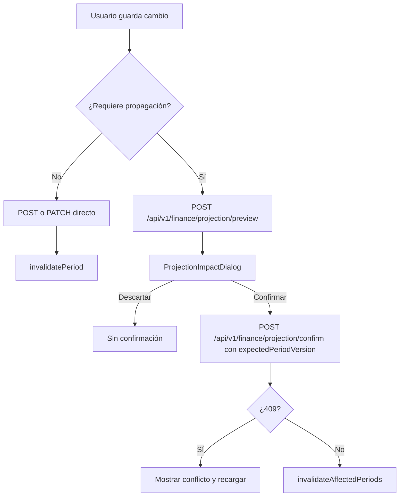

# Integración — Mutaciones y proyección

**Tipo:** Integration  
**Depende de:** [`02-functional-months-and-projections.md`](02-functional-months-and-projections.md), [`08-backend-calculations-and-projection.md`](08-backend-calculations-and-projection.md), [`13-ux-ui-month-detail-and-editors.md`](13-ux-ui-month-detail-and-editors.md), [`17-integration-finance-api-client-and-cache.md`](17-integration-finance-api-client-and-cache.md), [`18-integration-dashboard-tracer-bullet.md`](18-integration-dashboard-tracer-bullet.md)  
**Implementa:** Crear/editar/cancelar movimientos, preview de impacto, `expectedPeriodVersion`, confirmación de propagación, invalidación de caché, manejo 409; escenario canónico Marzo → Abril → Mayo sin modificar Enero–Febrero en SPA + tests.  
**No incluye:** Flujos crédito/Klar dedicados (`20`), runbook E2E (`21`), commits.

## Resultado

El usuario edita movimientos e ítems en detalle de mes (`13`), ve una
previsualización antes de persistir el cambio cuando afecta saldos futuros,
confirma con la versión optimista del periodo y obtiene resúmenes recalculados
para Marzo, Abril y Mayo. Enero y Febrero permanecen invariantes. Un conflicto
de concurrencia muestra 409 y obliga a recargar; la caché TanStack Query se
invalida para todos los periodos afectados.

## Contratos de entrada y salida

### Fixture de propagación — Marzo → Abril → Mayo

Este spec consume únicamente el registro de UUIDs y el ledger canónico de
`18`. El escenario usa el periodo origen
`4bc02a91-6ad8-4627-8ab9-01c3ee0a1003` (Marzo); no depende de la fecha del
sistema.

**Baseline proyectado antes de editar** — el saldo de Débito es el cierre
proyectado, por lo que incluye los ítems aún `PLANNED`:

| Periodo | Saldo cierre Débito proyectado | Ahorro esperado | ¿Origen? |
|---------|--------------------------------|-----------------|----------|
| Enero (`4bc02a91-6ad8-4627-8ab9-01c3ee0a1001`) | $28,000.00 | $29,000.00 | No; histórico |
| Febrero (`4bc02a91-6ad8-4627-8ab9-01c3ee0a1002`) | $36,000.00 | $37,000.00 | No; histórico |
| Marzo (`4bc02a91-6ad8-4627-8ab9-01c3ee0a1003`) | $28,900.00 | $29,650.00 | Sí |
| Abril (`4bc02a91-6ad8-4627-8ab9-01c3ee0a1004`) | $900.00 | $1,650.00 | Futuro |
| Mayo (`4bc02a91-6ad8-4627-8ab9-01c3ee0a1005`) | $900.00 | $1,650.00 | Futuro |

**Acción tracer:** modificar el gasto real de Extras
`e8c54f93-3b6d-4c28-8e8b-4fcd709e4011` de `$500.00` a `$2,000.00`
(+$1,500.00). Es una transacción realizada: aumenta `actualExpense`, reduce
el saldo de Débito y el ahorro esperado/real, pero no cambia
`expectedExpense` porque no altera un ítem `PLANNED`.

| Periodo | Δ gasto esperado | Δ gasto real | Δ ahorro esperado | Δ cierre Débito | ¿Cambia? |
|---------|------------------|--------------|-------------------|-----------------|----------|
| Enero | $0.00 | $0.00 | $0.00 | $0.00 | No |
| Febrero | $0.00 | $0.00 | $0.00 | $0.00 | No |
| Marzo | $0.00 | +$1,500.00 | −$1,500.00 | −$1,500.00 | Sí |
| Abril | $0.00 | $0.00 | −$1,500.00 | −$1,500.00 | Sí |
| Mayo | $0.00 | $0.00 | −$1,500.00 | −$1,500.00 | Sí |

### Artefactos SPA

| Artefacto | Ruta |
|-----------|------|
| Mutaciones API | `repos/finance-app/src/api/finance-mutations.ts` |
| Hooks mutación | `repos/finance-app/src/hooks/useFinanceMutations.ts` |
| Preview hook | `repos/finance-app/src/hooks/useProjectionPreview.ts` |
| Diálogo impacto | `repos/finance-app/src/components/finance/ProjectionImpactDialog.tsx` |
| Form movimiento | `repos/finance-app/src/components/forms/TransactionForm.tsx` |
| Month detail page | `repos/finance-app/src/pages/MonthDetailPage/MonthDetailPage.tsx` |
| Tests SPA | `repos/finance-app/src/test/integration/propagation.test.tsx` |
| Test backend | `repos/personal-api/tests/integration/finance-propagation.test.ts` |

### Crear movimiento — `POST /api/v1/finance/periods/:periodId/transactions`

El siguiente alta usa el periodo Marzo y los IDs canónicos. La respuesta `201`
es `{ transaction: TransactionDto }` con el shape completo de `09`; el servidor
genera el UUID en `response.transaction.id` y no se usa como fixture estable.

```json
{
  "type": "EXPENSE",
  "accountId": "7f5c8b0d-771c-4d4c-8cbd-7e7f318f1001",
  "categoryId": "9bde3079-486b-44f1-97d5-49a0d3e91005",
  "occurredOn": "2026-03-15",
  "amount": "850.00",
  "concept": "Extra integración — cena"
}
```

**Invalidación:** `summary(periodId)`, `transactions(periodId)`, `periods` y
`accounts` con balances.

### Editar movimiento — `PATCH /api/v1/finance/transactions/:transactionId`

```json
{
  "amount": "2000.00",
  "concept": "Ajuste marzo — propagación tracer"
}
```

La respuesta `200` es `{ transaction: TransactionDto }`; el cliente consume
`response.transaction`, nunca un DTO plano.

Para la transacción real de la fixture, la URL concreta es:

```text
/api/v1/finance/transactions/e8c54f93-3b6d-4c28-8e8b-4fcd709e4011
```

Si altera el saldo de cierre y existen periodos posteriores, el cliente abre
preview antes de persistir o el backend exige el flujo preview → confirm según
`09`.

### Cancelar ítem planeado

```text
PATCH /api/v1/finance/plan-items/d0bf673e-d70c-4a8d-9ed2-7418f2073004
```

```json
{ "status": "CANCELLED" }
```

No borrar realizados; cancelar conserva el registro y no altera gasto real.

### Preview — `POST /api/v1/finance/projection/preview`

```json
{
  "originPeriodId": "4bc02a91-6ad8-4627-8ab9-01c3ee0a1003",
  "changes": [
    {
      "kind": "UPDATE_TRANSACTION",
      "transactionId": "e8c54f93-3b6d-4c28-8e8b-4fcd709e4011",
      "patch": { "amount": "2000.00" }
    }
  ]
}
```

**Response** `200`:

```json
{
  "originPeriodId": "4bc02a91-6ad8-4627-8ab9-01c3ee0a1003",
  "affectedPeriodIds": [
    "4bc02a91-6ad8-4627-8ab9-01c3ee0a1003",
    "4bc02a91-6ad8-4627-8ab9-01c3ee0a1004",
    "4bc02a91-6ad8-4627-8ab9-01c3ee0a1005"
  ],
  "diffs": [
    {
      "periodId": "4bc02a91-6ad8-4627-8ab9-01c3ee0a1003",
      "year": 2026,
      "month": 3,
      "deltaExpectedExpense": "0.00",
      "deltaActualExpense": "1500.00",
      "deltaExpectedSavings": "-1500.00",
      "accountDeltas": {
        "7f5c8b0d-771c-4d4c-8cbd-7e7f318f1001": {
          "opening": "0.00",
          "closing": "-1500.00"
        }
      },
      "deltaDebt": "0.00",
      "deltaCreditAvailable": "0.00"
    },
    {
      "periodId": "4bc02a91-6ad8-4627-8ab9-01c3ee0a1004",
      "year": 2026,
      "month": 4,
      "deltaExpectedExpense": "0.00",
      "deltaActualExpense": "0.00",
      "deltaExpectedSavings": "-1500.00",
      "accountDeltas": {
        "7f5c8b0d-771c-4d4c-8cbd-7e7f318f1001": {
          "opening": "-1500.00",
          "closing": "-1500.00"
        }
      },
      "deltaDebt": "0.00",
      "deltaCreditAvailable": "0.00"
    },
    {
      "periodId": "4bc02a91-6ad8-4627-8ab9-01c3ee0a1005",
      "year": 2026,
      "month": 5,
      "deltaExpectedExpense": "0.00",
      "deltaActualExpense": "0.00",
      "deltaExpectedSavings": "-1500.00",
      "accountDeltas": {
        "7f5c8b0d-771c-4d4c-8cbd-7e7f318f1001": {
          "opening": "-1500.00",
          "closing": "-1500.00"
        }
      },
      "deltaDebt": "0.00",
      "deltaCreditAvailable": "0.00"
    }
  ],
  "warnings": ["PROJECTED_SAVINGS_DROP"]
}
```

### Confirm — `POST /api/v1/finance/projection/confirm`

```json
{
  "originPeriodId": "4bc02a91-6ad8-4627-8ab9-01c3ee0a1003",
  "expectedPeriodVersion": 1,
  "changes": [
    {
      "kind": "UPDATE_TRANSACTION",
      "transactionId": "e8c54f93-3b6d-4c28-8e8b-4fcd709e4011",
      "patch": { "amount": "2000.00" }
    }
  ]
}
```

**Response** `200` — cada objeto `summary` es el `PeriodSummaryCompact`
completo de `08`/`09`, sin campos omitidos:

```json
{
  "affectedPeriodIds": [
    "4bc02a91-6ad8-4627-8ab9-01c3ee0a1003",
    "4bc02a91-6ad8-4627-8ab9-01c3ee0a1004",
    "4bc02a91-6ad8-4627-8ab9-01c3ee0a1005"
  ],
  "summaries": [
    {
      "periodId": "4bc02a91-6ad8-4627-8ab9-01c3ee0a1003",
      "summary": {
        "expectedIncome": "10000.00",
        "receivedIncome": "10000.00",
        "expectedExpense": "19400.00",
        "actualExpense": "12350.00",
        "expectedSavings": "28150.00",
        "actualSavings": "38150.00",
        "cashRemaining": "750.00",
        "creditAvailable": "46500.00",
        "projectedCreditAvailable": "46500.00"
      }
    },
    {
      "periodId": "4bc02a91-6ad8-4627-8ab9-01c3ee0a1004",
      "summary": {
        "expectedIncome": "0.00",
        "receivedIncome": "0.00",
        "expectedExpense": "23000.00",
        "actualExpense": "0.00",
        "expectedSavings": "150.00",
        "actualSavings": "33150.00",
        "cashRemaining": "750.00",
        "creditAvailable": "50000.00",
        "projectedCreditAvailable": "50000.00"
      }
    },
    {
      "periodId": "4bc02a91-6ad8-4627-8ab9-01c3ee0a1005",
      "summary": {
        "expectedIncome": "10000.00",
        "receivedIncome": "0.00",
        "expectedExpense": "10000.00",
        "actualExpense": "0.00",
        "expectedSavings": "150.00",
        "actualSavings": "33150.00",
        "cashRemaining": "750.00",
        "creditAvailable": "50000.00",
        "projectedCreditAvailable": "50000.00"
      }
    }
  ]
}
```

### Conflicto 409 — versión stale

Una segunda pestaña confirma con `expectedPeriodVersion: 1` después de la
primera confirmación, cuando la versión de Marzo ya es `2`:

```json
{
  "error": "FINANCE_CONFLICT",
  "message": "Period was modified by another session",
  "details": {
    "periodId": "4bc02a91-6ad8-4627-8ab9-01c3ee0a1003",
    "expectedPeriodVersion": 1,
    "actualVersion": 2
  }
}
```

**UI (`13`):** mostrar banner y acción «Recargar periodo»; invalidar las
queries del periodo, no aplicar cambios locales y volver a solicitar
`GET /api/v1/finance/periods/4bc02a91-6ad8-4627-8ab9-01c3ee0a1003`.

### Flujo UI mutación con propagación



### Cliente y hooks de mutación

```typescript
export async function previewProjection(
  input: ProjectionPreviewRequest,
  signal?: AbortSignal,
): Promise<ProjectionPreviewResult> {
  return http.request('/api/v1/finance/projection/preview', {
    method: 'POST',
    body: JSON.stringify(input),
    signal,
  });
}

export function useUpdateTransaction() {
  const qc = useQueryClient();
  return useMutation({
    mutationFn: updateTransactionWithPreviewFlow,
    onSuccess: (result) => {
      invalidateAffectedPeriods(qc, result.affectedPeriodIds);
    },
    onError: (err: ApiError) => {
      if (err.code === 'FINANCE_CONFLICT') {
        // El diálogo ofrece recargar; no hay actualización optimista.
      }
    },
  });
}
```

`useProjectionPreview` entrega su `AbortSignal` al wrapper para cancelar una
simulación descartada o reemplazada. `invalidateAffectedPeriods` invalida, para
cada UUID afectado, summary, period, transactions, planItems, budgets y la
lista `periods`.

## Tareas

1. Implementar `repos/finance-app/src/api/finance-mutations.ts`: CRUD de
   transacciones, plan-items, preview y confirm bajo la base `/api/v1/finance`.
2. Implementar `useProjectionPreview` con hash de changes y `AbortSignal`; no cachear previews de forma larga.
3. Implementar `ProjectionImpactDialog` con periodo origen, periodos afectados, Δ ahorro y Δ saldo.
4. Integrar `TransactionForm` en `MonthDetailPage` sección movimientos.
5. Implementar flujo cambio local → preview → confirm → invalidación.
6. Manejar 409 con recarga de `GET /api/v1/finance/periods/:periodId`.
7. Extender el seed canónico de `18` con Abril/Mayo; mantener Enero/Febrero como snapshots históricos.
8. Probar backend `finance-propagation.test.ts`: asertar Enero/Febrero idénticos y los tres UUIDs afectados.
9. Probar SPA con MSW: preview → confirm → invalidación de los tres periodos.

## Criterios de aceptación

1. **CA-01** Crear un gasto de Marzo de $850.00 incrementa `actualExpense` y reduce ahorro real del resumen.
2. **CA-02** Editar la transacción `e8c54f93-3b6d-4c28-8e8b-4fcd709e4011` dispara preview con Marzo, Abril y Mayo.
3. **CA-03** Confirm con `expectedPeriodVersion: 1` correcto persiste y retorna los tres `PeriodSummaryCompact` completos.
4. **CA-04** Tras confirm, los ahorros esperados son Marzo `$28,150.00`, Abril `$150.00` y Mayo `$150.00`.
5. **CA-05** `GET` summary de Enero y Febrero es idéntico antes/después de confirm (snapshot).
6. **CA-06** Descartar preview no llama `POST /api/v1/finance/projection/confirm`.
7. **CA-07** Versión stale produce 409 `FINANCE_CONFLICT`; recargar revela versión `2`.
8. **CA-08** Cancelar el ítem planeado no incrementa gasto real.
9. **CA-09** La invalidación refresca timeline y hero sin recargar la página.
10. **CA-10** `POST /api/v1/finance/projection/preview` no cambia conteos de base de datos.

## Verificación

```powershell
# Backend: ejecutar desde la raíz del workspace.
Set-Location repos/personal-api
# Requiere los artefactos planned db:seed-finance-tracer y
# db:clean-finance-tracer creados y registrados en 18.
npm run db:seed-finance-tracer
npm run test:integration -- tests/integration/finance-propagation.test.ts
```

```powershell
# SPA: ejecutar en otra terminal PowerShell desde la raíz del workspace.
Set-Location repos/finance-app
npm test -- src/test/integration/propagation.test.tsx
npm run typecheck
```

**Manual:**

1. Abrir detalle de Marzo y editar el extra de `$500.00` a `$2,000.00`.
2. Verificar que preview muestra exactamente Marzo, Abril y Mayo, y cero cambios en Enero/Febrero.
3. Confirmar y volver al dashboard: hero Marzo `$28,150.00`; Abril y Mayo `$150.00` de ahorro esperado.
4. Abrir dos pestañas: confirmar en la primera; la segunda recibe 409 y ofrece recargar.

## Impacto y riesgos

| Riesgo | Mitigación |
|--------|------------|
| PATCH directo salta preview | Service exige preview/confirm para cambios propagables |
| Invalidación incompleta | Helper central `invalidateAffectedPeriods` |
| Usuario confunde descartar | Copy claro `13`; preview sin mutación |
| UI optimista desincronizada | No usar optimistic update para propagación MVP |
| Fechas o datos no deterministas | Ledger y UUIDs fijos de `18`; periodo foco explícito |
