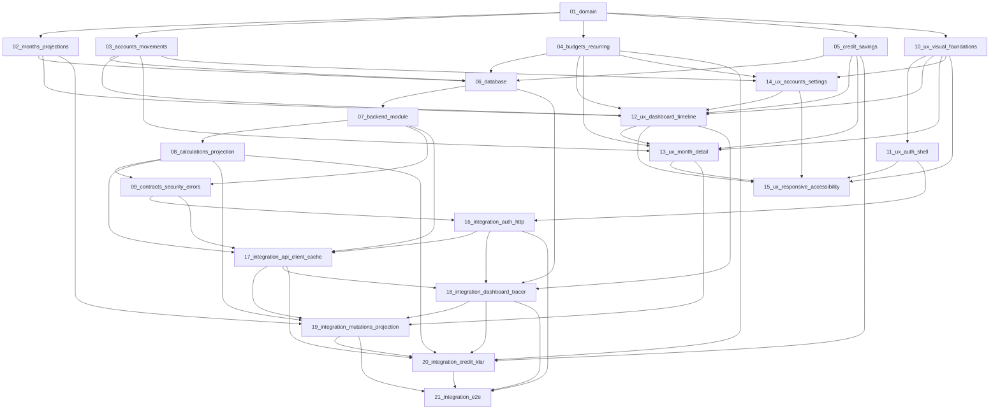

# Especificaciones — Aplicación de finanzas personales

Índice único, contrato de escritura y grafo de dependencias para los specs ejecutables de la app financiera. Deriva del PRD y la arquitectura aprobados; guía la ejecución de Tasks 2–6 del plan de specs.

## Documentos fuente

| Documento | Ruta | Rol |
|-----------|------|-----|
| PRD | [`docs/briefs/finance-app/prd.md`](../../briefs/finance-app/prd.md) | Comportamiento del producto, reglas de negocio, alcance MVP |
| Arquitectura | [`docs/architecture/finance-app/architecture.md`](../../architecture/finance-app/architecture.md) | Límites técnicos, stack, flujos, decisiones irrevocables |
| Modelo SQL | [`docs/architecture/finance-app/sql-tables.md`](../../architecture/finance-app/sql-tables.md) | Entidades `Finance*`, enums, relaciones, convenciones de dinero y fechas |
| README API | [`repos/personal-api/README.md`](../../../repos/personal-api/README.md) | Bootstrap, scripts disponibles y operación local de `personal-api` |

Todos los specs viven en `docs/plans/finance-app/`. Este `README.md` es la única fuente de orden de ejecución y dependencias.

## Separación de responsabilidades

Los specs se organizan en cuatro carriles con ownership estricto:

| Carril | Pregunta que responde | Contiene | No contiene |
|--------|----------------------|----------|-------------|
| **Functional** | ¿Qué debe hacer el producto? | Vocabulario, invariantes, reglas de negocio, escenarios de aceptación conceptuales | Endpoints, SQL, componentes, stack, fixtures |
| **Backend** | ¿Cómo se expone, valida y persiste? | Prisma, módulo `finance`, cálculos, contratos Zod, auth, errores | Decisiones visuales, mock data, flujos SPA |
| **UX/UI** | ¿Cómo se ve y se usa? | Jerarquía visual, tokens, layout, estados visuales, accesibilidad, roles de contenido | Funcionalidad, lógica de negocio, endpoints, SQL, JSON, fixtures, mock data, importes concretos |
| **Integration** | ¿Cómo se conectan y verifican frontend y backend? | Cliente HTTP, cache, hooks, fixtures, payloads, tracer bullet, E2E, runbook | Redefinición de reglas de negocio ni rediseño visual |

### Regla de datos concretos

- **UX/UI** no usará importes como `$23,650`, nombres de cuentas reales, JSON, fixtures ni listas inventadas. Usará roles de contenido: «total esperado», «saldo disponible», «estado vacío», «alerta de presupuesto», etc.
- **Integración** es el **único** carril autorizado para fixtures, seed data, ejemplos de payloads y escenarios con datos concretos.

### Restricciones globales

- Importes: `NUMERIC(14,2)` / Prisma `Decimal`; prohibido `Float`.
- Ownership: usuario autenticado dueño exclusivo de sus datos; provisionado por administrador en MVP.
- Fixtures de usuario: emails/passwords reproducibles, pero `FINANCE_USER_ID` y el ID de B se resuelven en runtime por login → `/api/v1/auth/me`; el registry conserva UUID v4 fijos solo para entidades Finance.
- Crédito, pagos, transferencias y retiro de efectivo permanecen diferenciados para evitar doble conteo.
- Cambios de regla desde un mes deben declarar impacto en meses futuros y confirmación del usuario.
- No crear commits durante la ejecución de specs salvo solicitud explícita.

### Autenticación y PRD §9.1

El PRD §9.1 describe registro y recuperación de contraseña como flujos futuros. La arquitectura aprobada los deja **diferidos**; en MVP el usuario se **provisiona por administrador** (sin registro público ni autoservicio de alta). Los specs de auth e integración deben alinearse con ese alcance.

## Orden de ejecución y paralelismo seguro

### Fases

1. **Funcionalidad** — specs `01`–`05` (secuencial recomendado; `01` es raíz).
2. **Backend** — specs `06`–`09` (después de cerrar funcionalidad `01`–`05`).
3. **UX/UI** — specs `10`–`15` (pueden avanzar **en paralelo con backend** una vez satisfecho `01`; `10` es raíz visual).
4. **Integración** — specs `16`–`21` (requieren backend `06`–`09` y UX/UI relevantes según el grafo).

### Paralelismo seguro

| Puede ejecutarse en paralelo | Condición |
|------------------------------|-----------|
| Backend `06`–`08` y UX/UI `10`–`15` | Funcionalidad `01`–`05` cerrada |
| Backend `09` | Tras cerrar `07` y `08` (`09` consume tipos y resultados de `08`; no paralelizar con `08`) |
| UX/UI `11`–`15` entre sí (parcial) | Respetar dependencias del grafo (p. ej. `12` requiere `02`, `03`, `04`, `05`, `10`, `14`; `13` requiere `03`, `04`, `05`, `10`, `12`; `14` requiere `03`, `04`, `10`; `15` requiere `10`–`14`) |
| Integración `16`–`21` | Solo cuando sus dependencias de backend, UX/UI y funcionalidad estén disponibles |

**Orden interno en backend:** `06` → `07` → `08` → `09`. El spec `08` precede a `09`.

**No iniciar un spec posterior hasta que todas sus dependencias estén disponibles.**

### Criterio «spec listo»

Un spec se considera listo cuando:

- Sigue la plantilla obligatoria (sección inferior).
- Sus dependencias están satisfechas y referenciadas.
- No viola los límites de su carril.
- Incluye criterios de aceptación y verificación ejecutables.
- No contiene placeholders (`TBD`, `TODO`, `por definir`, `implement later`).

## Grafo de dependencias



El grafo es acíclico: no hay dependencias circulares.

## Catálogo de specs (21)

### Fase 1 — Funcionalidad

| # | Archivo | Propósito | Depende de |
|---|---------|-----------|------------|
| 01 | [`01-functional-domain-and-rules.md`](01-functional-domain-and-rules.md) | Vocabulario, ownership, MXN, fechas calendario, invariantes de movimiento/transferencia/crédito/efectivo; tabla de decisiones | PRD |
| 02 | [`02-functional-months-and-projections.md`](02-functional-months-and-projections.md) | Meses pasados/actual/futuros, duplicación, edición histórica, propagación, preview, conflictos conceptuales | `01`, PRD |
| 03 | [`03-functional-accounts-and-movements.md`](03-functional-accounts-and-movements.md) | Cuentas configurables, ingresos, movimientos con fecha, filtros, visibilidad, desactivación sin perder historia | `01`, PRD |
| 04 | [`04-functional-budgets-and-recurring.md`](04-functional-budgets-and-recurring.md) | Servicios recurrentes, Mandado, Salidas, Extras, retiro combinado, límites, overrides por periodo | `01`, PRD |
| 05 | [`05-functional-credit-and-savings.md`](05-functional-credit-and-savings.md) | Compra de crédito, deuda, límite, pagos, Fondo Klar, ahorro esperado/real, sugerencias; fórmulas conceptuales sin doble conteo | `01`, PRD |

### Fase 2 — Backend

| # | Archivo | Propósito | Depende de |
|---|---------|-----------|------------|
| 06 | [`06-backend-database-and-migrations.md`](06-backend-database-and-migrations.md) | Modelos Prisma `Finance*`, enums, índices, constraints, seeds por usuario, orden de migración | `01`–`05`, [`sql-tables.md`](../../architecture/finance-app/sql-tables.md), [`architecture.md`](../../architecture/finance-app/architecture.md) |
| 07 | [`07-backend-finance-module.md`](07-backend-finance-module.md) | Estructura `src/modules/finance/`, capas route/controller/schema/repository/service, montaje en API | `06`, funcionalidad `01`–`05`, [`architecture.md`](../../architecture/finance-app/architecture.md) |
| 08 | [`08-backend-calculations-and-projection.md`](08-backend-calculations-and-projection.md) | Funciones puras: saldos, deuda, crédito disponible, gasto, ahorro, simulación, propagación, concurrencia | `07`, funcionalidad `01`–`05`, [`architecture.md`](../../architecture/finance-app/architecture.md) |
| 09 | [`09-backend-contracts-security-and-errors.md`](09-backend-contracts-security-and-errors.md) | Contratos request/response, auth/ownership, validación, códigos 400/401/404/409/422/500, logging seguro | `07`, `08`, funcionalidad `01`–`05`, [`architecture.md`](../../architecture/finance-app/architecture.md) |

### Fase 3 — UX/UI

| # | Archivo | Propósito | Depende de |
|---|---------|-----------|------------|
| 10 | [`10-ux-ui-visual-foundations.md`](10-ux-ui-visual-foundations.md) | Intent visual, tokens semánticos, tipografía, spacing, números tabulares, firma distintiva | `01`, [`architecture.md`](../../architecture/finance-app/architecture.md) |
| 11 | [`11-ux-ui-auth-and-app-shell.md`](11-ux-ui-auth-and-app-shell.md) | Composición visual de login, shell autenticado, navegación, selector de mes, estados de sesión | `10` |
| 12 | [`12-ux-ui-dashboard-and-timeline.md`](12-ux-ui-dashboard-and-timeline.md) | Resumen mensual, timeline, focal ahorro/disponible, restante real/proyectado, navegación por categoría y por cuenta, estados loading/empty/error/over-budget | `02`, `03`, `04`, `05`, `10`, `14` |
| 13 | [`13-ux-ui-month-detail-and-editors.md`](13-ux-ui-month-detail-and-editors.md) | Secciones servicios/Mandado/Salidas/Extras/movimientos/Crédito/Klar/retiro; handoff visual desde dashboard por categoría; formularios y confirmaciones visuales | `03`, `04`, `05`, `10`, `12` |
| 14 | [`14-ux-ui-accounts-and-settings.md`](14-ux-ui-accounts-and-settings.md) | Pantallas de cuentas, categorías, reglas recurrentes, preferencias; empty states y desactivación visual | `03`, `04`, `10` |
| 15 | [`15-ux-ui-responsive-and-accessibility.md`](15-ux-ui-responsive-and-accessibility.md) | Reglas transversales desktop/tablet/mobile, teclado, contraste, reduced motion, errores de campo | `10`, `11`, `12`, `13`, `14` |

### Fase 4 — Integración

| # | Archivo | Propósito | Depende de |
|---|---------|-----------|------------|
| 16 | [`16-integration-auth-and-http-client.md`](16-integration-auth-and-http-client.md) | Cliente HTTP, `ApiError`, tokens, bootstrap de sesión, retry en 401, guarda de rutas; fixtures de usuario **provisionado por admin** (sin registro público en MVP) | `09`, UX/UI `11`, [`architecture.md`](../../architecture/finance-app/architecture.md), [`personal-api README`](../../../repos/personal-api/README.md) |
| 17 | [`17-integration-finance-api-client-and-cache.md`](17-integration-finance-api-client-and-cache.md) | Tipos de respuesta, wrappers, query keys, hooks, invalidación; fixtures y payloads representativos | `07`, `08`, `09`, `16` |
| 18 | [`18-integration-dashboard-tracer-bullet.md`](18-integration-dashboard-tracer-bullet.md) | Primera integración vertical: login → resumen → cuentas/movimientos → dashboard; ledger canónico con owner A/B resuelto en runtime y seed de prueba | `06`, `12`, `16`, `17` |
| 19 | [`19-integration-mutations-and-projection.md`](19-integration-mutations-and-projection.md) | CRUD movimientos, preview de impacto, propagación, conflicto 409; fixture Marzo→Abril→Mayo | funcionalidad `02`, `08`, `13`, `17`, `18` |
| 20 | [`20-integration-credit-klar-and-suggestions.md`](20-integration-credit-klar-and-suggestions.md) | Crédito, pagos, Klar, retiro de efectivo y sugerencias; mutaciones anti doble conteo en fixture aislada + lectura del ledger | `04`, `05`, `08`, `17`, `18`, `19` |
| 21 | [`21-integration-e2e-and-runbook.md`](21-integration-e2e-and-runbook.md) | Recorrido E2E completo, runbook PowerShell, comandos, URLs, limpieza y fallos esperados; consume mutaciones/propagación de `19`; A/B provisionados por admin con IDs runtime (sin registro público en MVP) | `16`, `18`, `19`, `20`, [`architecture.md`](../../architecture/finance-app/architecture.md), [`personal-api README`](../../../repos/personal-api/README.md) |

## Plantilla obligatoria de cada spec

Todo spec debe usar esta estructura. Debe ser implementable de forma independiente una vez satisfechas sus dependencias.

En specs **UX/UI**, la sección «Contratos de entrada y salida» describe **roles visuales y estados de interfaz** (p. ej. «estado vacío», «alerta de presupuesto»), no payloads HTTP ni contratos de API.

```markdown
# [Nombre]

**Tipo:** Functional | Backend | UX/UI | Integration
**Depende de:** [specs o documentos]
**Implementa:** [repo y límite de archivos]
**No incluye:** [límites explícitos]

## Resultado
## Contratos de entrada y salida
## Tareas
## Criterios de aceptación
## Verificación
## Impacto y riesgos
```

## Stack de referencia

Documentación Markdown; implementación futura en React + TypeScript + Vite (SPA `repos/finance-app`), Express + TypeScript (`repos/personal-api`), Prisma + PostgreSQL, JWT, TanStack Query, Vitest, Playwright CLI para E2E.

## Mapa de archivos esperado

Al completar Tasks 2–6, el directorio debe contener:

- `README.md` (este índice)
- `01-functional-domain-and-rules.md` … `05-functional-credit-and-savings.md`
- `06-backend-database-and-migrations.md` … `09-backend-contracts-security-and-errors.md`
- `10-ux-ui-visual-foundations.md` … `15-ux-ui-responsive-and-accessibility.md`
- `16-integration-auth-and-http-client.md` … `21-integration-e2e-and-runbook.md`

**Total: 22 archivos** (1 índice + 21 specs).
