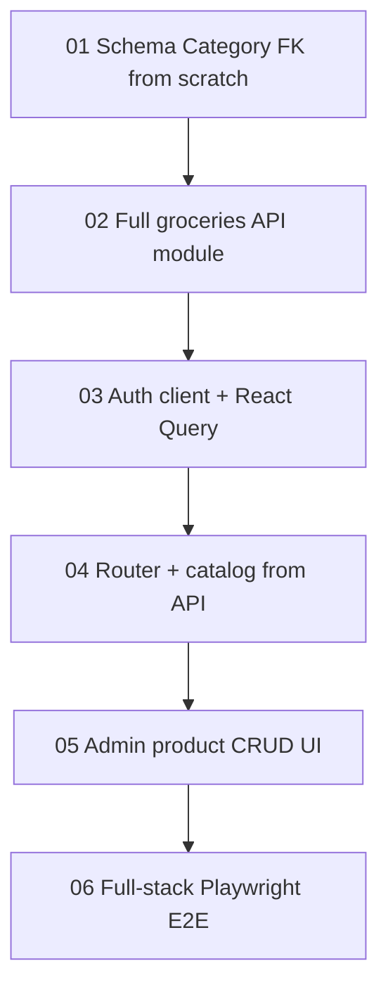

# Groceries App Backend Integration Specifications

These specifications split the Mandado SPA (`full-groceries-app`) ↔ `personal-api` integration into small, independently reviewable implementation units.

**Baseline:** `personal-api` **`main`** has fitness + Application permissions and **no groceries tables or module**. Build groceries **from scratch** (do not migrate an Int `category` column — that approach is obsolete). Discard / reset any prior `feat/groceries-api` work that used Int categories or ADMIN-only router gates without READ_ONLY browse.

Both apps stay on **separate hosts**. Catalog data (categories + products) lives in PostgreSQL with `GroceryCategory` as a foreign table from day one. Shopping cart stays **local** in this plan (trips / history UI deferred; trip tables + API still land for later use).

> **For agentic workers:** Execute specs in order (01 → 06). Steps use checkbox (`- [ ]`) syntax. Use superpowers:subagent-driven-development (recommended) or superpowers:executing-plans to implement task-by-task.

## Execution order

1. [01 — Groceries database schema](01-groceries-category-schema.md)
   - Creates `GroceryCategory`, `GroceryProduct`, `GroceryTrip`, `GroceryTripItem` with `categoryId` FK; seeds five Mandado categories.
2. [02 — Groceries API module](02-groceries-categories-and-product-api.md)
   - New `/api/v1/groceries` module: categories list, product CRUD, trips; `requireAppRole('groceries-app', …)`.
3. [03 — Auth and API client](03-groceries-auth-and-api-client.md)
   - JWT session, HTTP client, TanStack Query hooks for catalog reads in the SPA.
4. [04 — Router, login, and catalog UI](04-router-login-and-catalog-ui.md)
   - react-router, login gate, categories/products from API; local cart kept.
5. [05 — Admin product CRUD UI](05-admin-product-crud-ui.md)
   - groceries-app ADMIN product create/edit/delete via mobile icon actions; category select from API list.
6. [06 — Groceries E2E](06-groceries-e2e.md)
   - Consolidated playwright-cli happy path.
   - Runbook: [e2e-local-runbook.md](e2e-local-runbook.md).



## Fixed decisions

- **API baseline:** Branch from `personal-api` `main`. No groceries code assumed. Prefer a clean branch `feat/groceries-api` (reset prior Int-category work if the branch still exists).
- **Target SPA:** `repos/full-groceries-app` only (greenfield from static `main`). Do not change `repos/groceries-app` in this plan.
- **Catalog source of truth:** `personal-api` PostgreSQL. Remove runtime imports of `data/products.json` and `src/data/categories.ts` from the SPA (JSON may remain as an optional API seed input only).
- **Categories:** `GroceryCategory` table from day one; products and trip items use `categoryId` UUID FK. Seed the five Mandado labels in the migration. No category admin UI (list API + seed only).
- **Product CRUD:** Full ADMIN mutate via `/api/v1/groceries/products`; SPA admin UI in spec 05.
- **Mobile-first admin actions:** Create / edit / delete (and form save / cancel) use **icon buttons** with accessible names (`aria-label`), not text-only toolbar labels. Min ~44×44px touch targets.
- **Cart / trips:** Keep cart **in-memory** (`useCart`). Do **not** wire trip UI in the SPA. Trip **tables and API** are included so a later plan can attach cart → trips.
- **Auth (matches `main`):** Application-scoped permissions via `UserAppPermission` + `requireAppRole('groceries-app', …)`. Seed Application slug `groceries-app`. `/me` returns `permissions[]`. SPA derives `isGroceriesAdmin` from membership with `role === 'ADMIN'`.
- **Role matrix on groceries routes:** READ_ONLY+ for GET (categories, products, trips); ADMIN for product/trip mutations.
- **SPA stack additions:** `react-router-dom`, `@tanstack/react-query`.
- **Separate hosts:** API `http://localhost:3000`, SPA Vite with `base: '/full-groceries-app/'`, `VITE_API_BASE_URL=http://localhost:3000`.
- **Online catalog:** No offline write queue for products/categories.
- **Related plans:** [`docs/plans/groceries-app-rework/`](../groceries-app-rework/) targets a different repo; do not merge. Follow-up plan folder later for cart → trips / history UI.

## Auth / role matrix (`groceries-app` membership)

| Action | No groceries membership | READ_ONLY | ADMIN |
| --- | --- | --- | --- |
| Login | yes | yes | yes |
| Browse categories and products | 403 | yes | yes |
| Local cart add / export / import | n/a (need browse first) | yes | yes |
| Product create / update / delete | 403 | 403 | yes |
| Category mutate | n/a (seed only this plan) | n/a | seed / later API |

## Review contract

Each specification has:

- a limited file boundary;
- test-first acceptance criteria (or explicit UI verification for UI-only specs);
- a standalone commit boundary; and
- explicit dependency and verification / E2E requirements.

Do not begin a later specification until its listed dependency is merged or otherwise available in the working branch.

## Branch setup (before Task 1 of spec 01 / 03)

```bash
cd repos/personal-api
git checkout main && git pull
# If feat/groceries-api exists with Int-category leftovers, delete or reset it:
# git branch -D feat/groceries-api
git checkout -b feat/groceries-api

cd ../full-groceries-app
git checkout main && git pull
git checkout -b feat/personal-api-integration
```

## Global constraints

- Feature branches: `feat/groceries-api` (`personal-api`), `feat/personal-api-integration` (`full-groceries-app`).
- REST base: `/api/v1/groceries/...` with `authenticate` + `requireAppRole('groceries-app', …)`.
- Product IDs are UUID strings; SPA cart types must use string ids.
- Vite router must use `basename={import.meta.env.BASE_URL}` because `base` is `/full-groceries-app/`.
- Session storage key: `mandado:auth:v1` (refresh token only).
- Do not host the SPA from personal-api.
- Do not implement category admin screens or trip/history UI in this plan set.
- Do not introduce Int `category` columns at any point.
