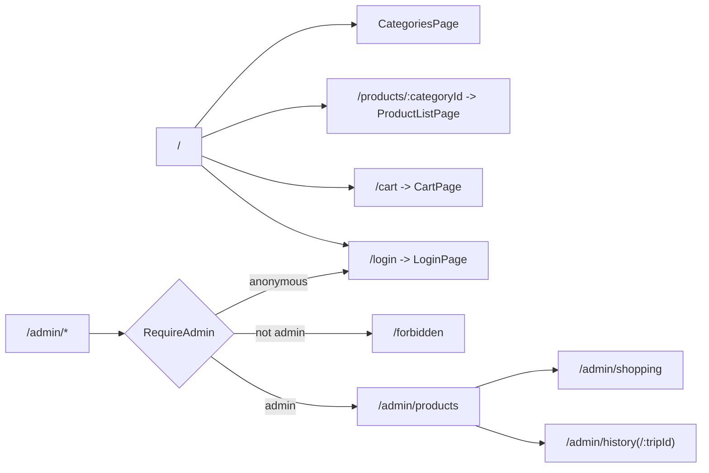

# Groceries App Rework

> **For agentic workers:** Execute the specs in order (01 → 02 → 03). Steps use checkbox (`- [ ]`) syntax. Use superpowers:subagent-driven-development (recommended) or superpowers:executing-plans to implement task-by-task.

**Goal:** Rework `repos/groceries-app` to the workspace React folder standard and replace the hand-rolled `useState` view navigation with `react-router` (including protected admin routes). No changes to permissions, admin logic, or `personal-api`.

## Scope boundaries (explicitly out of scope)

- No `personal-api` changes. No `UserAppPermission`, `User.isAdmin`, `requireAppRole`, or seed changes.
- No `AuthProvider` logic changes. `isGroceriesAdmin`, `groceries-api-session`, the `api/groceries.ts` session pattern, and `api/types.ts` permissions stay as-is.
- No `LoginPage` / `CategoriesPage` permission-flow changes beyond swapping navigation calls for router navigation.

## Branch

- `groceries-app`: `feat/groceries-rework` (branched from current `feat/groceries-admin`).
- No git worktrees (per existing plan convention).

## Execution order

1. `01-frontend-folder-structure.md` — restructure `src/` to the folder standard; add `react-router-dom` + vitest.
2. `02-frontend-routing-and-protected-routes.md` — `react-router` routes, `RequireAdmin` guard, `CartProvider` context, page migration.
3. `03-verification-and-e2e.md` — build/lint/test + manual smoke + runbook updates.

## Route map

## Key references in the workspace

- Folder standard: `.agents/rules/react-folder-structure.mdc` (canonical: `repos/screen-recorder`).
- Router + guard pattern: `repos/user-management-app/src/App.tsx`, `repos/user-management-app/src/auth/RequirePermission.tsx`.
- vitest setup: `repos/user-management-app/vite.config.ts`, `repos/user-management-app/src/test/setup.ts`.
- Vite `base`/basename: groceries app has `base: '/groceries-app/'`, so the router must use `basename={import.meta.env.BASE_URL}`.
