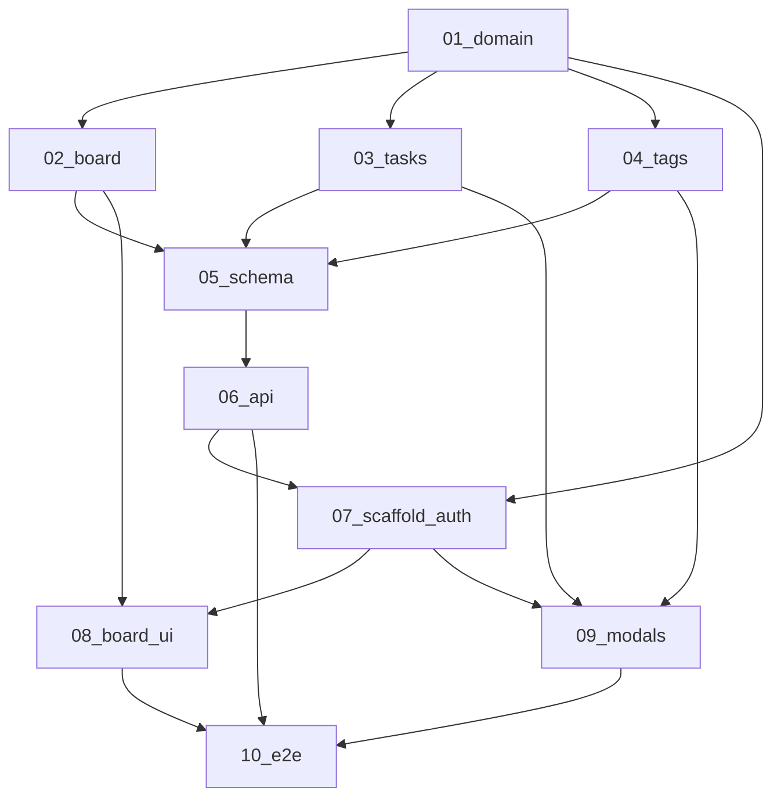

# Kanban Dashboard Specifications

These specifications split a personal 3-column kanban SPA (`repos/kanban-dashboard`) ↔ `personal-api` into independently reviewable implementation units.

Both apps stay on **separate hosts**. The API does **not** host the SPA. Users are provisioned only by administrators via the existing user-management flow. Any authenticated user may use kanban endpoints for **their own** data only (no teams, no shared boards, no new `Application` slug).

> **For agentic workers:** Execute specs in order (01 → 10). Steps use checkbox (`- [ ]`) syntax where present. Use superpowers:subagent-driven-development (recommended) or superpowers:executing-plans to implement task-by-task. Personas: **backend-developer** for specs 05–06; **frontend-developer** for specs 07–09.

## Execution order

1. [01 — Domain and ownership](01-functional-domain-and-ownership.md)  
   Vocabulary, isolation rules, status enum, out of scope.
2. [02 — Board and drag-drop (functional)](02-functional-board-and-drag-drop.md)  
   Three fixed columns, card contents, drop/keyboard move, persistence.
3. [03 — Tasks and checklist (functional)](03-functional-tasks-and-checklist.md)  
   Create/edit/delete modal fields, checklist, deadline.
4. [04 — Tags (functional)](04-functional-tags.md)  
   Per-user tags, create modal, one tag per task, delete clears task tag.
5. [05 — Database schema](05-backend-database-and-migrations.md)  
   Prisma `KanbanTag` / `KanbanTask`, migration, smoke test.
6. [06 — Kanban API module](06-backend-kanban-module.md)  
   `/api/v1/kanban` CRUD with ownership filter; Vitest/Supertest.
7. [07 — SPA scaffold, auth, shell](07-frontend-scaffold-auth-and-shell.md)  
   Vite app, JWT session, login, AppShell, BoardPage placeholder, tokens.
8. [08 — Board UI and drag-drop](08-frontend-board-and-drag-drop.md)  
   Columns, cards, HTML5 DnD + keyboard → PATCH status.
9. [09 — Task and tag modals](09-frontend-task-and-tag-modals.md)  
   TaskFormDialog, TagFormDialog, ConfirmDialog; mutations.
10. [10 — E2E and runbook](10-integration-e2e-and-runbook.md)  
    Playwright happy path + isolation; runbook: [e2e-local-runbook.md](e2e-local-runbook.md).



## Fixed decisions

- **Who / verb / feel:** One person moving their own work across three columns. Calm desk, index-card board. No Jira/team chrome.
- **Columns (fixed):** `PENDING` → Pending, `IN_PROGRESS` → In progress, `FINISHED` → Finished. No custom columns, no multiple boards.
- **Ownership:** Each tag and task belongs to one user. Global `ADMIN` does **not** read another user’s board (same rule as finance: owner = `req.user.id`, not fitness `requireSelf` URL userId).
- **Auth:** Existing `/api/v1/auth/login|refresh|logout|me`. `authenticate` on all kanban routes. No new Application slug. No public signup. Users provisioned by admin (`npm run db:seed-admin` + `POST /api/v1/users`).
- **REST base:** `/api/v1/kanban`.
- **Task fields:** title (required), description (required, min 1), tag (optional, **one**), deadline (optional, calendar `YYYY-MM-DD`), checklist (optional).
- **Edit/delete:** Click card opens the same modal for edit. Delete with confirm.
- **Checklist:** JSON on the task: `{ id: string, text: string, done: boolean }[]`. Not a child table.
- **Tags:** Per-user `KanbanTag`. Unique `(userId, name)`. Modal creates tags. `DELETE` tag sets `task.tagId` to null (`onDelete: SetNull`). No tag colors, no multi-tag.
- **Drag and drop:** Drop a card onto a **column** → `PATCH` status. Keyboard: “Move to …” on the card. No extra DnD library. **No within-column reorder** in v1; sort by `createdAt` descending.
- **SPA stack:** Vite + React 19 + TypeScript, `react-router-dom`, `@tanstack/react-query`, Zod, CSS Modules, Vitest, Playwright. Folder rule: `components/Name/index.tsx`, `pages/`, `hooks/`, `utils/`, `types/`. JWT: access in memory, refresh in `sessionStorage` key `kanban:refresh:v1`.
- **Hosts:** API `http://localhost:3000`, SPA Vite (document origin in spec 07; add to `CORS_ORIGINS`). `VITE_API_BASE_URL` is origin only (no `/api/v1`).
- **Language:** Specs and UI copy in English (column labels as given).
- **Feature branches:** `feat/kanban-api` (`personal-api`), `feat/kanban-dashboard` (`kanban-dashboard`).
- **Out of v1:** teams, sharing, comments, attachments, assignees, custom columns, tag colors, public registration, offline queue, `@dnd-kit`.

## Auth / ownership matrix

| Action | Unauthenticated | Authenticated owner | Other user / global ADMIN |
| --- | --- | --- | --- |
| Login / refresh / logout / me | login yes | yes | n/a |
| List / mutate own tags and tasks | 401 | yes | n/a |
| Access another user’s tag or task id | 401 | 404 (looks missing) | 404 |

## Review contract

Each specification has:

- a limited file boundary;
- test-first acceptance criteria (or explicit UI verification for UI-only pieces);
- a standalone commit boundary; and
- explicit dependency and verification / E2E requirements.

Do not begin a later specification until its listed dependency is merged or otherwise available in the working branch.

## Branch setup (before Task 1 of spec 05 / 07)

```bash
cd repos/personal-api
git checkout main && git pull
git checkout -b feat/kanban-api

cd ../kanban-dashboard
git checkout main && git pull
git checkout -b feat/kanban-dashboard
```

Note: `repos/kanban-dashboard` may already contain a Vite starter and `repos/personal-api` may have stub `src/modules/kanban/*` files. Specs 05–09 define the **target** contract; replace or extend stubs to match — do not keep divergent shapes.

## Global constraints

- Feature branches: `feat/kanban-api` (`personal-api`), `feat/kanban-dashboard` (`kanban-dashboard`).
- REST base: `/api/v1/kanban/...` with `authenticate` and ownership by `req.user.id`.
- Session storage key: `kanban:refresh:v1` (refresh token only).
- Do not host the SPA from personal-api.
- Do not introduce Application permissions for kanban.
- Do not add within-column reorder, multi-tag, or a DnD library in this plan set.
- Specs must not contain placeholders (`TBD`, `TODO`, `implement later`).
- Do not create commits during implementation unless the user explicitly asks.

## Spec template (mandatory)

Every numbered spec uses this structure:

```markdown
# [Name]

**Tipo:** Functional | Backend | UX/UI | Integration
**Depende de:** …
**Implementa:** … (exact repo + files)
**No incluye:** …

## Resultado
## Requirements
## Architecture
## Code to do
## Testing
## Acceptance
## Playwright scenarios unlocked
## Impact
```

- **Functional** (`01`–`04`): requirements and vocabulary only. “Code to do” names the later spec that owns files — no Prisma/React implementation details.
- **Backend / UX / Integration** (`05`–`10`): “Code to do” lists exact paths, snippets, and commands.
- **UX/UI** uses content roles (empty column, overdue deadline), not fixture emails. Integration is the only lane for concrete fixture data.

## Stack of reference

- SPA: React 19 + TypeScript + Vite — `repos/kanban-dashboard`
- API: Express + TypeScript + Prisma + PostgreSQL — `repos/personal-api`
- Auth: JWT access + rotating refresh (existing auth module)
- Data: TanStack Query
- Unit/integration: Vitest (+ Supertest on API)
- E2E: Playwright (`@playwright/test`); `playwright-cli` optional for exploration

## Expected files after this catalog

- `README.md` (this index)
- `01-functional-domain-and-ownership.md` … `04-functional-tags.md`
- `05-backend-database-and-migrations.md` … `06-backend-kanban-module.md`
- `07-frontend-scaffold-auth-and-shell.md` … `09-frontend-task-and-tag-modals.md`
- `10-integration-e2e-and-runbook.md`
- `e2e-local-runbook.md`

**Total: 12 files** (1 index + 10 specs + 1 runbook).
