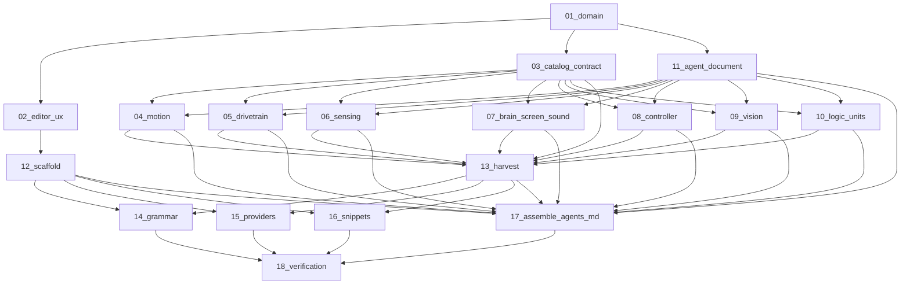

# VEXcode IQ (1st gen) C++ editor overlay — specifications

These specifications split a docs-only VS Code / Cursor extension (`repos/personal-projects/vex-iq-extension`) into independently reviewable units: editor overlay (completions, hover, signatures, snippets, extra highlighting) plus one agentic playbook (`AGENTS.md`).

The extension is **not** a compiler, linker, downloader, or firmware tool. It injects into existing `cpp` files. It does not steal the C++ language id.

> **For agentic workers:** Execute specs in order (`01` → `18`). Use superpowers:subagent-driven-development (recommended) or superpowers:executing-plans to implement task-by-task. Persona: **backend-developer** for catalog schema, Zod validation, and provider error paths.

## Execution order

1. [01 — Domain and scope](01-functional-domain-and-scope.md)  
   Vocabulary, success/failure, coexistence, out of scope.
2. [02 — Editor experience](02-functional-editor-experience.md)  
   Highlight, complete, hover, signature help, snippets (user-visible).
3. [03 — Catalog contract](03-functional-catalog-contract.md)  
   JSON/`CatalogEntry` schema; single source of truth for symbols.
4. [04 — Motion](04-functional-motion.md)  
   `motor`, `motor_group`, `pneumatic` + Agent chapter.
5. [05 — Drivetrain](05-functional-drivetrain.md)  
   `drivetrain`, `smartdrive` + Agent chapter.
6. [06 — Sensing](06-functional-sensing.md)  
   Brain buttons/battery, bumper, touchled, color, optical, gyro, distance/sonar + Agent chapter.
7. [07 — Brain screen, sound, console](07-functional-brain-screen-sound.md)  
   Screen, speaker (`playSound` / `playNote` / `soundOff`), console + Agent chapter.
8. [08 — Controller](08-functional-controller.md)  
   Controller buttons and axes (`AxisA`–`AxisD`) + Agent chapter.
9. [09 — Vision](09-functional-vision.md)  
   Classic Vision Sensor (`vision`) + Agent chapter. No AI Vision.
10. [10 — Logic and units](10-functional-logic-and-units.md)  
    `wait`, events, threads, ports, unit aliases + Agent chapter.
11. [11 — Agent document (functional)](11-functional-agent-document.md)  
    One-file `AGENTS.md` contract, front matter, chapter template.
12. [12 — Extension scaffold](12-extension-scaffold.md)  
    `package.json`, activation, `vexIq.enable`, TypeScript layout.
13. [13 — Catalog harvest](13-extension-catalog-harvest.md)  
    `catalog/iq1-cpp.json`, Zod, unique ids, official `docUrl`.
14. [14 — Grammar and brackets](14-extension-grammar-and-brackets.md)  
    TextMate injection into `source.cpp`.
15. [15 — Providers](15-extension-providers.md)  
    Completion, hover, signature help.
16. [16 — Snippets](16-extension-snippets.md)  
    `vex-motor`, `vex-drivetrain`, `vex-wait`, `vex-main`.
17. [17 — Assemble `AGENTS.md`](17-extension-agent-document.md)  
    Concatenate spec 11 front matter + chapters from 04–10.
18. [18 — Integration verification](18-integration-verification.md)  
    Extension Development Host tracer + playbook completeness.



## Agent document rule

- Specs **04–10** each include a `## Agent chapter` whose Markdown is concatenated into `repos/personal-projects/vex-iq-extension/AGENTS.md`.
- Spec **11** owns front matter, heading order, and the chapter template.
- Spec **17** assembles the file. Do not create per-topic Markdown files.
- A member must not appear in `AGENTS.md` if it is absent from the catalog (spec 03 / 13).

## Fixed decisions

- **Platform:** VEX IQ (1st gen) C++ only. Docs: [https://api.vex.com/iq1/home/cpp/index.html](https://api.vex.com/iq1/home/cpp/index.html).
- **Language model:** inject into `source.cpp`. Do not register a new language id for `.cpp`.
- **Catalog:** JSON `CatalogEntry[]` (or wrapped object with `entries`) is the symbol SSOT. Providers, snippets, and extra tokens read it.
- **Playbook path:** `repos/personal-projects/vex-iq-extension/AGENTS.md`.
- **Setting:** `vexIq.enable` (boolean, default `true`).
- **Publisher / name (v1):** publisher `francisco` (local), extension `vex-iq-cpp`. Change only if the user names a publisher later.
- **Target repo:** `repos/personal-projects/vex-iq-extension/` (empty except `README.md` at spec-writing time).
- **Feature branch (when implementing code, not this spec pass):** `feat/vex-iq-cpp-overlay` in that repo.
- **Language:** Specs and playbook in English.
- **No commits** during spec writing or implementation unless the user asks.

## Review contract

Each specification has:

- a limited file boundary;
- test-first acceptance (or Extension Host / playbook checks for editor-only pieces);
- a standalone commit boundary when code is implemented;
- explicit dependencies.

Do not begin a later specification until its listed dependency is available.

## Global constraints

- Platform: **VEX IQ (1st gen) C++ only**. Source of user-facing docs: [https://api.vex.com/iq1/home/cpp/index.html](https://api.vex.com/iq1/home/cpp/index.html).
- Out of v1: compiler, linker, download/firmware, Python, Blocks, V5/EXP/CTE/AIM/AIR, IQ **2nd gen** as the primary API (Brain built-in `inertial`, `aivision`, stick-click `ButtonL3`/`ButtonR3`, Axis1–4 as preferred names). IQ1 Range Finder is `sonar`; IQ1 Distance Sensor is `distance` — both are in-scope when their official IQ1 pages exist.
- Do **not** compete with `VEXRobotics.vexcode` for build/deploy. Coexist with Microsoft C/C++ for standard C++ coloring/IntelliSense.
- Language model: **inject into `source.cpp`**. Do not register a new language id that takes over `.cpp`.
- DRY (symbols): completions, hover, signature help, snippets, and extra keyword coloring all read the catalog. Do not hand-maintain parallel symbol lists.
- DRY (agents): **one** playbook file `AGENTS.md`. Do not create per-topic Markdown files. Specs `04`–`10` each add a chapter to that same file. Catalog remains the structured API; `AGENTS.md` adapts it into agent-operable prose (when to use, skeletons, pitfalls, official URLs). Do not invent APIs in the playbook that are absent from the catalog.
- Official docs win for **hover prose, playbook examples, and VEXcode-style names** (`spinFor`, `objectDistance`). SDK/doxygen headers ([iqcpp-doxygen](https://johnholbrook.github.io/iqcpp-doxygen/namespacevex.html)) win when a documented name has **no matching symbol** — do not ship completions or agent instructions for invented APIs.
- `using namespace vex;` plus `vex::` qualified names are both in scope for completions and for playbook examples.
- Specs and UI copy: English. No placeholders (`TBD`, `TODO`, `implement later`).
- Do not create git commits unless the user asks.
- JS/TS (when implemented later): always braces, explicit returns.
- Catalog parse failure: log once, disable VEX providers, do not crash the extension host.
- Agentic playbook path (locked): `repos/personal-projects/vex-iq-extension/AGENTS.md`. Cursor agents working in that repo must be able to follow it without reading `api.vex.com`.

## Spec template (mandatory)

Every numbered spec uses this structure:

```markdown
# [Name]

**Tipo:** Functional | Extension | Integration
**Depende de:** …
**Implementa:** … (exact repo + files for Extension/Integration; later spec name for Functional)
**No incluye:** …

## Resultado
## Requirements
## Architecture
## Code to do
## Testing
## Acceptance
## Verification unlocked
## Impact
```

- **Functional** (`01`–`11`): requirements and vocabulary. “Code to do” names the later spec that owns files.
- **Extension** (`12`–`17`): “Code to do” lists exact paths, snippets, and commands.
- **Integration** (`18`): fixtures, Extension Host steps, playbook checks.

Specs `04`–`10` add a mandatory `## Agent chapter` after `## Impact` (or immediately before it if the chapter is the functional deliverable). The chapter body is the exact Markdown spec 17 concatenates.

## Stack of reference

- Extension: VS Code Extension API + TypeScript (strict), Vitest, Zod
- Grammar: TextMate JSON, `injectTo: ["source.cpp"]`
- Catalog: `catalog/iq1-cpp.json`
- Playbook: `AGENTS.md`
- Coexist: Microsoft C/C++ (`ms-vscode.cpptools`) for standard C++

## Expected files after this catalog

- `README.md` (this index)
- `01-functional-domain-and-scope.md` … `11-functional-agent-document.md`
- `12-extension-scaffold.md` … `17-extension-agent-document.md`
- `18-integration-verification.md`

**Total: 19 files** (1 index + 18 specs).
