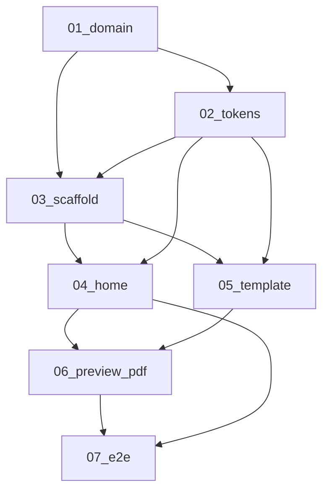

# Web CV Generator — Spec Index

Complete specification for a Vite + React CV previewer and PDF exporter at
`repos/personal-projects/web-cv-generator`. The folder today contains only the
pinned visual reference `image.png`. These specs define the app to build there.

> **For agentic workers:** REQUIRED SUB-SKILL: Use superpowers:subagent-driven-development
> (recommended) or superpowers:executing-plans to implement task-by-task. Execute
> specs in order (01 → 07). Steps use checkbox (`- [ ]`) syntax where present.
> Persona: **frontend-developer** for specs 03–07 (impeccable, vercel-react-best-practices,
> typescript-error-handling-patterns, braces, react-folder-structure, change-impact).

## Vision

Francisco (or anyone with a matching JSON file) opens a quiet print-studio tool,
picks a resume source of truth, previews it on an A4 sheet that matches the Olivia
template, and downloads a selectable-text PDF via the browser print dialog.

Impeccable modes:

- **Operate** — home catalog and preview toolbar (task: pick a source, export PDF).
- **Pinned artifact** — the A4 sheet. Visual authority is
  `repos/personal-projects/web-cv-generator/image.png`. Do not invent a second
  resume look.

Who / verb / feel: one person at a desk, picking a tailored JSON and exporting a
PDF. Cool gray studio wall; the white A4 sheet is the product; chrome recedes.

## Design principles

1. **The sheet is the product.** Studio chrome exists to pick a source and print.
   It must never restyle the CV to look like a dashboard.
2. **One layout for screen and PDF.** Preview HTML is what prints. No html2canvas,
   no jsPDF, no `@react-pdf/renderer` in v1.
3. **Allowlisted local JSON only.** Slugs come from `catalog.json`. No remote URL
   fetch, no path traversal, no GitHub runtime fetch.
4. **Same schema as resume-data-source.** Extra keys are allowed; missing optional
   arrays default to empty. The renderer only maps header, summary, experience,
   education, and skills.
5. **Every state exists.** Loading, empty, error, not-found, default, hover, focus,
   disabled. Keyboard-complete. Contrast AA for chrome and body text on the sheet.
6. **Multi-page is required.** The default Francisco JSON has 9 jobs and 34 skills.
   Items use `break-inside: avoid`.

## Information architecture

Single route `/` (React Router). Screen is chosen by the query string, matching
slides-generator’s `?presentation=<name>`:

| URL | Screen | Purpose |
|-----|--------|---------|
| `/` (no `resume` param) | HomePage | Catalog of sources |
| `/?resume=<kebab-slug>` | PreviewPage | A4 preview + Download PDF |
| `/?resume=` (empty) | HomePage | Treat as missing |
| `/?resume=not-in-catalog` | PreviewPage | Not-found state |
| unknown path | redirect `/` | No extra routes in v1 |

Vite `base` is `/web-cv-generator/`. Production URL example:

`https://<host>/web-cv-generator/?resume=francisco-veloz`

Dev URL example:

`http://localhost:5173/web-cv-generator/?resume=francisco-veloz`

## Data contract

- Catalog: `public/resumes/catalog.json` — `{ resumes: { slug, title, subtitle }[] }`.
- Resume files: `public/resumes/<slug>.json` — resume-data-source `index.json` shape.
- Default file: `francisco-veloz.json`, kept in sync by `npm run sync-resume`.
- View-model: `toCvViewModel(resume)` so `CvDocument` never reads skill ids.

Field mapping (normative; copy lives in spec 01):

- Name ← `profile.fullName` (CSS `text-transform: uppercase`)
- Title ← `profile.headline`
- Contact ← `email`, `phone`, `location`, optional `website`, joined with ` | `
- Summary ← `summary.long` if non-empty, else `summary.short`
- Experience ← `position`, `company`, `duration`, `responsibilities[]`
- Education ← `degree`, `institution`, `duration`
- Skills ← every `skills[].name` in three columns

Not rendered in v1: projects, certifications, achievements, languages,
socialNetworks, logos, profilePhoto, employmentType, skill categories.

## Scope

In scope:

- Vite React 19 TypeScript SPA with CSS Modules, Zod, Vitest, Playwright.
- Home catalog, query-param source selection, A4 preview, print-to-PDF.
- Olivia-template document layout and studio chrome.
- `sync-resume` copy from `repos/personal-projects/resume-data-source/index.json`.

Out of scope (v1):

- In-app editor, accounts, backend, CMS.
- Remote JSON URLs (`?resumeUrl=`).
- Extra document sections (projects, certs, languages, photo, logos).
- PDF npm libraries; silent download without the print dialog.
- Registering `web-cv-generator` as a git submodule / GitHub remote.
- Commits unless the user explicitly asks.

## Spec files

| File | Contents |
|------|----------|
| [01-functional-domain-and-data.md](01-functional-domain-and-data.md) | Vocabulary, URL contract, Zod-level schema, mapping, allowlist, errors |
| [02-design-tokens-and-surfaces.md](02-design-tokens-and-surfaces.md) | Studio + sheet tokens, type, A4 geometry, states, motion |
| [03-frontend-scaffold-and-routing.md](03-frontend-scaffold-and-routing.md) | Vite tree, scripts, Router, Zod parse, slug, fetch hooks |
| [04-home-catalog.md](04-home-catalog.md) | HomePage, SourceCard, catalog states |
| [05-cv-document-template.md](05-cv-document-template.md) | CvDocument tree, view-model, Olivia layout CSS |
| [06-preview-chrome-and-pdf.md](06-preview-chrome-and-pdf.md) | Toolbar, A4 scale, print CSS, Download PDF |
| [07-verification-and-e2e.md](07-verification-and-e2e.md) | Vitest + Playwright + sync-resume smoke |
| [e2e-local-runbook.md](e2e-local-runbook.md) | Local commands to run the suite |



## Execution order

1. [01 — Domain and data](01-functional-domain-and-data.md)
2. [02 — Design tokens and surfaces](02-design-tokens-and-surfaces.md)
3. [03 — Scaffold and routing](03-frontend-scaffold-and-routing.md)
4. [04 — Home catalog](04-home-catalog.md)
5. [05 — CV document template](05-cv-document-template.md)
6. [06 — Preview chrome and PDF](06-preview-chrome-and-pdf.md)
7. [07 — Verification and E2E](07-verification-and-e2e.md) — runbook:
   [e2e-local-runbook.md](e2e-local-runbook.md)

Do not begin a later implementation spec until its listed dependency is available
on the working branch.

## Fixed decisions

- **App root:** `repos/personal-projects/web-cv-generator`
- **Feature branch:** `feat/web-cv-generator` on the parent workspace (folder is
  not a submodule yet).
- **Stack:** Vite 8, React 19, TypeScript, CSS Modules, `react-router-dom` `^7.6.2`,
  Zod `^3.24.2`, Vitest, RTL, ESLint 9, Playwright. No Next.js, no Tailwind.
- **Folder rule:** `components/Name/index.tsx`, `pages/`, `hooks/`, `utils/`, `types/`.
- **Router:** `BrowserRouter` with basename from `import.meta.env.BASE_URL`
  (strip trailing slash except `/`).
- **PDF:** `window.print()` + `@page { size: A4; margin: 0 }`. Button label:
  `Download PDF`.
- **Language:** Specs and UI copy in English.
- **Prettier:** match `repos/productive-apps/user-management-app/.prettierrc.json`
  (no semicolons, single quotes, `printWidth` 115).
- **Braces:** block bodies and explicit returns in all TS/TSX.

## Review contract

Each numbered spec has a limited file boundary, test-first acceptance (or explicit
UI verification for visual pieces), a standalone commit boundary, and listed
dependencies. Specs must not contain placeholders (`TBD`, `TODO`, `implement later`).

## Global constraints

- Do not fetch GitHub or any remote host for resume JSON at runtime.
- Do not render projects, certifications, achievements, languages, social links,
  photo, or logos on the sheet in v1.
- Do not add a PDF npm library in v1.
- Do not create commits during implementation unless the user explicitly asks.
- Always braces and explicit returns in TS/TSX.
- Named exports from `components/Name/` and `pages/Name/` folders.

## Spec template (mandatory)

Every numbered spec uses this structure:

```markdown
# [Name]

**Tipo:** Functional | UX/UI | Integration
**Depende de:** …
**Implementa:** … (exact repo + files)
**No incluye:** …

## Resultado
## Requirements
## Architecture
## Code to do
## Testing
## Acceptance
## Playwright scenarios unlocked
## Impact
```

- **Functional (01):** requirements and vocabulary only. “Code to do” names the
  later spec that owns files.
- **UX/UI (02–06):** exact paths, snippets, and commands.
- **Integration (07):** concrete fixture data and Playwright.

## Stack of reference

- Routed SPA: `repos/productive-apps/user-management-app` (Router, Vitest, Prettier, ESLint)
- Vite `base` for GitHub Pages: `repos/personal-projects/screen-recorder`
- Query-param source selection: `repos/utils/slides-generator/README.md`
  (`/?presentation=my-topic`)
- Resume schema: `repos/personal-projects/resume-data-source/index.json`
- Visual authority: `repos/personal-projects/web-cv-generator/image.png`

## Expected files after this catalog

- `README.md` (this index)
- `01-functional-domain-and-data.md` … `07-verification-and-e2e.md`
- `e2e-local-runbook.md`

**Total: 9 files** (1 index + 7 specs + 1 runbook).
