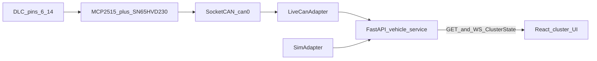

# Cavalier Digital Cluster Prototype Implementation Plan

> **For agentic workers:** REQUIRED SUB-SKILL: Use superpowers:subagent-driven-development (recommended) or superpowers:executing-plans to implement this plan task-by-task. Steps use checkbox (`- [ ]`) syntax for tracking.

**Goal:** Bench browser shows an OEM-homage cluster driven only by `ClusterState`, from sim traces or live OBD-II Mode 01 PIDs.

**Architecture:** Three units. `CanAdapter` produces `ClusterState` (`SimAdapter` or `LiveCanAdapter`). Vehicle service validates, holds current state, exposes `GET /v1/cluster`, `WS /v1/cluster/stream`, `POST /v1/source`. React UI renders gauges from generated OpenAPI types and never imports python-can, SocketCAN, or PID numbers. Tracer-bullet slice (keep it working): SimAdapter → GET + WS → tacho/speedo needles move.

**Tech Stack:** Python 3.11+, FastAPI, Pydantic v2, pydantic-settings, uvicorn, python-can, pytest, pytest-asyncio, httpx. React 18, Vite, TypeScript, CSS Modules, Vitest, Playwright, openapi-typescript.

**Canonical plan file (write on execution start):** [docs/superpowers/plans/2026-09-13-cavalier-digital-cluster-prototype.md](docs/superpowers/plans/2026-09-13-cavalier-digital-cluster-prototype.md)

**Spec:** [docs/superpowers/specs/2026-09-13-cavalier-digital-cluster-prototype-design.md](docs/superpowers/specs/2026-09-13-cavalier-digital-cluster-prototype-design.md)

## Global Constraints

- Phase 1 only. No Phase 2 IPC sniff, Arduino in the data path, Node/Express, Johnny-Five, auth, persistence, or internet exposure.
- Default adapter is `sim`. UI and API work with no car and no CAN hardware.
- OEM cluster stays installed. Harness is DLC pins 6/14 plus ground only. Do not power the Pi from pin 16. Do not connect to the IPC connector.
- TX cap: 11-bit frames to `0x7DF` only; ISO-TP single-frame Mode 01 PID request; accept `0x7E8`–`0x7EF`; max 10 TX frames/s; no extended IDs; no GMLAN app IDs; no Mode 03/04/09.
- JSON field names are camelCase. Pydantic models are source of truth. Do not hand-write a second `ClusterState` in the UI.
- `odometerKm` is always JSON `null` in Phase 1.
- Missing `can0` is HTTP `200` with `connected=false` and `error.code=disconnected`, not an HTTP failure.
- WebSocket stays open on disconnect/bus-off and streams `connected=false` states.
- UI tokens live in `web/src/index.css`. No raw hex in components once tokens exist.
- `web/src/` matches [`.agents/rules/react-folder-structure.mdc`](.agents/rules/react-folder-structure.mdc): `components/`, `hooks/`, `utils/`, `types/`. One route: no `pages/`. Named exports, one folder per component, CSS Modules colocated. JS/TS always braces ([`.agents/rules/js-ts-always-braces.mdc`](.agents/rules/js-ts-always-braces.mdc)).
- UI work uses the frontend-developer persona: impeccable Operate mode, spec UI section as the brief, vercel-react-best-practices, typescript-error-handling. Reject Grafana charts, Tesla glass, neon cyberpunk, SaaS cards.
- Empty `catch` forbidden. Narrow `unknown` before reading `message`. Live info logs must not dump PID payloads.
- Do not copy GM shop-manual figures. Do not invent K216 pinouts or GMLAN DBC / CAN IDs.
- Project lives only at [`repos/personal-projects/cavalier-digital-cluster`](repos/personal-projects/cavalier-digital-cluster). Do not put server/web under workspace root, `docs/`, or another personal-projects sibling.
- Nested repo is private GitHub + workspace submodule (same pattern as other `repos/personal-projects/*`). Child-repo commits happen per task. Parent `.gitmodules` registration is the last step.
- Execution should use a git worktree for the child repo once it exists (`superpowers:using-git-worktrees`).



## File structure

**Home of the project:** [`repos/personal-projects/cavalier-digital-cluster/`](repos/personal-projects/cavalier-digital-cluster/). Task 0 creates this folder. Every later path is relative to it unless marked as a workspace-root change.

- Create: the directory itself (`mkdir -p repos/personal-projects/cavalier-digital-cluster`)
- Create: `README.md` — Task 0 stub, then Task 1/13 expand into the runbook (laptop sim, Pi live, one-box `web/dist`), safety notes, link to workspace spec and wiki
- Create: `.gitignore` — `.env`, `web/dist`, `web/node_modules`, `__pycache__`, `.venv`, Playwright artifacts
- Create: `.env.example` — the spec env vars plus `CAVALIER_SIM_TRACE`
- Create: `pyproject.toml` — package `cavalier_cluster` from `server/`
- Create: `docs/README.md` — relative link back to workspace spec; do not duplicate GM material
- Create: `docs/pi-setup.md` — overlay, bitrate, termination jumper **open**, INT GPIO, crystal 16 MHz
- Create: `server/cavalier_cluster/__init__.py`
- Create: `server/cavalier_cluster/config.py` — pydantic-settings
- Create: `server/cavalier_cluster/clock.py` — `Clock` protocol, `WallClock`, `FakeClock`
- Create: `server/cavalier_cluster/models.py` — `ClusterState`, `ClusterError`, `SourceMode`, HTTP envelope
- Create: `server/cavalier_cluster/exceptions.py` — unexpected adapter failures
- Create: `server/cavalier_cluster/pid.py` — Mode 01 formulas + TX builder + RX parse (used only by live adapter)
- Create: `server/cavalier_cluster/tx_limiter.py` — 10 Hz TX token
- Create: `server/cavalier_cluster/adapters/protocol.py` — `CanAdapter`
- Create: `server/cavalier_cluster/adapters/sim.py`
- Create: `server/cavalier_cluster/adapters/live.py` — python-can isolated here
- Create: `server/cavalier_cluster/adapters/factory.py` — `make_adapter(mode, settings, clock)`
- Create: `server/cavalier_cluster/service.py` — one started adapter, current state, source switch
- Create: `server/cavalier_cluster/app.py` — FastAPI factory, CORS, 422/500 handlers, routes, optional `web/dist`
- Create: `server/cavalier_cluster/main.py` — `app = create_app()`
- Create: `server/cavalier_cluster/export_openapi.py` — writes `server/openapi.json`
- Create: `server/sim/idle.json`
- Create: `server/sim/rev.json`
- Create: `server/tests/conftest.py`
- Create: `server/tests/test_models.py`
- Create: `server/tests/test_sim_adapter.py`
- Create: `server/tests/test_contract.py`
- Create: `server/tests/test_pid.py`
- Create: `server/tests/test_tx_limiter.py`
- Create: `server/tests/test_live_adapter.py`
- Create: `server/tests/test_source.py`
- Create: `server/tests/test_stream.py`
- Create: `web/package.json`, `web/tsconfig.json`, `web/vite.config.ts`, `web/index.html`, `web/playwright.config.ts`
- Create: `web/src/main.tsx`, `web/src/App.tsx`, `web/src/index.css`, `web/src/vite-env.d.ts`, `web/src/test/setup.ts`
- Create: `web/src/types/openapi.d.ts` — generated; do not hand-edit
- Create: `web/src/types/cluster.ts` — re-exports generated `ClusterState`
- Create: `web/src/utils/apiBase.ts`, `dicCopy.ts`, `gaugeGeometry.ts`, `narrowError.ts` (+ colocated tests)
- Create: `web/src/hooks/useClusterStream.ts`, `useNeedleAngle.ts`, `useSourceSwitch.ts` (+ tests)
- Create: `web/src/components/{AnalogGauge,BarGauge,Dic,SourceToggle,ClusterView,ClusterErrorBoundary}/`
- Create: `web/e2e/cluster-sim.spec.ts`
- Modify (workspace, last): [`.gitmodules`](.gitmodules) — add submodule
- Modify (workspace): [docs/superpowers/specs/2026-09-13-cavalier-digital-cluster-prototype-design.md](docs/superpowers/specs/2026-09-13-cavalier-digital-cluster-prototype-design.md) status line to `implementation plan written` only if the user wants spec status updated; default leave spec untouched

`CAVALIER_SIM_TRACE` is the only extra env var beyond the spec table. Default `idle` (spec). README laptop demo and Playwright set it to `rev` so needles move. Path is a filename under `server/sim/` (`idle.json` or `rev.json`).

---

### Task 0: Create the project folder

**Files:**
- Create: `repos/personal-projects/cavalier-digital-cluster/` (directory)
- Create: `repos/personal-projects/cavalier-digital-cluster/README.md` (stub so the folder is a real git tree)

**Interfaces:**
- Consumes: nothing
- Produces: empty project root at `repos/personal-projects/cavalier-digital-cluster`. Tasks 1–13 write only inside this folder (except workspace `.gitmodules` in Task 13).

- [ ] **Step 1: Confirm the parent exists and the target does not**

Run: `ls repos/personal-projects && test ! -e repos/personal-projects/cavalier-digital-cluster`

Expected: `personal-projects` lists sibling repos; `cavalier-digital-cluster` is absent. If the folder already exists with other content, stop and do not overwrite.

- [ ] **Step 2: Create the folder**

Run:

```bash
mkdir -p repos/personal-projects/cavalier-digital-cluster
```

Expected: directory exists. Do not create `server/` or `web/` yet.

- [ ] **Step 3: Write a stub README**

```markdown
# Cavalier digital cluster

Phase 1 prototype for the Chevrolet Cavalier 2021 instrument-cluster homage.

This folder is the project root (`server/` + `web/`). Spec: workspace `docs/superpowers/specs/2026-09-13-cavalier-digital-cluster-prototype-design.md`.
```

Path: `repos/personal-projects/cavalier-digital-cluster/README.md`

- [ ] **Step 4: Init the child git repo**

```bash
cd repos/personal-projects/cavalier-digital-cluster
git init
git add README.md
git commit -m "chore: start cavalier-digital-cluster project root"
```

Expected: nested repo with one commit. Do not `git submodule add` yet (Task 13). Do not add this folder to the parent index as a normal directory if you can avoid it; leave it untracked in the workspace until submodule registration.

- [ ] **Step 5: Verify location**

Run: `ls -la repos/personal-projects/cavalier-digital-cluster`

Expected: `.git/` and `README.md` only. Later tasks `cd` here before `pytest` / `npm`.

---

### Task 1: Repo scaffold, ClusterState, OpenAPI contract

**Files:**
- Create: `repos/personal-projects/cavalier-digital-cluster/pyproject.toml`
- Create: `repos/personal-projects/cavalier-digital-cluster/server/cavalier_cluster/models.py`
- Create: `repos/personal-projects/cavalier-digital-cluster/server/cavalier_cluster/config.py`
- Create: `repos/personal-projects/cavalier-digital-cluster/server/cavalier_cluster/export_openapi.py`
- Create: `repos/personal-projects/cavalier-digital-cluster/server/cavalier_cluster/app.py` (minimal app with no routes yet is OK; contract test needs OpenAPI paths — add stub routes that return a default `ClusterState` so `/openapi.json` lists them, or wait until Task 3 for path assertions and in this task only test model round-trip)
- Test: `repos/personal-projects/cavalier-digital-cluster/server/tests/test_models.py`

**Interfaces:**
- Consumes: nothing
- Produces: `ClusterState`, `ClusterError`, `SourceBody`, `HttpErrorEnvelope`; `Settings` with `source_default`, `can_interface`, `cors_origins`, `host`, `port`, `sim_trace`

- [ ] **Step 1: Write the failing test**

```python
# server/tests/test_models.py
from cavalier_cluster.models import ClusterState, ClusterError

def test_cluster_state_json_is_camel_case() -> None:
    state = ClusterState(
        source="sim",
        connected=True,
        speedKmh=0,
        rpm=800,
        coolantC=90,
        fuelPercent=55.3,
        milOn=False,
        odometerKm=None,
        updatedAt="2026-09-13T18:00:00.000Z",
        error=None,
    )
    payload = state.model_dump(mode="json", by_alias=True)
    assert payload["speedKmh"] == 0
    assert payload["fuelPercent"] == 55.3
    assert payload["odometerKm"] is None
    assert "speed_kmh" not in payload

def test_error_codes_round_trip() -> None:
    err = ClusterError(code="unsupported_pid", message="PID not supported", pid="0x2F")
    assert err.model_dump(mode="json")["pid"] == "0x2F"
```

- [ ] **Step 2: Run test to verify it fails**

Run: `cd repos/personal-projects/cavalier-digital-cluster && python -m pytest server/tests/test_models.py -v`

Expected: FAIL with `ModuleNotFoundError: cavalier_cluster` or `collection failed`

- [ ] **Step 3: Write minimal implementation**

`pyproject.toml` (exact dependency floors):

```toml
[project]
name = "cavalier-digital-cluster"
version = "0.1.0"
requires-python = ">=3.11"
dependencies = [
  "fastapi>=0.115.0",
  "pydantic>=2.9.0",
  "pydantic-settings>=2.5.0",
  "uvicorn[standard]>=0.32.0",
  "python-can>=4.4.0",
]

[project.optional-dependencies]
dev = [
  "pytest>=8.3.0",
  "pytest-asyncio>=0.24.0",
  "httpx>=0.27.0",
]

[build-system]
requires = ["setuptools>=75"]
build-backend = "setuptools.build_meta"

[tool.setuptools.packages.find]
where = ["server"]
include = ["cavalier_cluster*"]

[tool.pytest.ini_options]
asyncio_mode = "auto"
pythonpath = ["server"]
testpaths = ["server/tests"]
```

```python
# server/cavalier_cluster/models.py
from typing import Literal

from pydantic import BaseModel, ConfigDict, Field

ErrorCode = Literal[
    "disconnected",
    "bus_off",
    "timeout",
    "unsupported_pid",
    "adapter_error",
]
SourceMode = Literal["live", "sim"]

class ClusterError(BaseModel):
    model_config = ConfigDict(extra="forbid")
    code: ErrorCode
    message: str
    pid: str | None = None

class ClusterState(BaseModel):
    model_config = ConfigDict(extra="forbid", populate_by_name=True)
    source: SourceMode
    connected: bool
    speedKmh: float | None = Field(default=None, ge=0)
    rpm: float | None = Field(default=None, ge=0)
    coolantC: float | None = None
    fuelPercent: float | None = Field(default=None, ge=0, le=100)
    milOn: bool | None = None
    odometerKm: None = None
    updatedAt: str
    error: ClusterError | None = None

class SourceBody(BaseModel):
    model_config = ConfigDict(extra="forbid")
    mode: SourceMode

class HttpErrorBody(BaseModel):
    model_config = ConfigDict(populate_by_name=True)
    code: str
    message: str
    statusCode: int

class HttpErrorEnvelope(BaseModel):
    error: HttpErrorBody
```

```python
# server/cavalier_cluster/config.py
from pydantic import Field
from pydantic_settings import BaseSettings, SettingsConfigDict

class Settings(BaseSettings):
    model_config = SettingsConfigDict(env_prefix="CAVALIER_", extra="ignore")
    source_default: str = "sim"
    can_interface: str = "can0"
    cors_origins: str = "http://localhost:5173"
    host: str = "0.0.0.0"
    port: int = 8000
    sim_trace: str = "idle"

    def cors_origin_list(self) -> list[str]:
        return [part.strip() for part in self.cors_origins.split(",") if part.strip()]
```

Also add `README.md`, `.gitignore`, `.env.example`, empty `docs/README.md` linking to `../../../../docs/superpowers/specs/2026-09-13-cavalier-digital-cluster-prototype-design.md`.

- [ ] **Step 4: Run test to verify it passes**

Run: `pip install -e ".[dev]" && python -m pytest server/tests/test_models.py -v`

Expected: PASS

- [ ] **Step 5: Commit** (child repo already inited in Task 0; work inside `repos/personal-projects/cavalier-digital-cluster`)

```bash
git add pyproject.toml README.md .gitignore .env.example docs server/cavalier_cluster/models.py server/cavalier_cluster/config.py server/tests/test_models.py
git commit -m "feat: add ClusterState Pydantic contract"
```

---

### Task 2: Clock + SimAdapter + traces

**Files:**
- Create: `server/cavalier_cluster/clock.py`
- Create: `server/cavalier_cluster/adapters/protocol.py`
- Create: `server/cavalier_cluster/adapters/sim.py`
- Create: `server/sim/idle.json`
- Create: `server/sim/rev.json`
- Test: `server/tests/test_sim_adapter.py`

**Interfaces:**
- Consumes: `ClusterState` from Task 1; `Settings.sim_trace`
- Produces: `CanAdapter` protocol; `SimAdapter.start/stop/read`; traces without `source`/`error`

```python
# protocol.py
from typing import Protocol
from cavalier_cluster.models import ClusterState

class CanAdapter(Protocol):
    async def start(self) -> None: ...
    async def stop(self) -> None: ...
    async def read(self) -> ClusterState: ...
```

- [ ] **Step 1: Write the failing test**

```python
# server/tests/test_sim_adapter.py
from pathlib import Path
from cavalier_cluster.adapters.sim import SimAdapter
from cavalier_cluster.clock import FakeClock

REV = Path(__file__).resolve().parents[1] / "sim" / "rev.json"

async def test_rev_trace_rpm_rises_then_falls() -> None:
    clock = FakeClock()
    adapter = SimAdapter(trace_path=REV, clock=clock)
    await adapter.start()
    first = await adapter.read()
    clock.advance(4.0)
    mid = await adapter.read()
    clock.advance(4.0)
    last = await adapter.read()
    await adapter.stop()
    assert first.source == "sim"
    assert first.connected is True
    assert first.error is None
    assert first.rpm is not None and mid.rpm is not None and last.rpm is not None
    assert mid.rpm > first.rpm
    assert last.rpm < mid.rpm

async def test_sim_stays_connected_while_running() -> None:
    clock = FakeClock()
    adapter = SimAdapter(trace_path=REV, clock=clock)
    await adapter.start()
    state = await adapter.read()
    await adapter.stop()
    assert state.connected is True
    assert state.source == "sim"
```

- [ ] **Step 2: Run test to verify it fails**

Run: `python -m pytest server/tests/test_sim_adapter.py -v`

Expected: FAIL with `SimAdapter` not defined

- [ ] **Step 3: Write minimal implementation**

`FakeClock.monotonic()` returns `_t`. `advance(seconds)` adds to `_t`. `async sleep` calls `advance`. `WallClock` uses `time.monotonic` / `asyncio.sleep`.

`rev.json` keyframes (loop period = last `tMs`):

```json
[
  {"tMs": 0, "speedKmh": 0, "rpm": 800, "coolantC": 90, "fuelPercent": 55, "milOn": false, "odometerKm": null},
  {"tMs": 4000, "speedKmh": 80, "rpm": 4000, "coolantC": 92, "fuelPercent": 54.5, "milOn": false, "odometerKm": null},
  {"tMs": 8000, "speedKmh": 0, "rpm": 800, "coolantC": 90, "fuelPercent": 55, "milOn": false, "odometerKm": null}
]
```

`idle.json`: one frame, rpm 800, speed 0, coolant 90, fuel 55, mil false.

`SimAdapter`: on `start`, record origin monotonic time and load JSON. `read()`: `elapsed_ms = (clock.monotonic() - origin) * 1000 % period`; linear-interpolate numeric fields between surrounding keyframes; booleans from the left keyframe; fill `source="sim"`, `connected=True`, `error=None`, `updatedAt` as UTC ISO-8601 with milliseconds (`datetime.now(UTC).isoformat(timespec="milliseconds").replace("+00:00", "Z")`). `odometerKm` always `None`.

- [ ] **Step 4: Run test to verify it passes**

Run: `python -m pytest server/tests/test_sim_adapter.py -v`

Expected: PASS

- [ ] **Step 5: Commit**

```bash
git add server/cavalier_cluster/clock.py server/cavalier_cluster/adapters server/sim server/tests/test_sim_adapter.py
git commit -m "feat: add SimAdapter with idle and rev traces"
```

---

### Task 3: VehicleService + GET /v1/cluster

**Files:**
- Create: `server/cavalier_cluster/service.py`
- Create: `server/cavalier_cluster/adapters/factory.py`
- Modify: `server/cavalier_cluster/app.py`
- Create: `server/cavalier_cluster/main.py`
- Test: `server/tests/test_contract.py` (GET + OpenAPI paths)

**Interfaces:**
- Consumes: `CanAdapter`, `SimAdapter`, `Settings`, `ClusterState`
- Produces: `VehicleService.current() -> ClusterState`; `GET /v1/cluster` → `200` + `ClusterState`; `create_app(settings: Settings | None = None, clock: Clock | None = None, adapter: CanAdapter | None = None)`

- [ ] **Step 1: Write the failing test**

```python
from fastapi.testclient import TestClient
from cavalier_cluster.app import create_app
from cavalier_cluster.config import Settings

def test_get_cluster_returns_sim_state() -> None:
    app = create_app(Settings(source_default="sim", sim_trace="rev"))
    with TestClient(app) as client:
        response = client.get("/v1/cluster")
    assert response.status_code == 200
    body = response.json()
    assert body["source"] == "sim"
    assert body["connected"] is True
    assert "rpm" in body

def test_openapi_contains_phase1_paths() -> None:
    app = create_app(Settings())
    spec = app.openapi()
    assert "/v1/cluster" in spec["paths"]
    assert "/v1/source" in spec["paths"]
    # stream may be websocket-only; still must appear in OpenAPI
    assert "/v1/cluster/stream" in spec["paths"]
    schemas = spec["components"]["schemas"]
    assert "ClusterState" in schemas
```

Until Task 4/5 add those paths, this test will fail on missing `/v1/source` and `/v1/cluster/stream`. **Do not stub fake paths.** Split this test: Task 3 asserts only `GET /v1/cluster` and `ClusterState` schema. Add the other path asserts in Tasks 4 and 5.

Task 3 test file `test_contract.py`:

```python
def test_get_cluster_always_defined_after_start() -> None:
    ...

def test_openapi_has_cluster_get_and_cluster_state() -> None:
    spec = create_app(Settings()).openapi()
    assert spec["paths"]["/v1/cluster"]["get"]
    assert "ClusterState" in spec["components"]["schemas"]
```

- [ ] **Step 2: Run test to verify it fails**

Run: `python -m pytest server/tests/test_contract.py -v`

Expected: FAIL (`create_app` missing)

- [ ] **Step 3: Write minimal implementation**

`VehicleService` holds exactly one adapter. `start()` starts adapter and a loop: every 100 ms `state = await adapter.read(); self._current = state`. `current()` returns last state; if none yet, return a loading-safe connected sim snapshot only after `start` has completed one `read` — TestClient lifespan must call `service.start()` on FastAPI `lifespan`.

```python
# app.py lifespan
@asynccontextmanager
async def lifespan(app: FastAPI):
    service: VehicleService = app.state.service
    await service.start()
    try:
        yield
    finally:
        await service.stop()
```

`GET /v1/cluster` returns `service.current()`. CORS from `settings.cors_origin_list()`. Bind is not in app factory (uvicorn uses `CAVALIER_HOST` / `CAVALIER_PORT`).

If `web/dist/index.html` exists, mount `StaticFiles(directory=dist, html=True)` at `/` **after** `/v1` routes. If missing, skip mount (no crash). This covers the optional one-box demo without a later task.

- [ ] **Step 4: Run test to verify it passes**

Run: `python -m pytest server/tests/test_contract.py server/tests/test_sim_adapter.py server/tests/test_models.py -v`

Expected: PASS

- [ ] **Step 5: Commit**

```bash
git commit -m "feat: expose GET /v1/cluster from SimAdapter"
```

---

### Task 4: WebSocket stream at 10 Hz

**Files:**
- Modify: `server/cavalier_cluster/app.py`
- Test: `server/tests/test_stream.py`

**Interfaces:**
- Consumes: `VehicleService.current()`
- Produces: `WS /v1/cluster/stream` JSON text frames; first frame immediately; then every 100 ms; ignore client text; do not close on `connected=false`

- [ ] **Step 1: Write the failing test**

```python
import json
import time
from fastapi.testclient import TestClient
from cavalier_cluster.app import create_app
from cavalier_cluster.config import Settings

def test_stream_sends_immediately_then_about_10hz() -> None:
    app = create_app(Settings(sim_trace="rev"))
    with TestClient(app) as client:
        with client.websocket_connect("/v1/cluster/stream") as ws:
            first = json.loads(ws.receive_text())
            assert first["source"] == "sim"
            t0 = time.monotonic()
            ws.receive_text()
            ws.receive_text()
            elapsed = time.monotonic() - t0
    # two intervals ~200ms; allow ±20ms per spec, plus one extra 20ms slack for two hops
    assert 0.160 <= elapsed <= 0.240
```

- [ ] **Step 2: Run test to verify it fails**

Run: `python -m pytest server/tests/test_stream.py -v`

Expected: FAIL (404 or missing websocket)

- [ ] **Step 3: Write minimal implementation**

```python
@app.websocket("/v1/cluster/stream")
async def cluster_stream(ws: WebSocket) -> None:
    await ws.accept()
    await ws.send_text(service.current().model_dump_json(by_alias=True))
    try:
        while True:
            await asyncio.sleep(0.1)
            await ws.send_text(service.current().model_dump_json(by_alias=True))
    except WebSocketDisconnect:
        return
```

Do not `close()` when `connected` is false. Repeat last state if adapter has not changed. Protocol ping/pong is uvicorn’s default; do not invent an app-level ping JSON.

- [ ] **Step 4: Run test to verify it passes**

Run: `python -m pytest server/tests/test_stream.py -v`

Expected: PASS

- [ ] **Step 5: Commit**

```bash
git commit -m "feat: stream ClusterState over WebSocket at 10 Hz"
```

---

### Task 5: POST /v1/source, 422 envelope, 500 envelope

**Files:**
- Modify: `server/cavalier_cluster/app.py`
- Modify: `server/cavalier_cluster/service.py`
- Create: `server/cavalier_cluster/exceptions.py`
- Test: `server/tests/test_source.py`
- Modify: `server/tests/test_contract.py` — add `/v1/source` and `/v1/cluster/stream` to OpenAPI asserts

**Interfaces:**
- Consumes: `SourceBody`; `make_adapter(mode)`
- Produces: `VehicleService.set_source(mode) -> ClusterState`; `POST /v1/source` `200` + `ClusterState`; invalid body `422` + envelope; unhandled `500` + `code=adapter_error` generic message

- [ ] **Step 1: Write the failing test**

```python
def test_post_source_sim_is_idempotent() -> None:
    app = create_app(Settings(source_default="sim", sim_trace="idle"))
    with TestClient(app) as client:
        a = client.post("/v1/source", json={"mode": "sim"})
        b = client.post("/v1/source", json={"mode": "sim"})
    assert a.status_code == 200
    assert b.status_code == 200
    assert a.json()["source"] == "sim"
    assert b.json()["source"] == "sim"

def test_post_invalid_mode_is_422_envelope() -> None:
    app = create_app(Settings())
    with TestClient(app) as client:
        response = client.post("/v1/source", json={"mode": "arduino"})
    assert response.status_code == 422
    body = response.json()
    assert body["error"]["code"] == "adapter_error"
    assert body["error"]["statusCode"] == 422
    assert "stack" not in body["error"]["message"].lower()
    assert "/" not in body["error"]["message"] or "invalid" in body["error"]["message"].lower()

def test_post_live_without_can0_is_200_disconnected() -> None:
    app = create_app(Settings(can_interface="can0"))
    with TestClient(app) as client:
        # Task 5 may still use a stub live adapter; Task 7 replaces it.
        # If LiveCanAdapter is not built yet, factory maps live -> a NullLiveAdapter
        # that returns connected=false, error.code=disconnected, message like "can0 is down".
        response = client.post("/v1/source", json={"mode": "live"})
    assert response.status_code == 200
    body = response.json()
    assert body["source"] == "live"
    assert body["connected"] is False
    assert body["error"]["code"] == "disconnected"
```

For Task 5, implement `NullLiveAdapter` in `adapters/live.py` as a temporary stand-in **only if** you refuse to land python-can yet. Prefer landing the disconnected path of `LiveCanAdapter` here (open `can0` fails → disconnected state) and filling PID IO in Task 7. **Do not leave `NullLiveAdapter` after Task 7.**

- [ ] **Step 2: Run test to verify it fails**

Run: `python -m pytest server/tests/test_source.py -v`

Expected: FAIL

- [ ] **Step 3: Write minimal implementation**

`set_source`: `await current.stop(); adapter = make_adapter(mode); await adapter.start(); self._adapter = adapter; self._current = await adapter.read(); return self._current`. Same mode twice still stop/start (idempotent **effect**: `200` + same shape).

Validation exception handler:

```python
@app.exception_handler(RequestValidationError)
async def validation_handler(request: Request, exc: RequestValidationError) -> JSONResponse:
    envelope = HttpErrorEnvelope(
        error=HttpErrorBody(
            code="adapter_error",
            message="invalid source mode",
            statusCode=422,
        )
    )
    return JSONResponse(status_code=422, content=envelope.model_dump(mode="json"))
```

Unhandled:

```python
@app.exception_handler(Exception)
async def unhandled_handler(request: Request, exc: Exception) -> JSONResponse:
    logging.exception("unhandled")
    envelope = HttpErrorEnvelope(
        error=HttpErrorBody(
            code="adapter_error",
            message="internal adapter error",
            statusCode=500,
        )
    )
    return JSONResponse(status_code=500, content=envelope.model_dump(mode="json"))
```

Do not put filesystem paths or stack traces in `message`.

- [ ] **Step 4: Run test to verify it passes**

Run: `python -m pytest server/tests/test_source.py server/tests/test_contract.py -v`

Expected: PASS, OpenAPI includes `/v1/source` and `/v1/cluster/stream`

- [ ] **Step 5: Commit**

```bash
git commit -m "feat: switch cluster source over POST /v1/source"
```

---

### Task 6: PID codec + TX frame + 10 Hz limiter

**Files:**
- Create: `server/cavalier_cluster/pid.py`
- Create: `server/cavalier_cluster/tx_limiter.py`
- Test: `server/tests/test_pid.py`
- Test: `server/tests/test_tx_limiter.py`

**Interfaces:**
- Consumes: nothing from UI
- Produces: `PID_ORDER = (0x0C, 0x0D, 0x05, 0x2F, 0x01)`; `build_mode01_request(pid: int) -> bytes`; `decode_mode01_response(pid: int, data: bytes) -> float | bool`; `TxLimiter.allow(now: float) -> bool`

- [ ] **Step 1: Write the failing test**

```python
from cavalier_cluster.pid import build_mode01_request, decode_mode01_response, FUNCTIONAL_ID

def test_rpm_request_frame() -> None:
    assert FUNCTIONAL_ID == 0x7DF
    assert build_mode01_request(0x0C) == bytes([0x02, 0x01, 0x0C, 0x00, 0x00, 0x00, 0x00, 0x00])

def test_pid_formulas() -> None:
    # rpm ((A*256)+B)/4 ; A=0x1F B=0x40 -> 8000/4 = 2000
    assert decode_mode01_response(0x0C, bytes([0x04, 0x41, 0x0C, 0x1F, 0x40])) == 2000
    assert decode_mode01_response(0x0D, bytes([0x03, 0x41, 0x0D, 60])) == 60
    assert decode_mode01_response(0x05, bytes([0x03, 0x41, 0x05, 130])) == 90
    assert decode_mode01_response(0x2F, bytes([0x03, 0x41, 0x2F, 128])) == 128 * 100 / 255
    assert decode_mode01_response(0x01, bytes([0x06, 0x41, 0x01, 0x80, 0, 0, 0])) is True
    assert decode_mode01_response(0x01, bytes([0x06, 0x41, 0x01, 0x00, 0, 0, 0])) is False
```

```python
from cavalier_cluster.tx_limiter import TxLimiter

def test_tx_limiter_caps_at_10_per_second() -> None:
    limiter = TxLimiter(max_per_s=10)
    now = 0.0
    allowed = 0
    for i in range(20):
        if limiter.allow(now + (i * 0.05)):
            allowed += 1
    assert allowed == 10
```

- [ ] **Step 2: Run tests to verify they fail**

Run: `python -m pytest server/tests/test_pid.py server/tests/test_tx_limiter.py -v`

Expected: FAIL

- [ ] **Step 3: Write minimal implementation**

ISO-TP single frame only. PCI nibble 0, length 2, then `0x01`, PID, pad to 8 bytes. Parse: ignore if arbitration ID not in `0x7E8..0x7EF` (ID check lives in live adapter). Payload must contain `41 <pid>`. No consecutive-frame ISO-TP.

`TxLimiter`: sliding 1.0 s window, max 10 timestamps. Also used as min spacing: `allow` false if 10 stamps inside the last 1 s.

- [ ] **Step 4: Run tests to verify they pass**

Run: `python -m pytest server/tests/test_pid.py server/tests/test_tx_limiter.py -v`

Expected: PASS

- [ ] **Step 5: Commit**

```bash
git commit -m "feat: encode Mode 01 PID requests with a 10 Hz TX cap"
```

---

### Task 7: LiveCanAdapter with fake bus

**Files:**
- Modify: `server/cavalier_cluster/adapters/live.py`
- Test: `server/tests/test_live_adapter.py`
- Modify: `server/tests/test_source.py` if the stand-in adapter changes

**Interfaces:**
- Consumes: `CanAdapter`, `pid.py`, `TxLimiter`, `Clock`, `Settings.can_interface`
- Produces: `LiveCanAdapter(bus_factory, clock, interface_name)`; vendor `can.Bus` only inside this file

- [ ] **Step 1: Write the failing test**

```python
import can
from cavalier_cluster.adapters.live import LiveCanAdapter
from cavalier_cluster.clock import FakeClock

class FakeBus:
    def __init__(self) -> None:
        self.sent: list[can.Message] = []
        self._replies: list[can.Message] = []
        self.shutdown_called = False

    def queue_reply(self, pid: int, payload: bytes, arb_id: int = 0x7E8) -> None:
        self._replies.append(can.Message(arbitration_id=arb_id, data=payload, is_extended_id=False))

    def send(self, msg: can.Message, timeout: float | None = None) -> None:
        self.sent.append(msg)

    def recv(self, timeout: float | None = None) -> can.Message | None:
        if self._replies:
            return self._replies.pop(0)
        return None

    def shutdown(self) -> None:
        self.shutdown_called = True

async def test_live_reads_rpm_and_speed() -> None:
    bus = FakeBus()
    bus.queue_reply(0x0C, bytes([0x04, 0x41, 0x0C, 0x0C, 0x80]))  # 800 rpm
    bus.queue_reply(0x0D, bytes([0x03, 0x41, 0x0D, 0]))
    clock = FakeClock()
    adapter = LiveCanAdapter(bus_factory=lambda: bus, clock=clock, interface_name="can0")
    await adapter.start()
    state = await adapter.read()
    await adapter.stop()
    assert state.source == "live"
    assert state.connected is True
    assert state.rpm == 800
    assert state.speedKmh == 0
    assert all(m.arbitration_id == 0x7DF for m in bus.sent)
    assert all(not m.is_extended_id for m in bus.sent)
    assert all(m.data[1] == 0x01 for m in bus.sent)

async def test_unsupported_fuel_is_null_not_disconnect() -> None:
    bus = FakeBus()
    # rpm reply only; 0x2F times out
    bus.queue_reply(0x0C, bytes([0x04, 0x41, 0x0C, 0x0C, 0x80]))
    clock = FakeClock()
    adapter = LiveCanAdapter(bus_factory=lambda: bus, clock=clock, interface_name="can0")
    await adapter.start()
    # drain a full round-robin: advance 100ms per missing PID
    for _ in range(5):
        state = await adapter.read()
        clock.advance(0.1)
    await adapter.stop()
    assert state.connected is True
    assert state.fuelPercent is None
    assert state.error is None or state.error.code == "unsupported_pid"

async def test_missing_bus_is_disconnected() -> None:
    def boom() -> FakeBus:
        raise OSError("can0 down")
    adapter = LiveCanAdapter(bus_factory=boom, clock=FakeClock(), interface_name="can0")
    await adapter.start()
    state = await adapter.read()
    await adapter.stop()
    assert state.connected is False
    assert state.error is not None
    assert state.error.code == "disconnected"
    assert "can0" in state.error.message
    assert "/" not in state.error.message

async def test_all_pids_timeout_after_grace() -> None:
    bus = FakeBus()  # no replies
    clock = FakeClock()
    adapter = LiveCanAdapter(bus_factory=lambda: bus, clock=clock, interface_name="can0")
    await adapter.start()
    first = await adapter.read()
    clock.advance(2.1)
    later = await adapter.read()
    await adapter.stop()
    assert later.connected is False
    assert later.error is not None
    assert later.error.code == "timeout"
```

Also test: ignore frames not in `0x7E8–0x7EF`; `bus_off` maps to `error.code=bus_off` when the fake bus raises `can.CanError` with that condition (or a dedicated `bus_error` flag on FakeBus). Stale policy: keep last good value for 2 s per PID; then that field becomes `null`. `connected=false` only when **all** PIDs have failed (timeout), not when one PID is unsupported.

- [ ] **Step 2: Run test to verify it fails**

Run: `python -m pytest server/tests/test_live_adapter.py -v`

Expected: FAIL

- [ ] **Step 3: Write minimal implementation**

Round-robin `PID_ORDER`. One in-flight request. `recv` timeout 100 ms via `clock.sleep`. After each TX, `TxLimiter` must allow (wait with `clock.sleep` until it does). On positive `41 <pid>`, update that field and last-ok timestamp. Negative response / no reply on `0x2F` or `0x01`: field `null`, optional `error.code=unsupported_pid` with `error.pid` `"0x2F"` / `"0x01"`; other fields keep updating. If a previously good PID times out: hold last value until 2 s elapsed, then `null`. If all PIDs failed: `connected=False`, `error.code=timeout`. Unexpected exceptions: log once at adapter boundary (`logging.exception` with interface name, not payload bytes at info); surface `adapter_error`. `start` / `stop` open and `shutdown` the bus. Production `bus_factory` default:

```python
lambda: can.Bus(channel=interface_name, interface="socketcan")
```

Do not set bitrate in python-can; `ip link` owns 500000.

- [ ] **Step 4: Run tests to verify they pass**

Run: `python -m pytest server/tests -v`

Expected: PASS, including `test_post_live_without_can0_is_200_disconnected`

- [ ] **Step 5: Commit**

```bash
git commit -m "feat: read live PIDs through LiveCanAdapter"
```

---

### Task 8: Export OpenAPI snapshot

**Files:**
- Create: `server/cavalier_cluster/export_openapi.py`
- Create: `server/openapi.json` (generated, committed so the UI can typegen offline)
- Modify: `server/tests/test_contract.py` — assert export matches `app.openapi()`

**Interfaces:**
- Produces: `python -m cavalier_cluster.export_openapi` writes `server/openapi.json`

- [ ] **Step 1: Write the failing test** that `json.loads(Path("server/openapi.json").read_text())["paths"]` includes the three routes (file missing → fail)

- [ ] **Step 2: Run to verify fail**

- [ ] **Step 3: Implement export**

```python
from pathlib import Path
from cavalier_cluster.app import create_app
import json

def main() -> None:
    spec = create_app().openapi()
    out = Path(__file__).resolve().parents[1] / "openapi.json"
    out.write_text(json.dumps(spec, indent=2) + "\n")
```

`[project.scripts]` optional. Makefile-free: document the module command in README.

- [ ] **Step 4: Pass tests + commit**

```bash
git commit -m "chore: commit OpenAPI snapshot for UI typegen"
```

---

### Task 9: Vite app, tokens, typegen, error boundary

**Files:**
- Create: `web/package.json` scripts: `dev`, `build`, `preview`, `test`, `typecheck`, `gen:types`, `e2e`
- Create: `web/src/main.tsx`, `web/src/App.tsx`, `web/src/index.css`, `web/src/test/setup.ts`
- Create: `web/src/types/openapi.d.ts` (generated)
- Create: `web/src/types/cluster.ts`
- Create: `web/src/utils/narrowError.ts` + test
- Create: `web/src/components/ClusterErrorBoundary/`
- Create: `web/src/vite-env.d.ts` with `readonly VITE_API_BASE: string`

**Interfaces:**
- Consumes: `server/openapi.json`
- Produces: `components['schemas']['ClusterState']` re-export; `getApiBase()` → `import.meta.env.VITE_API_BASE ?? "http://localhost:8000"`

- [ ] **Step 1: Write the failing Vitest** for `narrowError` and for `ClusterErrorBoundary` rendering the static fallback

```tsx
// ClusterErrorBoundary.test.tsx
import { render, screen } from "@testing-library/react";
import { ClusterErrorBoundary } from "./index";

function Boom() {
  throw new Error("render died");
}

test("shows static fallback when the cluster view throws", () => {
  render(
    <ClusterErrorBoundary>
      <Boom />
    </ClusterErrorBoundary>
  );
  expect(screen.getByText("cluster failed to render")).toBeInTheDocument();
});
```

- [ ] **Step 2: Run `npm test` and confirm fail** (no package yet)

- [ ] **Step 3: Scaffold Vite React TS. `gen:types`:** `openapi-typescript ../server/openapi.json -o src/types/openapi.d.ts`

Tokens in `index.css` (only place with hex):

```css
:root {
  --ink: #f4f0e6;
  --well: #070708;
  --nickel: #c4bba8;
  --needle: #c1121f;
  --telltale-red: #e10600;
  --dic-amber: #e3a008;
  --tick: #d2cbb8;
}
html, body, #root {
  margin: 0;
  height: 100%;
  background: var(--well);
  color: var(--ink);
}
@media (prefers-reduced-motion: reduce) {
  :root { --needle-ease-ms: 0; }
}
:root { --needle-ease-ms: 150; }
```

`App.tsx` composes only: wrap `ClusterView` in `ClusterErrorBoundary`. Until Task 10, `ClusterView` can be a placeholder `main` landmark with DIC `---`.

`narrowError(error: unknown): string` — `error instanceof Error ? error.message : "unknown error"`. Never empty catch.

- [ ] **Step 4: `npm run typecheck` and `npm test` PASS**

- [ ] **Step 5: Commit**

```bash
git commit -m "feat: scaffold cluster web app with OpenAPI types"
```

---

### Task 10: Gauges, DIC, ClusterView (fixture-driven)

**Files:**
- Create: `web/src/utils/gaugeGeometry.ts` + `.test.ts`
- Create: `web/src/utils/dicCopy.ts` + `.test.ts`
- Create: `web/src/hooks/useNeedleAngle.ts` + `.test.ts`
- Create: `web/src/components/AnalogGauge/` (`index.tsx`, `AnalogGauge.module.css`, test)
- Create: `web/src/components/BarGauge/`
- Create: `web/src/components/Dic/`
- Create: `web/src/components/ClusterView/`

**Interfaces:**
- Consumes: `ClusterState` type from `types/cluster.ts`
- Produces: `dicPrimary(state)`; `clampNeedle(value, min, max)`; `ClusterView` props `{ state: ClusterState | null; frozen: boolean }`

- [ ] **Step 1: Write failing tests**

`dicCopy.ts` mapping (only these strings):

- `state === null` → `---`
- `error.code === "unsupported_pid"` or `error == null` and `connected` → `LIVE` or `SIM` from `source`
- `disconnected` or `timeout` → `NO BUS`
- `bus_off` → `BUS OFF`
- `adapter_error` → `ERROR`

`gaugeGeometry.ts`:

- speed display 0–200; tach 0–8000; fuel 0–100; coolant 50–130
- `clampNeedle(250, 0, 200) === 200`
- fuel `null` → needle at 0 (E)
- coolant `null` → needle at 50 (C)

`useNeedleAngle`: given target 90 and previous 0, after mock rAF it moves; if `prefers-reduced-motion: reduce`, snap. Cap ease 150 ms. If `frozen`, do not move.

- [ ] **Step 2: Run Vitest, confirm fail**

- [ ] **Step 3: Implement UI**

Layout: fullscreen `main`, no nav chrome. Speedo dominant left, tacho right, center DIC, fuel E–F and coolant C–H smaller. Analog needles red, chrome-ish rings using `--nickel`, well `--well`, numerals `--ink`. DIC amber `--dic-amber`. MIL text `CHECK ENGINE` when `milOn === true`. Odometer line `---` while `odometerKm` is null.

Gauges expose `aria-label` including current speed, rpm, fuel, coolant, MIL. Loading (`state === null`): needles at rest 0, DIC `---`, no telltale.

`AnalogGauge` SVG: sweep −120° to +120°. Needle is a wrapper `div` (or `<g>` inside a CSS-animated wrapper) — animate the wrapper, not a raw SVG root, for transform. CSS `transform: rotate(...)`; `transition-duration: var(--needle-ease-ms)`.

No debug overlay. No charts.

- [ ] **Step 4: Vitest PASS. Typecheck PASS.**

- [ ] **Step 5: Commit**

```bash
git commit -m "feat: render OEM-homage gauges from ClusterState"
```

---

### Task 11: Stream hook, source toggle, freeze on disconnect (tracer bullet UI)

**Files:**
- Create: `web/src/hooks/useClusterStream.ts` + test
- Create: `web/src/hooks/useSourceSwitch.ts` + test
- Create: `web/src/components/SourceToggle/`
- Modify: `web/src/App.tsx`
- Create: `web/src/utils/apiBase.ts`

**Interfaces:**
- Consumes: `GET ${api}/v1/cluster`, `WS ${ws}/v1/cluster/stream`, `POST ${api}/v1/source`
- Produces: `{ state, frozen, socketDead }`; `switchSource(mode)` with in-flight flag

- [ ] **Step 1: Write failing tests** with mocked `WebSocket` / `fetch`

`useClusterStream`: first paint `state=null` (loading). On first message, set state. If `connected===false` or the socket closes, `frozen=true` and keep last state (needles do not jump to 0). Do not use SWR.

`useSourceSwitch`: POST body `{ mode }`. While in flight, `busy=true`. Narrow `unknown` on failure.

`SourceToggle`: native `button`, label `SIM` / `LIVE` reflecting the *next* target or current source (spec: one control to switch). Hit target min 44px. `aria-busy` while switching. `disabled` while busy. Hover and focus styles. Keyboard accessible.

- [ ] **Step 2: Run tests, confirm fail**

- [ ] **Step 3: Implement**

WS URL: `http` → `ws`, `https` → `wss`, path `/v1/cluster/stream`. On connect the server already sends current state. Reconnect is allowed after close, but DIC stays `NO BUS` until a `connected:true` frame.

`App.tsx`: call hooks, pass `state` and `frozen` into `ClusterView`, render `SourceToggle`.

Partial PID: fuel gauge stays visible; others continue.

- [ ] **Step 4: Tests PASS. Manual laptop check: `CAVALIER_SIM_TRACE=rev uvicorn ...` and `npm run dev` — DIC `SIM`, needles move.**

- [ ] **Step 5: Commit**

```bash
git commit -m "feat: drive cluster UI from ClusterState stream"
```

---

### Task 12: Playwright sim e2e

**Files:**
- Create: `web/playwright.config.ts`
- Create: `web/e2e/cluster-sim.spec.ts`
- Modify: `web/package.json` `e2e` script
- Modify: `README.md` CI instructions

**Interfaces:**
- Consumes: API with `CAVALIER_SIM_TRACE=rev`, UI `VITE_API_BASE=http://localhost:8000`
- Produces: two e2e tests; no car required

- [ ] **Step 1: Write the failing spec**

```ts
import { expect, test } from "@playwright/test";

test("sim DIC and tacho leave rest", async ({ page }) => {
  await page.goto("/");
  await page.waitForTimeout(1000);
  await expect(page.getByRole("main")).toContainText("SIM");
  const tacho = page.getByLabel(/rpm/i);
  const angle = await tacho.evaluate((el) => {
    const needle = el.querySelector("[data-needle]");
    return needle ? getComputedStyle(needle).transform : "";
  });
  expect(angle).not.toBe("none");
  expect(angle).not.toBe("matrix(1, 0, 0, 1, 0, 0)");
});

test("API stop shows NO BUS within 2s", async ({ page, request }) => {
  await page.goto("/");
  await expect(page.getByRole("main")).toContainText("SIM");
  // webServer shutdown is orchestrated in this test via a control endpoint
  // only if we add one — spec forbids extra APIs.
  // Instead: Playwright webServer starts API; this test uses a dedicated
  // fixture that kills the API process after the first assertion.
});
```

Do **not** add a kill endpoint. Playwright `webServer` can start both API and Vite. For the stop-API test, use `child_process` in the spec to spawn uvicorn on a test port, run Vite with that `VITE_API_BASE`, then `proc.kill()` and assert `NO BUS` within 2 s. Mark that test `test.describe.configure({ mode: "serial" })`.

Needle selector: add `data-needle` on the tacho needle wrapper in Task 10 (test hook, not visible chrome).

- [ ] **Step 2: Run `npx playwright test` — fail**

- [ ] **Step 3: Make it pass** (wire `data-needle`, freeze/DIC on WS close)

- [ ] **Step 4: `npx playwright test` PASS; `pytest` still PASS**

- [ ] **Step 5: Commit**

```bash
git commit -m "test: cover sim cluster e2e without a car"
```

---

### Task 13: Pi runbook, README, submodule registration

**Files:**
- Create: `docs/pi-setup.md`
- Modify: `README.md`
- Modify (workspace): `.gitmodules` after child remote exists

**Interfaces:** none (docs + git)

- [ ] **Step 1: Write `docs/pi-setup.md` with these exact facts**

```
dtparam=spi=on
dtoverlay=mcp2515-can0,oscillator=16000000,interrupt=25
```

```
sudo ip link set can0 up type can bitrate 500000 restart-ms 100
```

Crystal must be 16 MHz. Reject 8 MHz modules. INT GPIO must match the overlay. Termination jumper on the MCP2515 module stays **open**. DLC 6 = CANH, 14 = CANL, 4/5 ground to transceiver ground. Pin 16 does not power the Pi. Optional USB isolator if the Pi also talks USB to an earthed laptop (wiki: `ground-isolation`). Manual car checklist copied from the spec (OEM on, idle, `POST live`, rpm follows, unplug → OEM still normal, UI `NO BUS`, candump only `7DF` / `7E8–7EF`).

- [ ] **Step 2: README sections** — laptop sim; bench (`VITE_API_BASE=http://<pi-lan-ip>:8000`); one-box (`npm run build` then FastAPI serves `web/dist`); env table including `CAVALIER_SIM_TRACE`; safety (scan-tool equivalent, no odometer write, no port-forward).

- [ ] **Step 3: Export OpenAPI one last time. Run full `pytest` and `npm test` and Playwright.**

- [ ] **Step 4: Commit docs in the child repo**

```bash
git commit -m "docs: add Pi DLC bench runbook"
```

- [ ] **Step 5: Register submodule** using [`.agents/skills/create-git-submodule/SKILL.md`](.agents/skills/create-git-submodule/SKILL.md): private `gh repo create cavalier-digital-cluster --private --source=. --remote=origin --push` from the child folder; parent `git submodule add` at `repos/personal-projects/cavalier-digital-cluster`; parent commit `Add cavalier-digital-cluster as a submodule.` Skip parent commit if the user said not to commit the workspace.

---

## Self-review (spec coverage)

- Project folder under `repos/personal-projects/` → Task 0 (`cavalier-digital-cluster`)
- Sim UI animates + DIC `SIM` → Tasks 2, 10, 11, 12 (`rev` trace)
- Live PIDs speed/rpm/coolant/MIL/fuel → Tasks 6–7
- Unsupported `0x2F` → `fuelPercent` null, rest live → Task 7 + Task 10 E rest
- DLC unplug freezes needles, `connected=false`, DIC `NO BUS`, OEM untouched → Tasks 7, 11, 12, 13
- TX only Mode 01 `7DF` 10 Hz → Tasks 6–7
- OpenAPI types, no hand-written UI `ClusterState` → Tasks 1, 8, 9
- CORS, env, `0.0.0.0:8000`, `VITE_API_BASE` → Tasks 3, 5, 11, 13
- WS 10 Hz, stay open → Task 4
- POST source + 422 envelope → Task 5
- Tokens, a11y, reduced motion, source `button`, error boundary → Tasks 9–11
- Playwright sim + kill API → Task 12
- Pi overlay / termination / pin 16 → Task 13
- Phase 2 / Arduino / wiki article farm / Grafana → out of this plan

No TBD placeholders. Names are consistent: `CanAdapter`, `read()`, `ClusterState`, `dicPrimary`, `TxLimiter`, `FUNCTIONAL_ID`.
