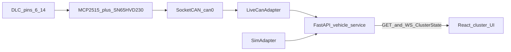

# Cavalier 2021 digital cluster prototype

- **Date:** 2026-09-13
- **Status:** approved design (awaiting implementation plan)
- **Vehicle:** Chevrolet Cavalier 2021 1.5L LT (project K216, PATAC / Mexico-LATAM)
- **Research:** [`research/chevrolet-cavalier-2021-cluster/03-report.md`](../../../research/chevrolet-cavalier-2021-cluster/03-report.md) (gitignored locally; cited, not copied)
- **Wiki:** [`repos/docs/cavalier-cluster-wiki`](../../../repos/docs/cavalier-cluster-wiki/readme.md)

## Intent

You at a bench, ignition on or simulator running, glance at a browser the way a driver glances at the instrument panel. Prove that live OBD-II PIDs can drive an OEM-homage cluster. The only vehicle contract the UI consumes is `ClusterState`.

## Locked decisions

| Decision | Choice |
| --- | --- |
| Phase 1 tap | OBD-II DLC only (SAE J1962 pins 6 and 14, HS-GMLAN, 500 kbit/s) |
| OEM cluster | Stays installed and running |
| Phase 1 done | Bench browser shows speed, rpm, coolant, fuel, MIL from live PIDs or sim |
| Phase 2 | Optional IPC-harness PHY sniff; not a drop-in replica |
| Backend | Python FastAPI + python-can; Node/Express is out of Phase 1 |
| Frontend | React + Vite + TypeScript |
| Arduino | Out of the Phase 1 data path; reserved for Phase 2 |
| Smart-house | Pattern reference only (Pi + pushed UI updates). Johnny-Five does not speak CAN |
| Safety TX | ISO-TP single-frame Mode 01 PID requests only |
| Power | Raspberry Pi from a bench 5 V supply, not DLC pin 16 |
| Default source | `sim` (UI and API work with no car and no CAN hardware) |

## Out of scope

- OEM cluster-connector drop-in, invented K216 pinouts, or invented GMLAN DBC / CAN IDs
- Arbitrary GMLAN frame injection, odometer write, immobilizer bypass, firmware reverse engineering, exploits
- Verbatim copyrighted GM service information
- Body telltales that are not standard PIDs (doors, TPMS detail, StabiliTrak, high beam)
- Production electrical design, in-dash kiosk, phone companion, Node/Express, Johnny-Five
- Auth, multi-user, internet exposure, persistence, accounts

## Success criteria (Phase 1)

The prototype is done when all of the following hold:

1. With `source=sim`, the React UI animates speedo and tacho needles, shows fuel and coolant, and labels the DIC `SIM`.
2. With a Pi + MCP2515 + SN65HVD230 on DLC 6/14 at 500 kbit/s, `source=live`, the same UI shows ECM PIDs for speed, rpm, coolant, MIL, and fuel when the PID exists.
3. If fuel PID `0x2F` is unsupported, `fuelPercent` is `null`; the rest of the cluster still updates.
4. Disconnecting the DLC freezes needles on last values, sets `connected=false`, and shows a DIC error. The OEM cluster continues to behave normally.
5. No process sends CAN frames other than Mode 01 PID requests described below.

---

## Architecture



Three units, each with one job:

| Unit | Does | Depends on | Consumers |
| --- | --- | --- | --- |
| `CanAdapter` | Produce `ClusterState` | SocketCAN (`live`) or JSON traces (`sim`) | Vehicle service |
| Vehicle service | Validate, hold current state, expose HTTP + WebSocket | Adapter interface only | React UI |
| Cluster UI | Render OEM-homage gauges from `ClusterState` | Generated TS types from OpenAPI | Human at the bench |

The UI never imports python-can, SocketCAN, or PID numbers. Swapping `LiveCanAdapter` for a future Arduino serial adapter must not change the HTTP contract.

### Tracer-bullet slice

SimAdapter → `GET /v1/cluster` + `WS /v1/cluster/stream` → speedo needle moves. That path is implemented first and kept. Live CAN is the same contract with a different adapter.

### Runtime topology

- **UI work (no hardware):** FastAPI and Vite on the laptop. `CAVALIER_SOURCE_DEFAULT=sim`.
- **Car bench:** FastAPI on the Pi (`0.0.0.0:8000`). Vite on the laptop, `VITE_API_BASE=http://<pi-lan-ip>:8000`. CORS from `CAVALIER_CORS_ORIGINS` (default `http://localhost:5173`).
- **One-box demo (optional, same Phase 1):** FastAPI serves `web/dist` at `/`. CORS unused.

### Future repo layout (not created by this spec)

Intended path: `repos/personal-projects/cavalier-digital-cluster`.

```
cavalier-digital-cluster/
  server/                 # FastAPI, adapters, sim traces
  web/                    # Vite React app
  docs/                   # link back to this spec
```

`web/src/` follows the workspace React layout: `components/`, `hooks/`, `utils/`, `types/`. One route, no `pages/` tree required.

---

## Hardware (Phase 1)

### Bill of materials

- Raspberry Pi 3, 4, or 5 with Raspberry Pi OS (Bookworm or later)
- MCP2515 CAN controller module with **16 MHz** crystal (8 MHz modules are rejected; overlay will be wrong)
- SN65HVD230-class ISO 11898-2 transceiver (3.3 V). **Not** NCV7356
- SAE J1962 OBD-II pigtail or breakout
- Bench 5 V PSU for the Pi
- Laptop browser on the same LAN
- Optional USB galvanic isolator if the Pi also talks USB to an earthed laptop ([ground-isolation](../../../repos/docs/cavalier-cluster-wiki/concepts/electronics/master/ground-isolation.md))

Arduino is not required to complete Phase 1.

### DLC wiring (facts, not IPC pinout)

| J1962 pin | Function in this prototype |
| --- | --- |
| 6 | CANH (HS-GMLAN +) |
| 14 | CANL (HS-GMLAN −) |
| 4 and/or 5 | Chassis / signal ground, bonded to transceiver ground |
| 16 | Do not power the Pi from this pin |

Do not connect this harness to the instrument-cluster connector. That pinout is not publicly confirmed for K216.

### Pi configuration

`/boot/firmware/config.txt` (or `/boot/config.txt` on older images):

```
dtparam=spi=on
dtoverlay=mcp2515-can0,oscillator=16000000,interrupt=25
```

Interrupt GPIO **25** is the default only if the module’s INT line is wired to GPIO 25. If the HAT uses another GPIO, the overlay `interrupt=` value must match that pin. Crystal frequency must match `oscillator=`.

Bring the interface up at **500000** bit/s:

```
sudo ip link set can0 up type can bitrate 500000 restart-ms 100
```

`restart-ms 100` recovers from bus-off without a reboot.

### Termination

The vehicle HS-CAN bus is already terminated (120 Ω at each end in GM SI for HS-GMLAN). The MCP2515 module’s onboard 120 Ω jumper stays **open**. Closing it on a terminated bus is a wiring error.

### Listen vs request

Passive listen-only cannot populate standard PIDs. Phase 1 **does** transmit, with this cap:

- Only 11-bit frames to functional address `0x7DF`
- Payload: Mode 01 PID request, ISO-TP **single frame** (PCI length + `0x01` + PID)
- Accept responses from `0x7E8`–`0x7EF`
- Hard cap **10 transmitted frames per second**
- No extended IDs, no GMLAN application IDs, no Mode 03/04/09 unless a later spec adds them

---

## OBD mapping

SAE J1979 / ISO 15031-5 Mode 01. Formulas are the public PID formulas, not a Cavalier DBC.

| Cluster field | PID | Formula | Notes |
| --- | --- | --- | --- |
| `rpm` | `0x0C` | `((A * 256) + B) / 4` | Request every round-robin pass |
| `speedKmh` | `0x0D` | `A` | km/h (Mexico market; no mph toggle in Phase 1) |
| `coolantC` | `0x05` | `A - 40` | °C |
| `fuelPercent` | `0x2F` | `A * 100 / 255` | May be unsupported; then `null` |
| `milOn` | `0x01` | bit 7 of A | `true` if MIL commanded on |
| `odometerKm` | none | — | Always `null` in Phase 1. OBD does not replace programmed IPC odometer |

Round-robin order: `0x0C`, `0x0D`, `0x05`, `0x2F`, `0x01`. One in-flight request. Per-request timeout **100 ms**. Negative response / no reply on `0x2F` or `0x01` sets that field `null` and may set `error.code=unsupported_pid` with `error.pid` set; other fields keep updating.

Stale policy: if a previously good PID times out, keep the last value for **2 s**, then set that field `null` and `connected=false` with `error.code=timeout` if **all** PIDs fail. A single unsupported PID is not a disconnect.

---

## API contract

Versioning: URL prefix `/v1`. Breaking changes require `/v2`.

Pydantic models on the server are the source of truth. FastAPI emits OpenAPI at `/docs` and `/openapi.json`. The UI types are generated from `/openapi.json` (for example `openapi-typescript`). Do not hand-write a second `ClusterState` interface.

JSON field names are **camelCase** (Pydantic serialization aliases).

### `ClusterState`

```json
{
  "source": "sim",
  "connected": true,
  "speedKmh": 0,
  "rpm": 800,
  "coolantC": 90,
  "fuelPercent": 55.3,
  "milOn": false,
  "odometerKm": null,
  "updatedAt": "2026-09-13T18:00:00.000Z",
  "error": null
}
```

| Field | Type | Rules |
| --- | --- | --- |
| `source` | `"live"` \| `"sim"` | Current adapter |
| `connected` | boolean | `true` only when the adapter produced a successful update within 2 s (`sim` is always connected while the sim loop runs) |
| `speedKmh` | number \| null | ≥ 0; no upper clamp in the API (UI clamps the needle) |
| `rpm` | number \| null | ≥ 0 |
| `coolantC` | number \| null | |
| `fuelPercent` | number \| null | 0–100 when present |
| `milOn` | boolean \| null | |
| `odometerKm` | null | Literal null in Phase 1; field exists so the DIC has a slot |
| `updatedAt` | string | ISO-8601 UTC with milliseconds |
| `error` | object \| null | See below |

`error` object:

```json
{
  "code": "disconnected",
  "message": "can0 is down",
  "pid": null
}
```

`code` is one of: `disconnected`, `bus_off`, `timeout`, `unsupported_pid`, `adapter_error`. `pid` is `"0x2F"`-style or `null`. `message` is safe for the DIC (no stack traces, no filesystem paths).

HTTP error envelope (non-WebSocket failures):

```json
{
  "error": {
    "code": "adapter_error",
    "message": "invalid source mode",
    "statusCode": 422
  }
}
```

Status codes: `200` success, `422` validation. Missing `can0` is not an HTTP failure: return `200` with `connected=false` and `error.code=disconnected`. Unhandled bugs: `500` with `code=adapter_error` and a generic message.

### Endpoints

| Method | Path | Purpose |
| --- | --- | --- |
| `GET` | `/v1/cluster` | Snapshot of current `ClusterState` |
| `WS` | `/v1/cluster/stream` | JSON text frames, one `ClusterState` each |
| `POST` | `/v1/source` | Switch adapter: `{ "mode": "live" \| "sim" }` |

No authentication in Phase 1. Bind is for a trusted LAN bench. Do not port-forward this service.

**`GET /v1/cluster`:** `200` + `ClusterState`. Always defined after process start (sim default).

**`WS /v1/cluster/stream`:** On connect, send current state immediately. Then send at **10 Hz** (every 100 ms), repeating last state if the adapter has not changed. Server ignores client text. Use protocol ping/pong for keepalive. On `bus_off` / disconnect, keep the socket open and stream `connected=false` states; do not close the socket for a missing car.

**`POST /v1/source`:** Body `{ "mode": "live" }` or `{ "mode": "sim" }`. `200` + `ClusterState` after the switch. Invalid body: `422`. Switching to `live` when `can0` is missing still returns `200` with `connected=false` and `error.code=disconnected`. Switching is idempotent in effect (same mode twice is `200`, same shape).

Query parameters, pagination, and sparse fieldsets are not used; the resource is a singleton.

---

## Vehicle service internals

### Adapter interface

```python
class CanAdapter(Protocol):
    async def start(self) -> None: ...
    async def stop(self) -> None: ...
    async def read(self) -> ClusterState: ...
```

`LiveCanAdapter` owns SocketCAN `can0`. `SimAdapter` owns looping traces. The service holds exactly one started adapter. `POST /v1/source` stops the current adapter, starts the other, and publishes a new state.

Vendor types (`can.Bus`, isotp sockets) stay inside `LiveCanAdapter`. Domain code sees `ClusterState` only.

### LiveCanAdapter TX frame

Example rpm request (hex):

```
ID 7DF  DLC 8  DATA 02 01 0C 00 00 00 00 00
```

Parse a matching `41 0C` positive response; ignore other IDs. Do not implement a full ISO-TP consecutive-frame stack in Phase 1. These Mode 01 PIDs fit in a single CAN frame.

### SimAdapter

Directory: `server/sim/`.

- `idle.json`: array of `ClusterState`-like objects without `source`/`error` (the adapter fills those). Looping. rpm ~800, speed 0, coolant 90, fuel 55, mil false.
- `rev.json`: rpm and speed rise and fall over ~8 s so needles visibly move. Used by unit tests as the default trace.

Interpolation is allowed inside the adapter so the 10 Hz stream is smooth. Tests use a fixed trace with a fake clock; they must not depend on wall time jitter beyond ±20 ms.

### Environment

| Variable | Default | Meaning |
| --- | --- | --- |
| `CAVALIER_SOURCE_DEFAULT` | `sim` | Adapter at boot |
| `CAVALIER_CAN_INTERFACE` | `can0` | SocketCAN name |
| `CAVALIER_CORS_ORIGINS` | `http://localhost:5173` | Comma-separated |
| `CAVALIER_HOST` | `0.0.0.0` | Bind |
| `CAVALIER_PORT` | `8000` | Bind |
| `VITE_API_BASE` | `http://localhost:8000` | UI build-time API origin |

---

## User interface

### Domain and visual world

- **Domain:** IPC, DIC, needle, telltale, PID, DLC, live vs sim — vocabulary from the Cavalier cluster, not from “dashboards”.
- **Color world:** black cluster well, white numerals, red needle, chrome-ish ring, amber DIC segment, telltale red.
- **Signature:** analog speedo and tacho with a small centered DIC that can read `SIM` or `LIVE` — that pairing is this product.
- **Defaults to reject:** Grafana-style charts, Tesla-wide glass, neon cyberpunk, generic SaaS cards, gray-200 token soup.

### Intent follow-through

Dark, dense, glanceable. Warm metal and amber DIC, not cold blue admin UI. Four text levels: speed numeral (if shown), DIC primary, DIC secondary, tick labels.

### Layout

- Focal point: speedometer (left or dominant) and tachometer (right), analog needles.
- Secondary: fuel (E–F) and coolant (C–H) as smaller gauges.
- Center DIC: `LIVE` or `SIM`; MIL text (`CHECK ENGINE` when `milOn`); odometer line shows `---` while `odometerKm` is null.
- No navigation chrome. One fullscreen view. Optional 8px debug is **not** in Phase 1 (OEM homage, not telemetry).

### Gauge geometry (UI clamps)

| Gauge | Display range | Needle at max |
| --- | --- | --- |
| Speed | 0–200 km/h | 200 |
| Tach | 0–8000 rpm | 8000 |
| Fuel | 0–100% | Full |
| Coolant | 50–130 °C mapped to C–H | H |

API values outside the display range pin the needle at the end stop. They are not rejected by the API.

### States

| State | How it looks |
| --- | --- |
| Loading | Needles at rest (0), DIC `---`, no telltale. Until first `ClusterState` |
| Sim | Needles move with sim data, DIC `SIM`, amber source chip |
| Live | Needles follow PIDs, DIC `LIVE` |
| Disconnected | Needles freeze at last angles, DIC shows `NO BUS`. Same presentation if the WebSocket closes or `connected` is false. |
| Bus error | Same freeze; DIC shows `BUS OFF` when `code=bus_off` |
| Partial PID | Fuel gauge stays visible; needle rests at E when `fuelPercent` is null; others continue |

Phase 1 includes one keyboard-accessible source control (`button`, not a `div`): **SIM** / **LIVE**. Disabled while a switch request is in flight (`aria-busy`). Hit target ≥ 44px. Hover and focus styles apply to that button.

DIC copy from `error.code` (only when `connected` is false, except `unsupported_pid`):

| `error.code` | DIC |
| --- | --- |
| `null` and `connected` | `LIVE` or `SIM` from `source` |
| `unsupported_pid` | Keep `LIVE` or `SIM`; do not show `NO BUS` |
| `disconnected` | `NO BUS` |
| `timeout` | `NO BUS` |
| `bus_off` | `BUS OFF` |
| `adapter_error` | `ERROR` |

### Tokens (names)

`--ink`, `--well`, `--nickel`, `--needle`, `--telltale-red`, `--dic-amber`, `--tick`. No raw hex in components once tokens exist. `index.css` defines them.

### Motion

Needles ease toward the latest value (short CSS or rAF lerp, ≤ 150 ms). Do not jump except on first frame. Reduced-motion: snap without easing.

### Accessibility

- `main` landmark. Gauges expose text alternatives: `aria-label` with current speed, rpm, fuel, coolant, MIL.
- Source toggle is a `button`.
- Contrast on DIC amber vs well must remain readable.

---

## Error handling

| Layer | Policy |
| --- | --- |
| Adapter expected failures | Encoded in `ClusterState.error` (disconnected, timeout, unsupported PID, bus-off) |
| Adapter unexpected failures | Log once at the adapter boundary; surface `adapter_error` |
| HTTP validation | `422` + envelope |
| WebSocket | Stay open; stream error states |
| UI | First paint loading; then map `connected` / `error.code` to DIC copy. Error boundary around the cluster view with a static “cluster failed to render” fallback |
| Logging | No PID payloads at info level on live (bench noise). Errors log code + interface name, not raw dumps in the UI |

Empty `catch` is forbidden. Narrow `unknown` before reading `message`.

---

## Testing

### Automated

- **SimAdapter unit tests:** given `rev.json` and a fake clock, `read()` returns increasing then decreasing rpm; `source` is always `sim`; `connected` true while running.
- **Contract tests:** Pydantic round-trip; OpenAPI contains `/v1/cluster`, `/v1/source`, and `ClusterState`. POST invalid mode → 422.
- **Playwright (sim only):** after 1 s, DIC contains `SIM` and the tacho needle has left rest (that test uses `rev.json`). Stop the API; within 2 s DIC shows `NO BUS`. Do not require a car for CI.

### Manual (car)

1. OEM cluster on, engine idle. Fit DLC pigtail only to 6/14/ground.
2. `ip link` shows `can0` bitrate 500000.
3. `POST /v1/source` `{ "mode": "live" }`. UI DIC `LIVE`. rpm near idle, speed 0.
4. Raise rpm; tacho moves. MIL matches OEM Check Engine lamp.
5. Unplug pigtail; OEM cluster still normal; UI freezes and DIC `NO BUS`.
6. Confirm `candump` (if used) shows only `7DF` requests and `7E8`–`7EF` responses.

---

## Phase 2 appendix (not built in Phase 1)

Goal: learn whether the K216 IPC data wire is ISO 11898-2 (~500 kbit/s differential) or J2411 SWCAN (~33.3 kbit/s single-wire). Not a drop-in cluster.

Rules:

1. Do not unplug the OEM IPC until the PHY is measured with the cluster still connected.
2. Measure with a scope or a known-good transceiver, not by guessing from Cruze 2011 or 科沃兹 SI indexes (those are analogies).
3. If differential HS-CAN: the Phase 1 HAT may sniff; still no DBC invention; listen-only on that wire (no PID TX on the IPC bus).
4. If SWCAN: Arduino (or Pi) + **NCV7356**, not SN65HVD230. MCP2515 can still be the controller.
5. If signals map to speed/rpm/etc., publish the same `ClusterState`. Otherwise a raw-frame log is a new spec.
6. Still no OEM connector drop-in, no TX on the IPC bus, no odometer programming.

Phase 2 BOM (do not block Phase 1): Arduino Uno or Nano, NCV7356, logic-level care between 5 V MCU and 3.3 V CAN controller if stacked.

---

## Safety and legal notes

- This is a parallel diagnostic display, equivalent in bus use to a scan tool requesting Mode 01 PIDs.
- Do not alter odometer data. Jurisdiction-local odometer laws apply to writes; Phase 1 cannot write them.
- Immobilizer and VIN programming are vehicle security topics, not APIs in this prototype.
- Ground isolation is electrical safety, not a security bypass.

---

## Pragmatic diagnostic (design)

Score **10/10** against the seven rows if implementation follows this spec: one `ClusterState` (DRY), adapters orthogonal to UI, sim tracer slice, Pydantic contracts, no boarded hacks, CAN vendor types isolated (reversible to Arduino later), Phase 1 scoped as one plan.

---

## Sources for implementers

- Research synthesis: `research/chevrolet-cavalier-2021-cluster/03-report.md`
- Validation: `research/chevrolet-cavalier-2021-cluster/02-validation.md`
- q05 hardware: `research/chevrolet-cavalier-2021-cluster/findings/q05-arduino-raspberry-interface.md`
- Wiki catalog: `repos/docs/cavalier-cluster-wiki/index.md`
- MCP2515 datasheet, SN65HVD230 datasheet, Linux SocketCAN docs, python-can docs (as cited in the research report)

Do not copy GM shop-manual figures into this repository.
