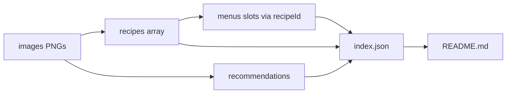

# Recipe App JSON Implementation Plan

> **For agentic workers:** REQUIRED SUB-SKILL: Use superpowers:subagent-driven-development (recommended) or superpowers:executing-plans to implement this plan task-by-task. Steps use checkbox (`- [ ]`) syntax for tracking.

**Goal:** Fill [`repos/recipe-app/index.json`](repos/recipe-app/index.json) with a web-ready hybrid meal-plan dataset transcribed from `images/`, and document it in [`repos/recipe-app/README.md`](repos/recipe-app/README.md). Building a web app is out of scope.

**Architecture:** Single JSON file is the product. `recipes[]` is the source of truth for dishes; `menus[]` (9 day-menus from 3 sheets × 3 rows) reference recipe IDs by meal slot; `recommendations[]` holds the 10 guidelines from `IMG_4050.png`. No patient PII. Spanish content, English keys, relative image paths.

**Tech Stack:** Hand-authored JSON + Markdown. Optional Node one-liner for validation (no package required).

## Global Constraints

- Hybrid model only: `meta` + `recommendations` + `recipes` + `menus`
- Anonymous: never include patient name; clinic may appear only as `meta.source`
- Locale: `es-MX` content; English JSON keys
- Image paths: relative from repo root, e.g. `images/IMG_4049.png`
- Duplicate dish titles with different ingredients → separate recipe IDs
- Simple snacks (fruit, gelatina) are still recipes for uniform menu references
- App UI / frameworks are out of scope
- Design decisions live in `repos/recipe-app/docs/superpowers/specs/2026-08-03-recipe-app-json-design.md`
- Full plan file (this content) also saved at `repos/recipe-app/docs/superpowers/plans/2026-08-03-recipe-app-json.md` during Task 1

## File Structure

- Create: [`repos/recipe-app/docs/superpowers/specs/2026-08-03-recipe-app-json-design.md`](repos/recipe-app/docs/superpowers/specs/2026-08-03-recipe-app-json-design.md) — approved design
- Create: [`repos/recipe-app/docs/superpowers/plans/2026-08-03-recipe-app-json.md`](repos/recipe-app/docs/superpowers/plans/2026-08-03-recipe-app-json.md) — this plan
- Modify: [`repos/recipe-app/index.json`](repos/recipe-app/index.json) — full dataset
- Create: [`repos/recipe-app/README.md`](repos/recipe-app/README.md) — schema + usage for web consumers
- Keep: `images/IMG_4049.png`, `IMG_4050.png`, `IMG_4051.png`, `IMG_4052.png` (unchanged)



## Schema (locked)

```json
{
  "version": "1.0.0",
  "meta": {
    "title": "Plan de alimentación",
    "locale": "es-MX",
    "source": "en forma salud y nutrición",
    "mealSlots": [
      { "id": "desayuno", "label": "Desayuno", "time": "9:00am" },
      { "id": "colacion_1", "label": "Colación", "time": "12:00pm" },
      { "id": "comida", "label": "Comida", "time": "3:00 / 4:00pm" },
      { "id": "colacion_2", "label": "Colación", "time": "6:00pm" },
      { "id": "cena", "label": "Cena", "time": "8-9pm" }
    ]
  },
  "recommendations": ["string"],
  "recipes": [
    {
      "id": "slug-kebab",
      "name": "Display name",
      "mealTypes": ["desayuno"],
      "ingredients": [
        { "item": "huevo", "quantity": 2, "unit": "pz", "notes": null }
      ],
      "sides": [],
      "drink": null,
      "instructions": [],
      "sourceImage": "images/IMG_4049.png"
    }
  ],
  "menus": [
    {
      "id": "menu-1",
      "label": "Menú 1",
      "sourceImage": "images/IMG_4049.png",
      "row": 1,
      "slots": {
        "desayuno": { "recipeId": "...", "drink": "..." },
        "colacion_1": { "recipeId": "..." },
        "comida": { "recipeId": "...", "drink": "..." },
        "colacion_2": { "recipeId": "..." },
        "cena": { "recipeId": "..." }
      }
    }
  ]
}
```

**Ingredient rules:** `quantity` is number or string when range (`"2-3"`, `"5-7"`); `unit` uses sheet units (`pz`, `taza`, `gr`, `reb`, `cda`, `vaso`, `puñito`, `trocito`, or `null` when unitless); put prep notes in `notes` or `instructions`.

**Menu mapping:**
- `menu-1..3` ← `IMG_4049.png` rows 1–3
- `menu-4..6` ← `IMG_4051.png` rows 1–3
- `menu-7..9` ← `IMG_4052.png` rows 1–3

**Drink rule:** Prefer slot-level `drink` for meal pairings; set recipe-level `drink` only when the drink is part of the dish (e.g. green juice recipe).

---

### Task 1: Spec + plan docs + JSON skeleton

**Files:**
- Create: `repos/recipe-app/docs/superpowers/specs/2026-08-03-recipe-app-json-design.md`
- Create: `repos/recipe-app/docs/superpowers/plans/2026-08-03-recipe-app-json.md`
- Modify: `repos/recipe-app/index.json`

**Interfaces:**
- Produces: empty arrays + full `meta.mealSlots`; schema frozen for later tasks

- [ ] Write design doc summarizing hybrid anonymous model, schema, image→menu mapping, constraints
- [ ] Copy this plan into `docs/superpowers/plans/2026-08-03-recipe-app-json.md`
- [ ] Write skeleton `index.json` with `version`, `meta` (full mealSlots), `"recommendations": []`, `"recipes": []`, `"menus": []`
- [ ] Commit: `docs: add recipe-app json design and plan`

---

### Task 2: Recommendations from IMG_4050

**Files:**
- Modify: `repos/recipe-app/index.json`

**Content (exact, Spanish):**
1. Beber 2 litros de agua natural
2. Acompañar las comidas con Café o té (Manzanilla, hierbabuena y limón)
3. Realizar ejercicio de 60 a 90 min (Anaeróbico)
4. Preferir alimentos integrales
5. No dejar más de 4 horas por cada comida
6. Combinar los desayunos, comidas y cenas de los menús
7. No añadir sal extra a las comidas (solo para cocinar y no en exceso)
8. Preferir condimentar los alimentos con especias
9. No consumir refresco ni bebidas gaseosas (solo agua mineral)
10. Agregar limón a las comidas

- Omit patient disclaimer from JSON (mention in README as source note only)
- Commit: `data: add meal-plan recommendations`

---

### Task 3: Sheet IMG_4049 → menus 1–3 + recipes

**Files:**
- Modify: `repos/recipe-app/index.json`

Transcribe all cells from rows 1–3. Create one recipe per cell (including snacks). Suggested IDs:

| Menu | Slot | Recipe id | Name |
|------|------|-----------|------|
| 1 | desayuno | `omelette-champinones` | Omelette con champiñones |
| 1 | colacion_1 | `gelatina-light` | Gelatina light |
| 1 | comida | `fajitas-pollo-verduras` | Fajitas de pollo con verduras |
| 1 | colacion_2 | `pepino-pieza` | Pepino |
| 1 | cena | `cereal-leche-manzana` | Cereal |
| 2 | desayuno | `taquitos-tinga-pollo` | Taquitos de tinga de pollo |
| 2 | colacion_1 | `jicama-taza` | Jícama |
| 2 | comida | `sopa-fria` | Sopa fría |
| 2 | colacion_2 | `manzana-gajos` | Manzana en gajos |
| 2 | cena | `thins-atun-4049` | Thins de atún |
| 3 | desayuno | `molletes-4049` | Molletes |
| 3 | colacion_1 | `pina-taza` | Piña |
| 3 | comida | `ensalada-atun` | Ensalada de atún |
| 3 | colacion_2 | `pepino-jicama-tajin` | Pepino con jícama y tajín |
| 3 | cena | `smoothie-fresas-4049` | Smoothie |

Also create companion drink recipes or use slot `drink` strings:
- Desayuno 1: green juice → recipe `jugo-verde` referenced from slot drink or as related recipe; store ingredients on `jugo-verde`, set `slots.desayuno.drink` to recipe name or keep drink as string `"Jugo verde"` and list `jugo-verde` in recipes with `mealTypes: ["bebida"]` — **decision locked:** slot `drink` is a plain string matching the sheet; green juice ingredients live in a separate recipe `jugo-verde` linked only via optional `relatedRecipeIds` on the breakfast recipe OR omit linkage and put juice ingredients in breakfast `sides`/`instructions`. **Locked simpler rule:** put green-juice ingredients into the breakfast recipe as additional ingredients with `notes: "jugo verde"`, and set slot `drink` to `"Jugo verde"`.

Fill quantities from the sheet (examples):
- Omelette: 2 pz huevo, 1/3 taza champiñones, 40 gr queso Oaxaca, 1 reb pan integral, 1/3 aguacate + jugo verde components
- Fajitas: 120 gr pollo, chayote/zanahoria/elote/brócoli, 2 tortillas maíz; drink `"Agua de piña"`
- Full remaining cells per image transcript

- Validate: every `menu-1..3` slot has a `recipeId` present in `recipes`
- Commit: `data: add menus 1-3 from IMG_4049`

---

### Task 4: Sheet IMG_4051 → menus 4–6 + recipes

**Files:**
- Modify: `repos/recipe-app/index.json`

| Menu | Slot | Recipe id | Name |
|------|------|-----------|------|
| 4 | desayuno | `fruta-cottage` | Fruta con cottage |
| 4 | colacion_1 | `uvas-18` | Uvas |
| 4 | comida | `enfrijoladas` | Enfrijoladas |
| 4 | colacion_2 | `jicama-taza-4051` | Jícama |
| 4 | cena | `thins-atun-4051` | Thins de atún |
| 5 | desayuno | `huevo-espinacas` | Huevo con espinacas |
| 5 | colacion_1 | `pera` | Pera |
| 5 | comida | `filete-plancha-verduras` | Filete a la plancha con verduras |
| 5 | colacion_2 | `manzana-4051` | Manzana |
| 5 | cena | `tostadas-preparadas-4051` | Tostadas preparadas |
| 6 | desayuno | `molletes-4051` | Molletes |
| 6 | colacion_1 | `manzana-4051-colacion` | Manzana |
| 6 | comida | `ceviche-atun` | Ceviche de atún |
| 6 | colacion_2 | `pepino-rodajas-4051` | Pepino en rodajas |
| 6 | cena | `smoothie-fresas-4051` | Smoothie de fresas |

Reuse snack recipe IDs across sheets only when name+ingredients+quantity are identical; otherwise new IDs (as above). Prefer reusing `jicama-taza` if identical “1 taza de jícama”.

- Commit: `data: add menus 4-6 from IMG_4051`

---

### Task 5: Sheet IMG_4052 → menus 7–9 + recipes

**Files:**
- Modify: `repos/recipe-app/index.json`

| Menu | Slot | Recipe id | Name |
|------|------|-----------|------|
| 7 | desayuno | `tinga-res-tostadas` | Tinga de res |
| 7 | colacion_1 | `pepino-rodajas-4052` | Pepino en rodajas |
| 7 | comida | `pechuga-asada` | Pechuga asada |
| 7 | colacion_2 | `manzana-4052` | Manzana |
| 7 | cena | `tostadas-preparadas-4052` | Tostadas preparadas |
| 8 | desayuno | `chilaquiles` | Chilaquiles |
| 8 | colacion_1 | `papaya-taza` | Papaya |
| 8 | comida | `carne-asada-nopales` | Carne asada |
| 8 | colacion_2 | `almendras-punado` | Almendras |
| 8 | cena | `avena-canela` | Avena con canela |
| 9 | desayuno | `hot-cakes-avena` | Hot cakes |
| 9 | colacion_1 | `jicama-taza-4052` | Jícama |
| 9 | comida | `fajitas-calabacitas` | Fajitas con calabacitas |
| 9 | colacion_2 | `pepino-rodajas-4052b` | Pepino en rodajas |
| 9 | cena | `ensalada-fria` | Ensalada fría |

Reuse identical snack recipes where safe (e.g. single shared `pepino-rodajas` with quantity 1).

- Commit: `data: add menus 7-9 from IMG_4052`

---

### Task 6: README documentation

**Files:**
- Create: `repos/recipe-app/README.md`

Must include:
- Purpose: static meal-plan dataset for web apps
- Directory layout (`index.json`, `images/`)
- Schema field reference (`meta`, `recommendations`, `recipes`, `menus`)
- How to resolve a day’s meals: load menu → lookup each `slots.*.recipeId` in `recipes`
- Example fetch snippet for web: `fetch('/index.json')` then join
- Conventions: anonymous data, Spanish content, relative image paths, units
- Note that images are source scans; JSON is the structured product
- Out of scope: UI app

- Commit: `docs: add recipe-app README`

---

### Task 7: Validate dataset integrity

**Files:**
- Modify only if validation finds gaps: `repos/recipe-app/index.json`

Run from `repos/recipe-app`:

```bash
node -e '
const fs = require("fs");
const d = JSON.parse(fs.readFileSync("index.json","utf8"));
const ids = new Set(d.recipes.map(r => r.id));
if (ids.size !== d.recipes.length) throw new Error("duplicate recipe ids");
const slots = ["desayuno","colacion_1","comida","colacion_2","cena"];
if (d.menus.length !== 9) throw new Error("expected 9 menus");
if (d.recommendations.length !== 10) throw new Error("expected 10 recommendations");
for (const m of d.menus) {
  for (const s of slots) {
    const ref = m.slots[s]?.recipeId;
    if (!ref || !ids.has(ref)) throw new Error(`missing ${m.id}.${s}=${ref}`);
  }
}
for (const r of d.recipes) {
  if (!r.sourceImage || !fs.existsSync(r.sourceImage)) throw new Error(`bad image ${r.id}`);
}
console.log("OK", d.recipes.length, "recipes,", d.menus.length, "menus");
'
```

Expected: `OK <n> recipes, 9 menus` with n ≥ 35.

- Spot-check 3 random recipes against their source PNG
- Commit only if fixes needed: `fix: correct recipe-app json validation issues`

---

## Spec coverage checklist

- Hybrid recipes + menus + recommendations — Tasks 2–5
- Anonymous / no patient name — Global + Task 1
- Ideal web-ready structure — Schema + Task 6
- All four images used — Tasks 2–5
- README — Task 6
- App out of scope — Global + README
